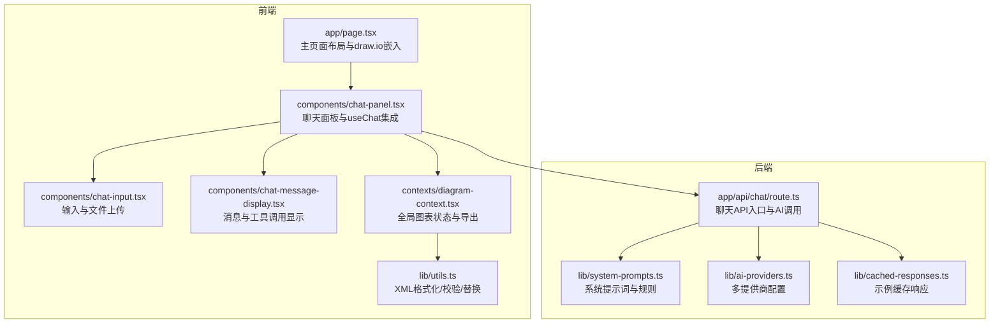
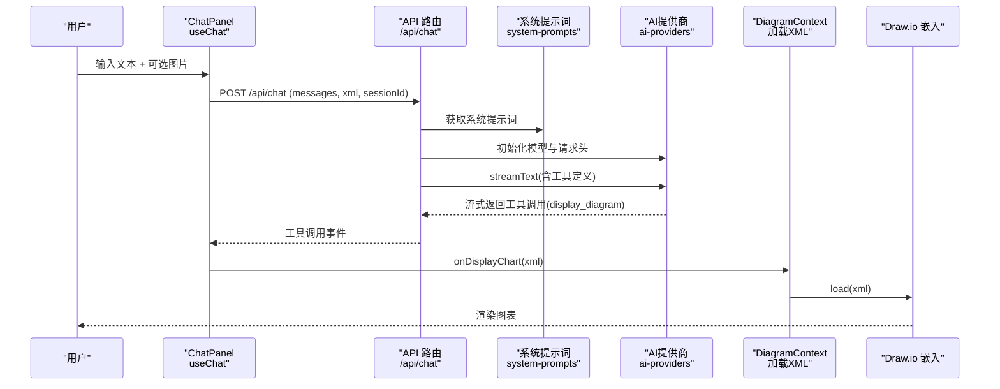
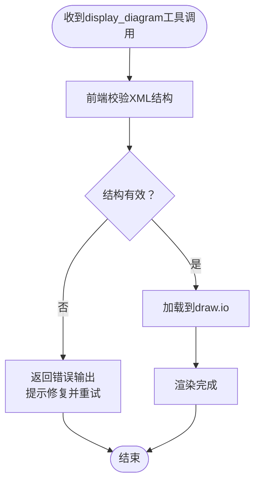
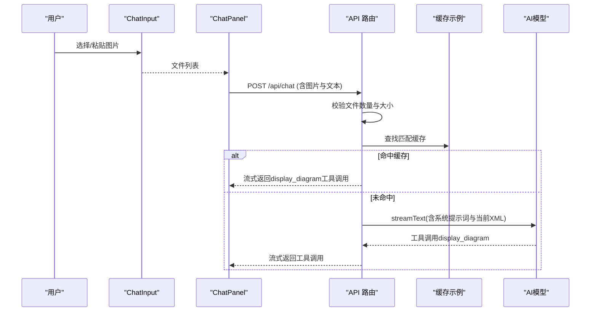
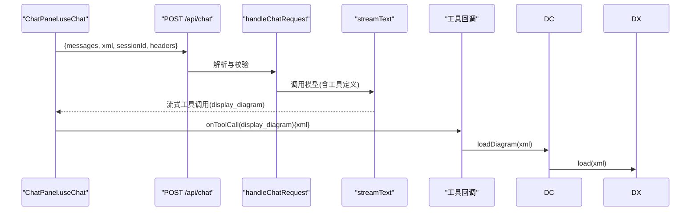
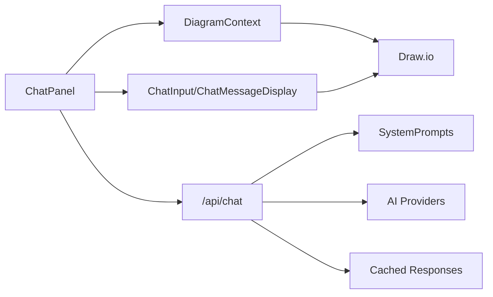

# 图表创建

<cite>
**本文引用的文件**
- [app/page.tsx](file://app/page.tsx)
- [app/api/chat/route.ts](file://app/api/chat/route.ts)
- [lib/system-prompts.ts](file://lib/system-prompts.ts)
- [lib/ai-providers.ts](file://lib/ai-providers.ts)
- [contexts/diagram-context.tsx](file://contexts/diagram-context.tsx)
- [lib/utils.ts](file://lib/utils.ts)
- [components/chat-panel.tsx](file://components/chat-panel.tsx)
- [components/chat-input.tsx](file://components/chat-input.tsx)
- [components/chat-message-display.tsx](file://components/chat-message-display.tsx)
- [lib/cached-responses.ts](file://lib/cached-responses.ts)
- [app/api/chat/xml_guide.md](file://app/api/chat/xml_guide.md)
- [README.md](file://README.md)
</cite>

## 目录
1. [简介](#简介)
2. [项目结构](#项目结构)
3. [核心组件](#核心组件)
4. [架构总览](#架构总览)
5. [详细组件分析](#详细组件分析)
6. [依赖关系分析](#依赖关系分析)
7. [性能考量](#性能考量)
8. [故障排查指南](#故障排查指南)
9. [结论](#结论)
10. [附录](#附录)

## 简介
本项目是一个基于大型语言模型（LLM）的图表创建与编辑系统，前端通过自然语言与图像输入驱动后端AI模型生成或修改draw.io XML，再由前端渲染到嵌入式draw.io编辑器中。系统支持：
- 文字描述生成图表
- 图片为基础的图表复制与解析
- 历史版本管理与回滚
- 多AI提供商适配（如Bedrock、OpenAI、Anthropic、Google等）
- AWS架构图专用提示词与图标支持
- 动画连接器等高级样式特性

## 项目结构
系统采用Next.js App Router组织，前后端职责清晰：前端负责UI交互与状态管理，后端负责AI推理与XML生成/修复。

**图表来源**
- [app/page.tsx](file://app/page.tsx#L1-L162)
- [components/chat-panel.tsx](file://components/chat-panel.tsx#L1-L200)
- [components/chat-input.tsx](file://components/chat-input.tsx#L1-L120)
- [components/chat-message-display.tsx](file://components/chat-message-display.tsx#L1-L120)
- [contexts/diagram-context.tsx](file://contexts/diagram-context.tsx#L1-L120)
- [lib/utils.ts](file://lib/utils.ts#L1-L120)
- [app/api/chat/route.ts](file://app/api/chat/route.ts#L1-L120)
- [lib/system-prompts.ts](file://lib/system-prompts.ts#L1-L120)
- [lib/ai-providers.ts](file://lib/ai-providers.ts#L1-L120)
- [lib/cached-responses.ts](file://lib/cached-responses.ts#L1-L80)

**章节来源**
- [README.md](file://README.md#L1-L120)
- [app/page.tsx](file://app/page.tsx#L1-L162)

## 核心组件
- 聊天面板与useChat集成：负责将用户输入与图片上传转换为AI请求，接收流式响应并通过工具调用驱动前端渲染。
- 图表上下文：封装draw.io嵌入、导出、历史记录、保存等功能，并提供XML校验与加载。
- AI聊天路由：统一接入AI模型，注入系统提示词、当前XML上下文、文件校验与缓存命中逻辑，并定义display_diagram/edit_diagram工具。
- 工具函数：XML格式化、合法性校验、节点替换、提取XML等。
- 系统提示词：明确draw.io结构约束、AWS图标使用、动画连接器等规则。
- 多提供商适配：自动检测或显式配置AI提供商，支持自定义端点。

**章节来源**
- [components/chat-panel.tsx](file://components/chat-panel.tsx#L120-L320)
- [contexts/diagram-context.tsx](file://contexts/diagram-context.tsx#L1-L120)
- [app/api/chat/route.ts](file://app/api/chat/route.ts#L120-L220)
- [lib/utils.ts](file://lib/utils.ts#L1-L120)
- [lib/system-prompts.ts](file://lib/system-prompts.ts#L1-L120)
- [lib/ai-providers.ts](file://lib/ai-providers.ts#L1-L120)

## 架构总览
下图展示了从用户输入到AI生成XML再到前端渲染的完整链路。

**图表来源**
- [components/chat-panel.tsx](file://components/chat-panel.tsx#L130-L220)
- [app/api/chat/route.ts](file://app/api/chat/route.ts#L320-L474)
- [lib/system-prompts.ts](file://lib/system-prompts.ts#L1-L120)
- [lib/ai-providers.ts](file://lib/ai-providers.ts#L112-L286)
- [contexts/diagram-context.tsx](file://contexts/diagram-context.tsx#L60-L120)
- [app/page.tsx](file://app/page.tsx#L90-L160)

## 详细组件分析

### 系统提示词设计与作用
- 设计原则
  - 明确工具职责：display_diagram用于全新或重大结构调整；edit_diagram用于局部精确修改。
  - 结构约束：严格规定draw.io XML根结构、mxCell层级、唯一ID、父子关系、边连接目标ID等。
  - 风格与平台：AWS 2025图标、动画连接器flowAnimation=1、边路由规则（避免重叠、拐角、障碍绕行）。
  - JSON转义：edit_diagram输入必须对双引号进行转义，避免解析失败。
- 在系统中的作用
  - 作为system消息注入到AI请求中，确保模型输出符合draw.io可接受的XML结构。
  - 与“当前XML上下文”组合，帮助模型在对话中保持一致性与可编辑性。

**章节来源**
- [lib/system-prompts.ts](file://lib/system-prompts.ts#L1-L120)
- [lib/system-prompts.ts](file://lib/system-prompts.ts#L135-L334)
- [app/api/chat/route.ts](file://app/api/chat/route.ts#L315-L340)

### display_diagram工具实现机制
- 工具定义
  - 输入：xml字符串（包含完整的draw.io XML）。
  - 输出：前端执行本地加载与校验，成功后渲染到draw.io。
- 输入验证流程
  - 前端：loadDiagram在加载前调用validateMxCellStructure进行结构校验，若失败则通过工具输出错误信息并允许模型重试。
  - 后端：display_diagram工具描述中列出严格规则（mxCell必须为root直接子元素、唯一ID、父引用有效、边source/target存在、特殊字符转义、起始两根根单元等），违反规则将被拒绝。
- 错误处理策略
  - 工具调用失败时，将错误信息作为tool输出返回给模型，配合sendAutomaticallyWhen使其自动重试。
  - 对于XML不合法（未转义特殊字符、孤儿mxPoint、重复ID、无效父引用、无效边连接等），前端会给出明确提示并阻止渲染。

**图表来源**
- [app/api/chat/route.ts](file://app/api/chat/route.ts#L393-L437)
- [contexts/diagram-context.tsx](file://contexts/diagram-context.tsx#L60-L120)
- [lib/utils.ts](file://lib/utils.ts#L508-L711)

**章节来源**
- [app/api/chat/route.ts](file://app/api/chat/route.ts#L393-L437)
- [contexts/diagram-context.tsx](file://contexts/diagram-context.tsx#L60-L120)
- [lib/utils.ts](file://lib/utils.ts#L508-L711)

### 图像为基础的图表复制流程
- 用户上传图片后，前端将其编码为data URL并随消息发送至后端。
- 后端对文件数量与大小进行校验（最多5张、每张≤2MB），超出限制将返回400错误。
- 若为首次消息且当前XML为空，则尝试命中缓存示例（例如“复制此流程图”、“复制为AWS风格”等），命中则直接以流式工具调用返回XML，避免重复推理。
- 未命中缓存时，模型根据图片与用户文字描述生成XML，随后进入display_diagram工具流程。

**图表来源**
- [components/chat-input.tsx](file://components/chat-input.tsx#L1-L120)
- [components/chat-panel.tsx](file://components/chat-panel.tsx#L449-L506)
- [app/api/chat/route.ts](file://app/api/chat/route.ts#L187-L213)
- [lib/cached-responses.ts](file://lib/cached-responses.ts#L551-L562)

**章节来源**
- [components/chat-input.tsx](file://components/chat-input.tsx#L1-L120)
- [components/chat-panel.tsx](file://components/chat-panel.tsx#L449-L506)
- [app/api/chat/route.ts](file://app/api/chat/route.ts#L187-L213)
- [lib/cached-responses.ts](file://lib/cached-responses.ts#L551-L562)

### useChat Hook到后端API的数据流
- 前端useChat配置transport指向/api/chat，自动处理流式响应与工具调用。
- 发送时携带：
  - messages：包含文本与文件部分（text与file）。
  - xml：当前图表XML快照，供AI参考。
  - sessionId：用于遥测与追踪。
  - headers：x-access-code访问码。
- 后端接收后：
  - 校验访问码、文件大小与数量。
  - 将messages转换为模型消息，注入系统提示词与当前XML上下文。
  - 定义工具（display_diagram/edit_diagram），开启工具调用修复与缓存点设置。
  - 返回流式响应，前端通过工具回调加载XML。

**图表来源**
- [components/chat-panel.tsx](file://components/chat-panel.tsx#L130-L220)
- [app/api/chat/route.ts](file://app/api/chat/route.ts#L145-L220)
- [contexts/diagram-context.tsx](file://contexts/diagram-context.tsx#L60-L120)

**章节来源**
- [components/chat-panel.tsx](file://components/chat-panel.tsx#L130-L220)
- [app/api/chat/route.ts](file://app/api/chat/route.ts#L145-L220)
- [contexts/diagram-context.tsx](file://contexts/diagram-context.tsx#L60-L120)

### AWS架构图支持实现
- 提示词优化：系统提示词明确要求在生成AWS相关图表时使用“AWS 2025图标”，并提供示例缓存（如“Replicate this in aws style”）。
- 模板应用：后端在首次消息且无XML时，优先查找匹配的缓存示例，减少推理成本。
- 实践要点：当用户描述AWS架构需求时，尽量提供清晰的组件与连接关系，以便模型生成更准确的连线与图标。

**章节来源**
- [lib/system-prompts.ts](file://lib/system-prompts.ts#L70-L80)
- [lib/cached-responses.ts](file://lib/cached-responses.ts#L260-L330)
- [README.md](file://README.md#L20-L60)

### 动画连接器等高级功能
- 动画连接器：系统提示词与工具描述中明确支持“flowAnimation=1”样式属性，用于在边样式中启用动画效果。
- 边路由规则：系统提示词提供了严格的边路由约束（避免重叠、拐角、障碍绕行、多条边路径不同、自然连接点等），确保生成的XML在draw.io中渲染正确且美观。
- 使用方法：在生成XML时为边元素添加flowAnimation=1，并按提示词的路由规则设置exitX/exitY/entryX/entryY与waypoints。

**章节来源**
- [app/api/chat/route.ts](file://app/api/chat/route.ts#L393-L437)
- [lib/system-prompts.ts](file://lib/system-prompts.ts#L240-L334)

### 初学者简单创建示例
- 文字描述：输入“给我一个流程图”或“绘制一个猫的草图”，系统将生成相应XML并渲染。
- 图片复制：上传一张已有流程图或架构图，输入“复制为AWS风格”或“复制为GCP风格”，系统将解析图片并生成对应架构图。
- 快速开始步骤
  1) 在聊天输入框中输入你的描述或编辑现有消息。
  2) 如需基于图片，请点击“上传图片”按钮选择图片。
  3) 点击发送，等待AI生成并自动渲染到右侧draw.io编辑器。
  4) 如需调整，使用“编辑图表”工具（edit_diagram）进行局部修改。

**章节来源**
- [README.md](file://README.md#L20-L120)
- [components/chat-input.tsx](file://components/chat-input.tsx#L400-L481)
- [components/chat-panel.tsx](file://components/chat-panel.tsx#L449-L506)

### 高级用户性能优化与最佳实践
- 缓存利用
  - 首次消息且当前XML为空时，系统会尝试命中缓存示例，显著降低推理时间。
  - 建议在复杂场景下先生成一次，后续通过edit_diagram进行微调，避免全量重绘。
- XML结构优化
  - 避免不必要的嵌套mxCell，确保所有mxCell均为root直接子元素。
  - 保持ID唯一且顺序增长，避免重复或缺失。
  - 边连接必须引用存在的源/目标ID，避免孤儿边。
- 边路由与布局
  - 使用系统提示词中的边路由规则，合理设置exit/entry点与waypoints，避免线条交叉与重叠。
  - 先规划布局再生成XML，减少后期调整成本。
- 多提供商与温度控制
  - 根据需求选择合适的模型与提供商，必要时设置温度参数以平衡创造性与稳定性。
- 错误恢复
  - 当edit_diagram失败时，遵循“三步重试”策略：修正属性顺序、扩大上下文、缩小匹配范围，仍失败则退回display_diagram。

**章节来源**
- [lib/cached-responses.ts](file://lib/cached-responses.ts#L551-L562)
- [lib/system-prompts.ts](file://lib/system-prompts.ts#L180-L240)
- [lib/ai-providers.ts](file://lib/ai-providers.ts#L112-L286)

## 依赖关系分析
- 组件耦合
  - ChatPanel依赖useChat与DiagramContext，负责消息流与XML加载。
  - ChatMessageDisplay依赖DiagramContext与工具回调，负责渲染工具调用结果。
  - API路由依赖系统提示词、AI提供商、缓存与工具定义，形成闭环。
- 外部依赖
  - react-drawio：嵌入draw.io编辑器。
  - @ai-sdk/*：多提供商AI SDK与流式响应。
  - pako：XML压缩解压（SVG内嵌数据）。
- 循环依赖
  - 未发现循环依赖；各模块职责清晰，通过上下文与工具回调解耦。

**图表来源**
- [components/chat-panel.tsx](file://components/chat-panel.tsx#L1-L120)
- [components/chat-message-display.tsx](file://components/chat-message-display.tsx#L1-L120)
- [contexts/diagram-context.tsx](file://contexts/diagram-context.tsx#L1-L120)
- [app/api/chat/route.ts](file://app/api/chat/route.ts#L1-L120)
- [lib/system-prompts.ts](file://lib/system-prompts.ts#L1-L120)
- [lib/ai-providers.ts](file://lib/ai-providers.ts#L1-L120)
- [lib/cached-responses.ts](file://lib/cached-responses.ts#L1-L80)

**章节来源**
- [components/chat-panel.tsx](file://components/chat-panel.tsx#L1-L120)
- [components/chat-message-display.tsx](file://components/chat-message-display.tsx#L1-L120)
- [contexts/diagram-context.tsx](file://contexts/diagram-context.tsx#L1-L120)
- [app/api/chat/route.ts](file://app/api/chat/route.ts#L1-L120)
- [lib/system-prompts.ts](file://lib/system-prompts.ts#L1-L120)
- [lib/ai-providers.ts](file://lib/ai-providers.ts#L1-L120)
- [lib/cached-responses.ts](file://lib/cached-responses.ts#L1-L80)

## 性能考量
- 流式工具调用：前端在工具输入可用时即可开始渲染，缩短首帧时间。
- 缓存命中：首次消息且空XML时优先命中缓存示例，减少推理与网络开销。
- XML校验前置：前端在加载前进行结构校验，避免无效XML导致的重试与错误。
- 边路由规则：提前规划布局与路由，减少edit_diagram重试次数。
- 提供商选择：根据任务复杂度与延迟要求选择合适模型与提供商。

[本节为通用指导，无需具体文件引用]

## 故障排查指南
- 访问码错误
  - 现象：后端返回401并提示配置访问码。
  - 处理：在设置中配置x-access-code，或在请求头中携带正确的访问码。
- 文件上传限制
  - 现象：超过数量或大小限制返回400。
  - 处理：单张图片不超过2MB，最多5张；检查文件类型与大小。
- XML结构错误
  - 现象：工具输出错误，提示重复ID、无效父引用、无效边连接、孤儿mxPoint等。
  - 处理：根据错误提示修复XML，确保所有mxCell为root直接子元素、ID唯一、边连接有效。
- 工具调用修复
  - 现象：模型生成的工具调用JSON存在未转义引号等问题。
  - 处理：后端已内置修复逻辑，若仍失败，检查输入格式并重试。
- 会话与历史
  - 现象：刷新后丢失会话或历史。
  - 处理：系统会持久化消息、XML快照与会话ID，检查localStorage是否被清理。

**章节来源**
- [app/api/chat/route.ts](file://app/api/chat/route.ts#L145-L213)
- [lib/utils.ts](file://lib/utils.ts#L508-L711)
- [components/chat-panel.tsx](file://components/chat-panel.tsx#L260-L287)

## 结论
该系统通过严谨的系统提示词与工具定义，将自然语言与图片输入转化为规范的draw.io XML，并借助缓存与流式渲染提升用户体验。AWS架构图与动画连接器等高级特性在提示词与工具层面得到明确支持。对于初学者，系统提供直观的输入与示例；对于高级用户，系统提供了丰富的性能优化与错误恢复策略。

[本节为总结，无需具体文件引用]

## 附录
- XML结构参考与样式清单可参考XML指南文档。
- 多提供商配置与环境变量说明请参阅README与AI提供商文档。

**章节来源**
- [app/api/chat/xml_guide.md](file://app/api/chat/xml_guide.md#L1-L120)
- [README.md](file://README.md#L80-L120)