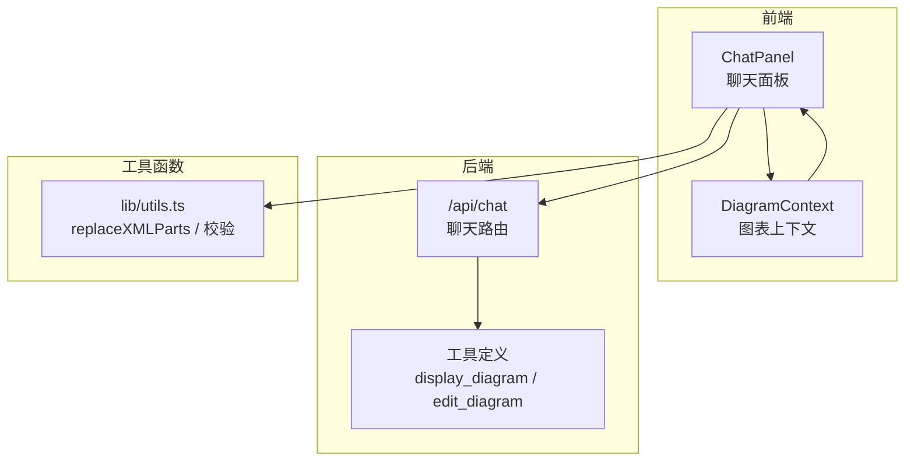
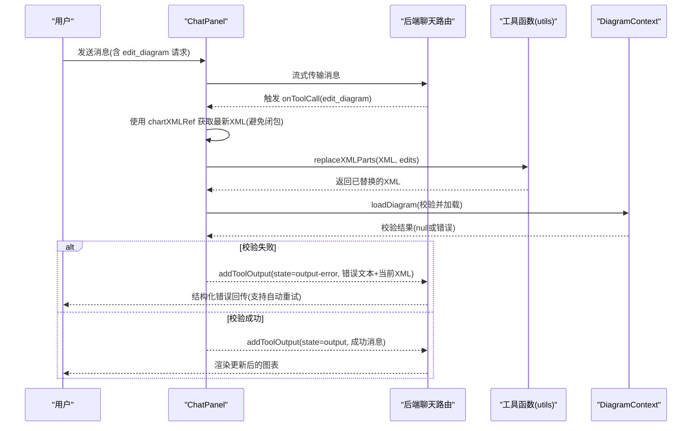
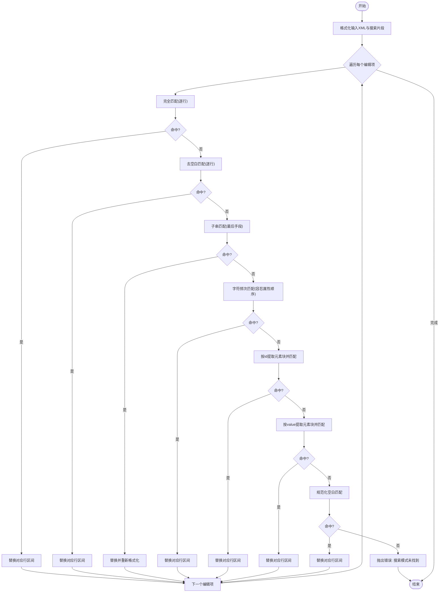
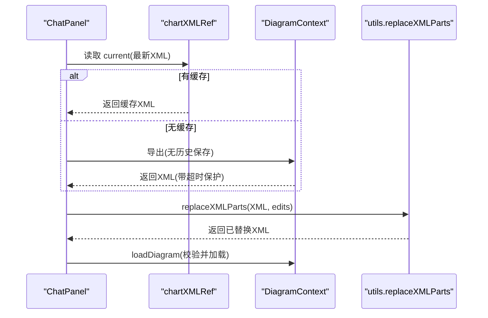
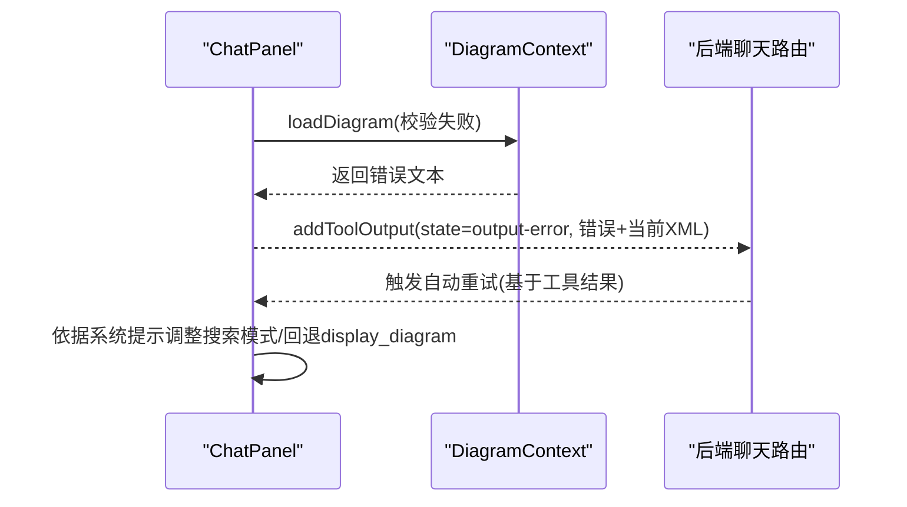
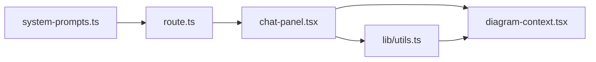

# 图表编辑

<cite>
**本文引用的文件**
- [README.md](file://README.md)
- [route.ts](file://app/api/chat/route.ts)
- [system-prompts.ts](file://lib/system-prompts.ts)
- [utils.ts](file://lib/utils.ts)
- [chat-panel.tsx](file://components/chat-panel.tsx)
- [diagram-context.tsx](file://contexts/diagram-context.tsx)
</cite>

## 目录
1. [简介](#简介)
2. [项目结构](#项目结构)
3. [核心组件](#核心组件)
4. [架构总览](#架构总览)
5. [详细组件分析](#详细组件分析)
6. [依赖分析](#依赖分析)
7. [性能考量](#性能考量)
8. [故障排查指南](#故障排查指南)
9. [结论](#结论)
10. [附录](#附录)

## 简介
本文件聚焦“自然语言驱动的图表编辑”能力，围绕 edit_diagram 工具的内部机制展开，重点解释：
- 如何利用 search 和 replace 操作对现有 XML 进行精准修改；
- replaceXMLParts 工具函数的实现逻辑与容错策略；
- 在编辑过程中如何通过 chartXMLRef 引用确保获取最新图表状态，避免闭包问题；
- 当编辑导致 XML 无效时的错误反馈机制，以及如何向 AI 返回结构化错误信息以支持自动重试；
- 典型使用场景：批量修改形状属性、调整连接关系；
- 最佳实践与常见失败排查（如 ID 冲突）。

## 项目结构
该项目基于 Next.js 构建，前端通过聊天面板与 AI 交互，后端通过流式响应将工具调用结果回传到前端。图表编辑的关键流程如下：
- 前端聊天面板负责收集用户输入、触发工具调用，并在回调中执行 edit_diagram；
- 后端 API 定义了 edit_diagram 工具的输入规范与行为约束；
- 工具函数 replaceXMLParts 负责在内存中对 XML 文本进行精确替换；
- 图表上下文负责加载与校验 XML，保证渲染安全。

图示来源
- [route.ts](file://app/api/chat/route.ts#L393-L471)
- [chat-panel.tsx](file://components/chat-panel.tsx#L141-L239)
- [diagram-context.tsx](file://contexts/diagram-context.tsx#L57-L99)
- [utils.ts](file://lib/utils.ts#L240-L506)

章节来源
- [README.md](file://README.md#L71-L80)
- [route.ts](file://app/api/chat/route.ts#L393-L471)
- [chat-panel.tsx](file://components/chat-panel.tsx#L141-L239)
- [diagram-context.tsx](file://contexts/diagram-context.tsx#L57-L99)
- [utils.ts](file://lib/utils.ts#L240-L506)

## 核心组件
- edit_diagram 工具：由后端系统提示与工具定义共同约束，要求从“当前图表 XML”中精确复制搜索模式，保持属性顺序与缩进一致；支持数组形式的多处替换，且每次只匹配第一个出现位置。
- replaceXMLParts：在内存中对 XML 文本进行逐条替换，包含多种匹配策略（完全匹配、去空白匹配、子串匹配、字符频次匹配、按 id/value 提取元素块、规范化空白），并在未找到时抛出明确错误。
- chartXMLRef：前端通过 useRef 缓存最新图表 XML，避免回调中的闭包陷阱；在 edit_diagram 执行前优先使用缓存，必要时再导出。
- validateMxCellStructure：在加载新 XML 前进行结构校验，覆盖重复 ID、嵌套 mxCell、孤儿节点、无效父引用、边连接异常、孤立 mxPoint 等常见问题。

章节来源
- [system-prompts.ts](file://lib/system-prompts.ts#L80-L110)
- [route.ts](file://app/api/chat/route.ts#L437-L466)
- [chat-panel.tsx](file://components/chat-panel.tsx#L181-L239)
- [utils.ts](file://lib/utils.ts#L240-L506)
- [utils.ts](file://lib/utils.ts#L508-L643)
- [diagram-context.tsx](file://contexts/diagram-context.tsx#L76-L99)

## 架构总览
下图展示 edit_diagram 的端到端流程：用户通过聊天面板发起请求，后端解析工具调用并调用前端回调；前端从缓存或导出获取最新 XML，调用 replaceXMLParts 执行替换，再通过 loadDiagram 加载并校验，若失败则将结构化错误回传给模型以触发自动重试。

图示来源
- [route.ts](file://app/api/chat/route.ts#L393-L471)
- [chat-panel.tsx](file://components/chat-panel.tsx#L176-L239)
- [utils.ts](file://lib/utils.ts#L240-L506)
- [diagram-context.tsx](file://contexts/diagram-context.tsx#L76-L99)

## 详细组件分析

### edit_diagram 工具与系统提示
- 工具定义与约束：
  - 输入为 edits 数组，每项包含 search 与 replace 字段；
  - 搜索模式必须从“当前图表 XML”中精确复制，属性顺序与缩进必须一致；
  - 建议每次只做少量改动，必要时拆分为多次小编辑；
  - 若首次未命中，可按“检查属性顺序→扩展上下文→仅匹配 id 前缀→最终回退 display_diagram”的策略重试。
- 系统提示强调：
  - 严格 JSON 转义规则（字符串内双引号需转义）；
  - 避免在 edit_diagram 中生成注释，因为 draw.io 会剥离注释，破坏匹配；
  - 边连接规则（避免路径重叠、双向连接使用相反侧、显式设置出口/入口坐标等）。

章节来源
- [route.ts](file://app/api/chat/route.ts#L437-L466)
- [system-prompts.ts](file://lib/system-prompts.ts#L80-L110)
- [system-prompts.ts](file://lib/system-prompts.ts#L174-L239)
- [system-prompts.ts](file://lib/system-prompts.ts#L228-L239)

### replaceXMLParts 实现逻辑与容错策略
该函数对 XML 文本进行逐条替换，采用多阶段匹配策略，优先级如下：
1) 完全匹配：严格按行对比，要求换行与缩进一致；
2) 去空白匹配：忽略多余空白后的逐行比较；
3) 子串匹配：作为最后手段，在整段文本中查找子串并替换；
4) 字符频次匹配：按字符频率判断两行是否语义相同（用于容忍属性顺序变化）；
5) 按 id 提取元素块：从 search 中提取 id，定位完整元素块（自闭合或带子节点）；
6) 按 value 提取元素块：从 search 中提取 value 属性，定位对应元素块；
7) 规范化空白匹配：将候选与搜索都折叠空白后比较。

若所有策略均未命中，则抛出明确错误，提示搜索模式不存在于当前结构中，便于模型调整。

图示来源
- [utils.ts](file://lib/utils.ts#L240-L506)

章节来源
- [utils.ts](file://lib/utils.ts#L240-L506)

### chartXMLRef 引用与闭包问题规避
- 前端通过 useRef 维护 chartXMLRef，实时同步最新图表 XML；
- 在 onToolCall(edit_diagram) 回调中，优先读取 chartXMLRef.current，避免因异步导出或 React 状态更新导致的闭包问题；
- 若缓存为空，再回退到导出流程（handleExportWithoutHistory），并设置超时保护；
- 在提交消息前也会同步更新 chartXMLRef，确保后续工具调用拿到最新状态。

图示来源
- [chat-panel.tsx](file://components/chat-panel.tsx#L181-L239)
- [diagram-context.tsx](file://contexts/diagram-context.tsx#L57-L99)
- [utils.ts](file://lib/utils.ts#L240-L506)

章节来源
- [chat-panel.tsx](file://components/chat-panel.tsx#L181-L239)
- [chat-panel.tsx](file://components/chat-panel.tsx#L449-L506)
- [diagram-context.tsx](file://contexts/diagram-context.tsx#L57-L99)

### 错误反馈与自动重试机制
- 当 replaceXMLParts 无法匹配或 loadDiagram 校验失败时，前端会构造结构化错误文本，包含：
  - 明确的错误类型与原因；
  - 当前图表 XML（便于模型诊断）；
  - 可选的修复建议（如“检查属性顺序/扩展上下文/仅匹配 id 前缀/回退 display_diagram”）。
- 后端通过 addToolOutput(state="output-error") 将错误回传给模型，配合 sendAutomaticallyWhen 使模型在收到错误后自动重试。

图示来源
- [chat-panel.tsx](file://components/chat-panel.tsx#L156-L175)
- [chat-panel.tsx](file://components/chat-panel.tsx#L210-L239)
- [route.ts](file://app/api/chat/route.ts#L393-L471)

章节来源
- [chat-panel.tsx](file://components/chat-panel.tsx#L156-L175)
- [chat-panel.tsx](file://components/chat-panel.tsx#L210-L239)
- [system-prompts.ts](file://lib/system-prompts.ts#L233-L239)

### 使用场景与最佳实践
- 批量修改形状属性：
  - 为每个形状构造独立的编辑项，确保 search 包含完整的 mxCell 与 mxGeometry 行；
  - 优先使用 id 精确定位，避免模糊匹配导致多处误改；
  - 将大改动拆分为多次小编辑，降低失败概率。
- 调整连接关系：
  - 修改 edge 的 source/target 时，确保目标 id 存在于当前 XML；
  - 遵循系统提示的边路由规则（避免路径重叠、双向连接使用相反侧、显式设置出口/入口坐标）。
- 最佳实践：
  - 严格遵循“从当前图表 XML 复制搜索模式”的原则，保持属性顺序与缩进；
  - 对 JSON 输出进行严格转义，字符串内的双引号必须转义；
  - 使用唯一标识符（id 或 value）作为搜索锚点，提升稳定性；
  - 遇到“模式未找到”，按系统提示逐步调整：检查属性顺序→扩展上下文→仅匹配 id 前缀→最终回退 display_diagram。

章节来源
- [system-prompts.ts](file://lib/system-prompts.ts#L80-L110)
- [system-prompts.ts](file://lib/system-prompts.ts#L174-L239)
- [system-prompts.ts](file://lib/system-prompts.ts#L228-L239)

## 依赖分析
- 工具定义依赖：
  - 后端工具定义约束 edit_diagram 的输入格式与行为；
  - 系统提示提供搜索模式构造规则与错误恢复策略。
- 函数依赖：
  - replaceXMLParts 依赖格式化工具与多策略匹配；
  - loadDiagram 依赖 validateMxCellStructure 进行结构校验。
- 前后端协作：
  - 前端通过 onToolCall 接收工具调用，使用 chartXMLRef 保障数据新鲜度；
  - 后端通过 addToolOutput 返回结构化输出，支持自动重试。

图示来源
- [system-prompts.ts](file://lib/system-prompts.ts#L80-L110)
- [route.ts](file://app/api/chat/route.ts#L393-L471)
- [chat-panel.tsx](file://components/chat-panel.tsx#L176-L239)
- [utils.ts](file://lib/utils.ts#L240-L506)
- [diagram-context.tsx](file://contexts/diagram-context.tsx#L76-L99)

章节来源
- [system-prompts.ts](file://lib/system-prompts.ts#L80-L110)
- [route.ts](file://app/api/chat/route.ts#L393-L471)
- [chat-panel.tsx](file://components/chat-panel.tsx#L176-L239)
- [utils.ts](file://lib/utils.ts#L240-L506)
- [diagram-context.tsx](file://contexts/diagram-context.tsx#L76-L99)

## 性能考量
- 内存替换优于 DOM 解析：replaceXMLParts 在文本层面进行替换，避免频繁解析/序列化带来的开销；
- 多策略匹配：先尝试高精度匹配（完全匹配、去空白匹配），再逐步放宽，减少不必要的复杂计算；
- 格式化统一：在替换前后统一格式化，有助于稳定匹配与减少差异；
- 导出超时控制：前端对导出设置超时，避免长时间阻塞；
- 自动重试：后端启用 sendAutomaticallyWhen，结合结构化错误，提高成功率。

[本节为通用指导，不直接分析具体文件]

## 故障排查指南
- 模式未找到（pattern not found）
  - 检查属性顺序与缩进是否与当前 XML 完全一致；
  - 扩展上下文，增加 1-2 行周围内容；
  - 仅匹配 id 前缀 + 完整替换；
  - 三次尝试后回退到 display_diagram。
- 重复 ID
  - 校验报错：发现重复 cell ID；
  - 修复：为冲突元素分配新的唯一 ID。
- 嵌套 mxCell
  - 校验报错：所有 mxCell 必须是 <root> 的直接子节点；
  - 修复：移除嵌套层级，确保结构正确。
- 孤儿节点/无效父引用
  - 校验报错：非根节点缺少 parent 或 parent 指向不存在的 ID；
  - 修复：补全 parent 或修正为存在的父 ID。
- 边连接异常
  - 校验报错：边的 source/target 指向不存在的 ID；
  - 修复：确保 source/target 指向现有元素。
- 孤立 mxPoint
  - 校验报错：mxPoint 既无 as 属性也未位于 <Array as="points">；
  - 修复：为 mxPoint 添加 as 属性或将点放入 points 数组。

章节来源
- [system-prompts.ts](file://lib/system-prompts.ts#L233-L239)
- [utils.ts](file://lib/utils.ts#L508-L643)

## 结论
本项目通过“系统提示约束 + 工具函数实现 + 前后端协同”的方式，实现了自然语言驱动的图表编辑能力。edit_diagram 以精确的搜索/替换为核心，配合多策略匹配与结构化错误反馈，能够在保证 XML 结构安全的前提下高效完成细粒度修改。通过 chartXMLRef 与导出超时控制，有效避免了闭包与异步延迟带来的问题。遵循系统提示的最佳实践与错误恢复策略，可显著提升编辑成功率与用户体验。

[本节为总结性内容，不直接分析具体文件]

## 附录
- 关键实现路径参考：
  - 工具定义与系统提示：[route.ts](file://app/api/chat/route.ts#L437-L466)，[system-prompts.ts](file://lib/system-prompts.ts#L80-L110)
  - 替换函数实现：[utils.ts](file://lib/utils.ts#L240-L506)
  - 校验函数实现：[utils.ts](file://lib/utils.ts#L508-L643)
  - 前端回调与引用：[chat-panel.tsx](file://components/chat-panel.tsx#L176-L239)，[diagram-context.tsx](file://contexts/diagram-context.tsx#L57-L99)