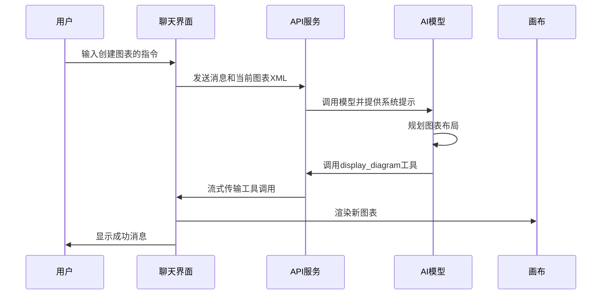
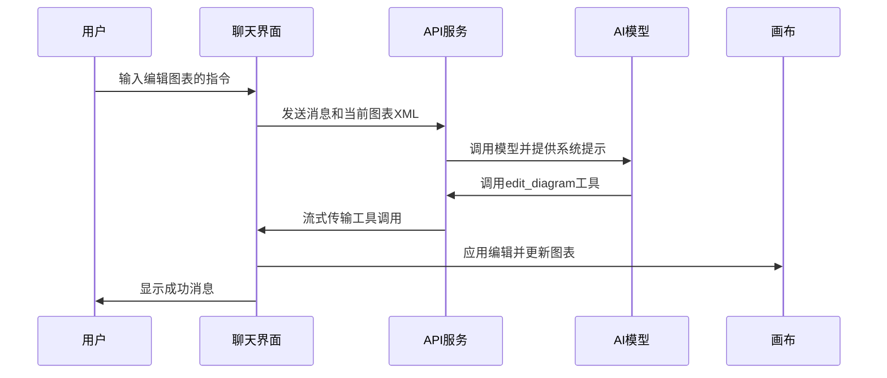
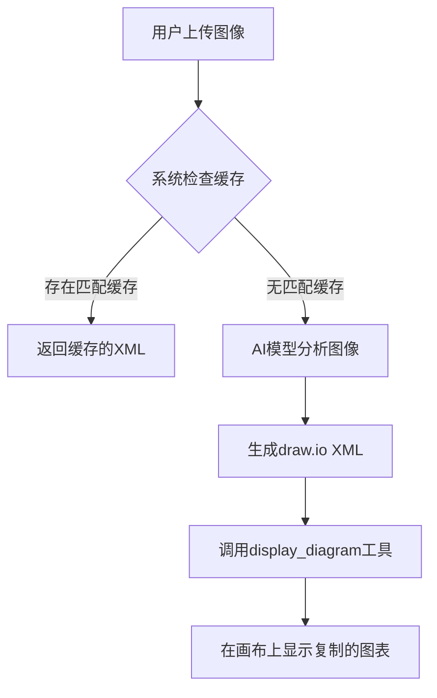
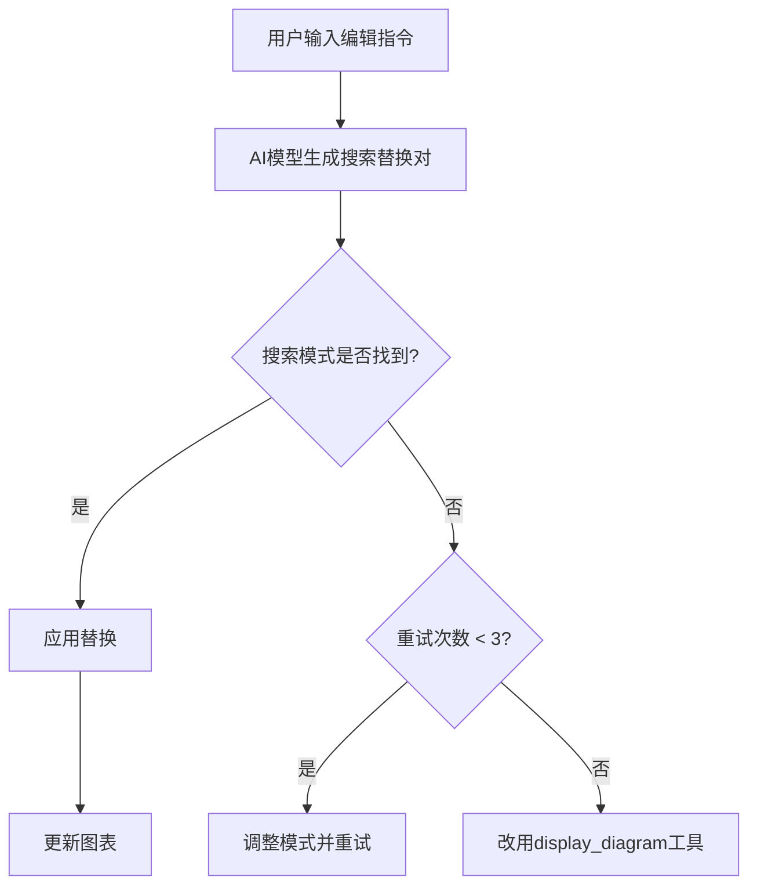
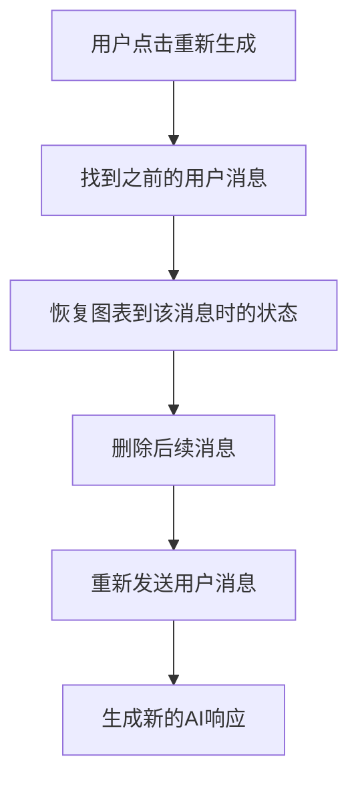
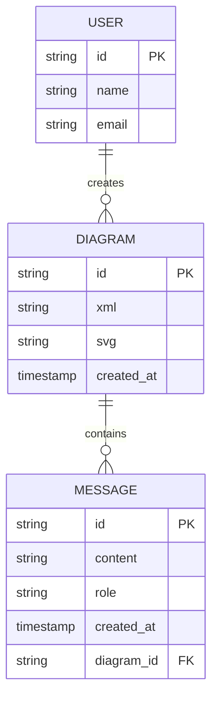

# 核心功能

<cite>
**本文档引用的文件**   
- [app/page.tsx](file://app/page.tsx)
- [app/api/chat/route.ts](file://app/api/chat/route.ts)
- [contexts/diagram-context.tsx](file://contexts/diagram-context.tsx)
- [components/chat-panel.tsx](file://components/chat-panel.tsx)
- [components/chat-input.tsx](file://components/chat-input.tsx)
- [lib/system-prompts.ts](file://lib/system-prompts.ts)
- [lib/utils.ts](file://lib/utils.ts)
- [lib/ai-providers.ts](file://lib/ai-providers.ts)
- [components/chat-message-display.tsx](file://components/chat-message-display.tsx)
- [components/history-dialog.tsx](file://components/history-dialog.tsx)
- [lib/cached-responses.ts](file://lib/cached-responses.ts)
- [lib/langfuse.ts](file://lib/langfuse.ts)
- [app/api/config/route.ts](file://app/api/config/route.ts)
- [app/api/log-save/route.ts](file://app/api/log-save/route.ts)
</cite>

## 目录
1. [LLM驱动的图表创建](#llm驱动的图表创建)
2. [AI工具调用机制](#ai工具调用机制)
3. [图像为基础的图表复制](#图像为基础的图表复制)
4. [自然语言编辑](#自然语言编辑)
5. [交互式聊天界面](#交互式聊天界面)
6. [高级功能实现](#高级功能实现)
7. [使用场景与最佳实践](#使用场景与最佳实践)

## LLM驱动的图表创建

该应用的核心功能是利用大型语言模型（LLM）通过自然语言指令创建和操作图表。系统通过精心设计的系统提示词引导AI模型生成符合draw.io格式的XML代码，从而实现图表的可视化。

当用户输入创建图表的请求时，AI模型会首先在文本中规划图表的布局和结构，以避免元素重叠或连接线交叉。随后，模型调用`display_diagram`工具，将完整的draw.io XML代码作为参数传递，从而在画布上生成新的图表。此过程确保了图表的结构完整性和视觉清晰度。

系统支持多种AI提供商，包括AWS Bedrock、OpenAI、Anthropic、Google AI等，用户可以通过环境变量配置首选的AI模型。推荐使用Claude Sonnet 4.5、GPT-4o、Gemini 2.0或DeepSeek V3/R1等具备强大长文本生成能力的模型，以确保能够生成符合严格格式要求的draw.io XML。

**Section sources**
- [app/api/chat/route.ts](file://app/api/chat/route.ts#L215-L240)
- [lib/system-prompts.ts](file://lib/system-prompts.ts#L8-L14)
- [lib/ai-providers.ts](file://lib/ai-providers.ts#L112-L285)

## AI工具调用机制

### display_diagram 工具

`display_diagram`工具用于在draw.io画布上显示新的图表。当需要从头创建图表或进行重大结构调整时，应使用此工具。该工具接收一个XML字符串作为输入，该字符串必须遵循严格的验证规则：

1. 所有`mxCell`元素必须是`<root>`的直接子元素，不能嵌套
2. 每个`mxCell`必须具有唯一的`id`属性
3. 每个`mxCell`（除了`id="0"`）必须具有有效的`parent`属性
4. 连接线的`source`和`target`属性必须引用存在的单元格ID
5. 必须对值中的特殊字符进行转义：`<`转为`&lt;`，`>`转为`&gt;`，`&`转为`&amp;`，`"`转为`&quot;`
6. XML必须以`<mxCell id="0"/>`和`<mxCell id="1" parent="0"/>`开始

**Diagram sources**
- [app/api/chat/route.ts](file://app/api/chat/route.ts#L395-L430)
- [lib/system-prompts.ts](file://lib/system-prompts.ts#L143-L150)
- [components/chat-panel.tsx](file://components/chat-panel.tsx#L142-L175)

### edit_diagram 工具

`edit_diagram`工具用于对现有图表进行特定部分的编辑。当需要进行小的修改，如添加/删除元素、更改标签或调整属性时，应使用此工具。该工具接收一个搜索替换对数组作为输入，每个对包含`search`和`replace`字段。

使用`edit_diagram`工具的关键是精确匹配。搜索模式必须与当前图表XML中的内容完全一致，包括属性顺序和空白字符。系统提供了多种匹配策略，包括精确匹配、行修剪匹配、子字符串匹配、字符频率匹配和基于ID的匹配，以确保即使在属性顺序不同的情况下也能成功匹配。

**Diagram sources**
- [app/api/chat/route.ts](file://app/api/chat/route.ts#L437-L465)
- [lib/system-prompts.ts](file://lib/system-prompts.ts#L80-L94)
- [components/chat-panel.tsx](file://components/chat-panel.tsx#L176-L239)

## 图像为基础的图表复制

该功能允许用户上传现有的图表或图像，AI模型会分析并自动复制和增强这些图像。用户可以通过聊天界面底部的回形针图标上传图像，系统支持多种图像格式，但单个文件大小不得超过2MB，最多可上传5个文件。

当用户上传图像并请求复制时，AI模型会根据图像内容生成相应的draw.io XML代码。系统会优先使用缓存的响应，如果存在与用户输入文本和图像上传状态匹配的缓存响应，则直接返回缓存的XML，从而提高响应速度和效率。

**Diagram sources**
- [app/api/chat/route.ts](file://app/api/chat/route.ts#L194-L212)
- [components/chat-input.tsx](file://components/chat-input.tsx#L185-L216)
- [lib/cached-responses.ts](file://lib/cached-responses.ts#L551-L561)

## 自然语言编辑

自然语言编辑功能允许用户通过简单的文本指令修改图表。`edit_diagram`工具通过搜索替换操作实现这一功能。当用户请求修改图表时，AI模型会生成一个或多个搜索替换对，每个对包含要查找的精确XML行和要替换的新内容。

编辑过程遵循以下最佳实践：
- 搜索模式必须唯一且精确，通常包括元素的`id`属性
- 保持编辑简洁，每次只修改必要的行
- 将大型更改分解为多个较小的编辑
- 如果模式未找到，最多重试3次，之后改用`display_diagram`工具

**Diagram sources**
- [lib/utils.ts](file://lib/utils.ts#L246-L505)
- [lib/system-prompts.ts](file://lib/system-prompts.ts#L174-L239)
- [components/chat-panel.tsx](file://components/chat-panel.tsx#L176-L239)

## 交互式聊天界面

### 用户交互模式

交互式聊天界面提供了丰富的用户交互功能。用户可以通过聊天输入框发送文本指令，通过回形钉图标上传图像，通过历史记录图标查看和恢复之前的图表版本，以及通过设置图标配置AI提供商。

聊天界面支持消息持久化和历史记录管理。所有消息、图表XML快照和会话ID都会保存在浏览器的`localStorage`中，确保用户在刷新页面后仍能恢复之前的会话状态。当用户关闭页面时，系统会自动保存当前状态。

### 重新生成机制

聊天界面提供了重新生成功能，允许用户重新生成AI的响应。当用户点击某个AI消息的重新生成按钮时，系统会：
1. 找到该消息之前的用户消息
2. 恢复到该用户消息时的图表状态
3. 删除该用户消息之后的所有消息
4. 重新发送用户消息以生成新的响应

**Diagram sources**
- [components/chat-panel.tsx](file://components/chat-panel.tsx#L518-L585)
- [components/chat-input.tsx](file://components/chat-input.tsx#L479-L498)
- [contexts/diagram-context.tsx](file://contexts/diagram-context.tsx#L301-L367)

## 高级功能实现

### AWS架构图支持

系统特别支持生成AWS架构图。当用户请求创建AWS架构图时，AI模型会使用AWS 2025图标来生成图表。系统提示词中明确指出："Note that when you need to generate diagram about aws architecture, use **AWS 2025 icons**." 这确保了生成的图表符合AWS的视觉规范。

### 动画连接器

系统支持创建动态和动画连接器。用户可以通过在连接线样式中添加`flowAnimation=1`来创建动画效果。例如，在变压器架构图示例中，所有连接线都设置了`flowAnimation=1`，从而实现了流动的动画效果。

**Diagram sources**
- [lib/system-prompts.ts](file://lib/system-prompts.ts#L77-L78)
- [lib/cached-responses.ts](file://lib/cached-responses.ts#L127-L201)
- [app/api/chat/route.ts](file://app/api/chat/route.ts#L332-L335)

## 使用场景与最佳实践

### 使用场景

1. **快速原型设计**：产品经理可以通过自然语言快速创建系统架构图，无需学习复杂的绘图工具。
2. **文档生成**：开发者可以将代码结构描述为文本，由AI生成相应的UML图或流程图。
3. **教学演示**：教师可以描述复杂的概念，AI生成相应的示意图辅助教学。
4. **会议记录**：会议中讨论的流程或架构可以实时转化为可视化图表。

### 最佳实践

1. **明确指令**：提供清晰、具体的指令，包括图表类型、元素和布局要求。
2. **分步修改**：对于复杂的修改，建议分步进行，每次只修改一个方面。
3. **利用历史记录**：在进行重大修改前，检查历史记录以确保可以恢复到之前的状态。
4. **选择合适的模型**：对于复杂的图表，选择支持长文本生成的高级模型。
5. **使用缓存**：对于常见的图表请求，系统会自动使用缓存响应，提高效率。

**Section sources**
- [README.md](file://README.md#L22-L68)
- [lib/system-prompts.ts](file://lib/system-prompts.ts#L12-L14)
- [app/api/chat/route.ts](file://app/api/chat/route.ts#L194-L212)