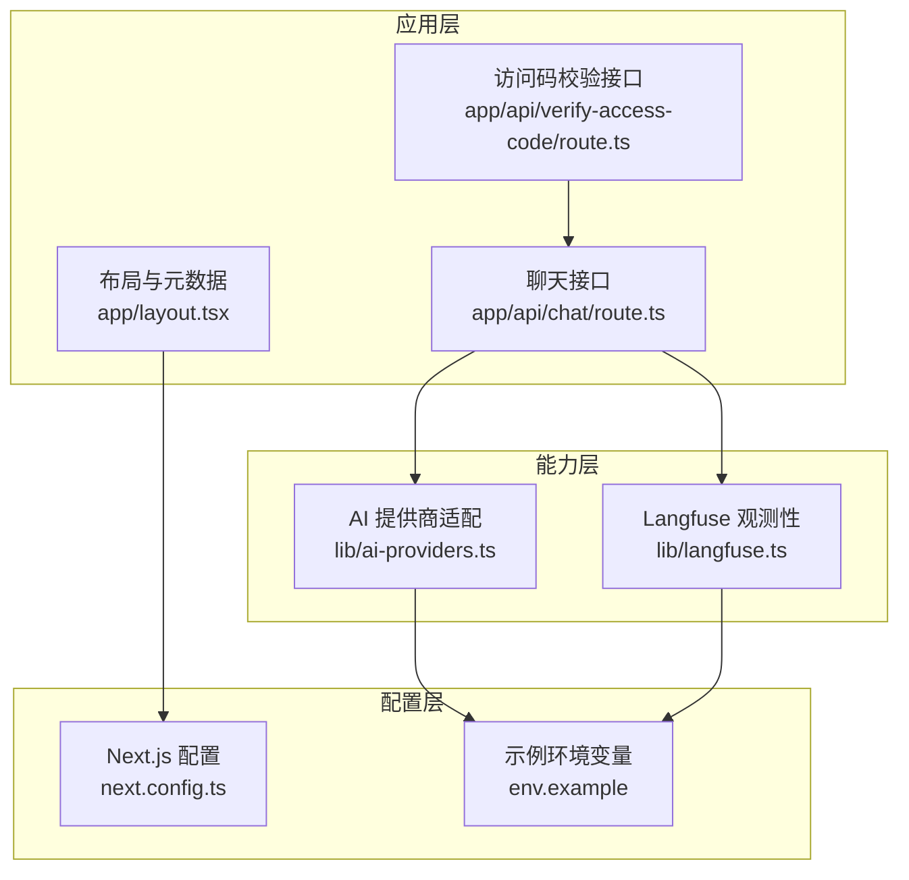
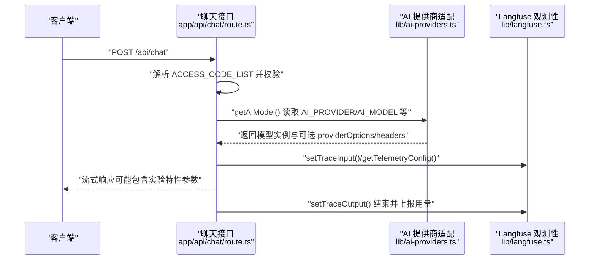
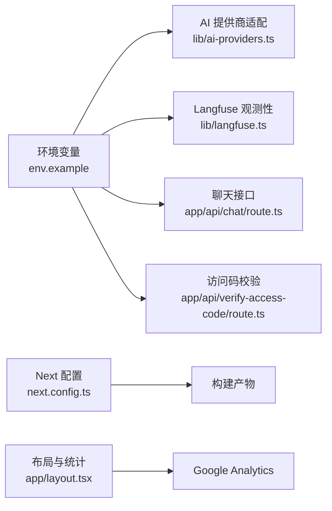

# 环境配置

<cite>
**本文引用的文件**
- [env.example](file://env.example)
- [next.config.ts](file://next.config.ts)
- [lib/ai-providers.ts](file://lib/ai-providers.ts)
- [lib/langfuse.ts](file://lib/langfuse.ts)
- [app/api/chat/route.ts](file://app/api/chat/route.ts)
- [app/api/verify-access-code/route.ts](file://app/api/verify-access-code/route.ts)
- [app/layout.tsx](file://app/layout.tsx)
- [package.json](file://package.json)
</cite>

## 目录
1. [简介](#简介)
2. [项目结构](#项目结构)
3. [核心组件](#核心组件)
4. [架构总览](#架构总览)
5. [详细组件分析](#详细组件分析)
6. [依赖分析](#依赖分析)
7. [性能考虑](#性能考虑)
8. [故障排查指南](#故障排查指南)
9. [结论](#结论)
10. [附录](#附录)

## 简介
本文件面向运维与开发人员，提供基于仓库内 env.example 的环境变量创建与配置指南，解释各关键变量的作用与使用方式；说明 next.config.ts 中与环境相关的配置项；覆盖多环境（开发、测试、生产）配置策略与安全最佳实践；并提供配置验证步骤、常见错误与解决方案，帮助确保应用正确读取环境变量并稳定运行。

## 项目结构
本项目为 Next.js 应用，环境变量主要在以下位置被读取：
- 服务端 API 路由：用于 AI 模型选择、鉴权与链路追踪
- 配置文件：next.config.ts 中的输出打包选项
- 布局与第三方统计：layout.tsx 中对 NEXT_PUBLIC 前缀变量的使用
- 提供商适配层：ai-providers.ts 根据环境变量自动选择与初始化模型
- 观测性：langfuse.ts 读取 Langfuse 公私钥与基础地址

图表来源
- [app/layout.tsx](file://app/layout.tsx#L1-L128)
- [app/api/chat/route.ts](file://app/api/chat/route.ts#L1-L495)
- [app/api/verify-access-code/route.ts](file://app/api/verify-access-code/route.ts#L1-L33)
- [next.config.ts](file://next.config.ts#L1-L9)
- [lib/ai-providers.ts](file://lib/ai-providers.ts#L1-L286)
- [lib/langfuse.ts](file://lib/langfuse.ts#L1-L108)
- [env.example](file://env.example#L1-L63)

章节来源
- [next.config.ts](file://next.config.ts#L1-L9)
- [env.example](file://env.example#L1-L63)

## 核心组件
- 环境变量定义与用途
  - AI 提供商与模型：AI_PROVIDER、AI_MODEL
  - 各提供商密钥与可选自定义端点：OPENAI_API_KEY、OPENAI_BASE_URL、ANTHROPIC_API_KEY、GOOGLE_GENERATIVE_AI_API_KEY、AZURE_API_KEY、AZURE_BASE_URL、OLLAMA_BASE_URL、OPENROUTER_API_KEY、OPENROUTER_BASE_URL、DEEPSEEK_API_KEY、DEEPSEEK_BASE_URL、SILICONFLOW_API_KEY、SILICONFLOW_BASE_URL
  - Langfuse 观测性：LANGFUSE_PUBLIC_KEY、LANGFUSE_SECRET_KEY、LANGFUSE_BASEURL
  - 温度系数：TEMPERATURE
  - 访问控制：ACCESS_CODE_LIST
- Next.js 配置
  - 输出模式：output: "standalone"
- 第三方统计
  - NEXT_PUBLIC_GA_ID：用于前端注入 Google Analytics

章节来源
- [env.example](file://env.example#L1-L63)
- [next.config.ts](file://next.config.ts#L1-L9)
- [app/layout.tsx](file://app/layout.tsx#L1-L128)

## 架构总览
下图展示环境变量在请求链路中的读取与使用关系，以及与观测性系统的集成。

图表来源
- [app/api/chat/route.ts](file://app/api/chat/route.ts#L1-L495)
- [lib/ai-providers.ts](file://lib/ai-providers.ts#L1-L286)
- [lib/langfuse.ts](file://lib/langfuse.ts#L1-L108)

## 详细组件分析

### 环境变量清单与作用说明
- AI_PROVIDER
  - 作用：指定使用的 AI 提供商（bedrock、openai、anthropic、google、azure、ollama、openrouter、deepseek、siliconflow）
  - 读取位置：AI 选择逻辑与自动检测
- AI_MODEL
  - 作用：指定具体模型 ID 或名称
  - 读取位置：AI 初始化流程
- 各提供商密钥与可选自定义端点
  - OPENAI_API_KEY / OPENAI_BASE_URL
  - ANTHROPIC_API_KEY / ANTHROPIC_BASE_URL
  - GOOGLE_GENERATIVE_AI_API_KEY / GOOGLE_BASE_URL
  - AZURE_API_KEY / AZURE_BASE_URL
  - OLLAMA_BASE_URL
  - OPENROUTER_API_KEY / OPENROUTER_BASE_URL
  - DEEPSEEK_API_KEY / DEEPSEEK_BASE_URL
  - SILICONFLOW_API_KEY / SILICONFLOW_BASE_URL
  - 读取位置：对应提供商初始化逻辑
- Langfuse 观测性
  - LANGFUSE_PUBLIC_KEY / LANGFUSE_SECRET_KEY / LANGFUSE_BASEURL
  - 读取位置：Langfuse 客户端初始化与追踪配置
- 温度系数
  - TEMPERATURE
  - 读取位置：聊天接口温度参数注入
- 访问控制
  - ACCESS_CODE_LIST
  - 读取位置：聊天接口与访问码校验接口

章节来源
- [env.example](file://env.example#L1-L63)
- [lib/ai-providers.ts](file://lib/ai-providers.ts#L1-L286)
- [lib/langfuse.ts](file://lib/langfuse.ts#L1-L108)
- [app/api/chat/route.ts](file://app/api/chat/route.ts#L1-L495)
- [app/api/verify-access-code/route.ts](file://app/api/verify-access-code/route.ts#L1-L33)

### Next.js 配置与环境相关项
- output: "standalone"
  - 作用：构建输出为独立可部署包，便于容器化与边缘部署
  - 影响：减少运行时依赖，提升启动效率
- 实验性功能
  - 在聊天接口中，当启用 Langfuse 时会通过 experimental_telemetry 注入遥测配置
  - 在聊天接口中，存在 experimental_repairToolCall 实验性工具调用修复逻辑
  - 注意：这些 experimental_* 参数属于 Next.js/SDK 的实验特性，需关注版本兼容与稳定性

章节来源
- [next.config.ts](file://next.config.ts#L1-L9)
- [app/api/chat/route.ts](file://app/api/chat/route.ts#L1-L495)

### 多环境配置策略
- 开发环境
  - 使用本地 Ollama 或自建兼容端点（如 OLLAMA_BASE_URL），或设置 OPENAI_BASE_URL 指向代理
  - 可开启 Langfuse 进行本地调试，但注意避免上传敏感数据
- 测试环境
  - 使用最小化示例数据与固定 ACCESS_CODE_LIST
  - 保持 TEMPERATURE 明确值，便于结果可复现
- 生产环境
  - 严格区分密钥与端点，使用只读部署用户与最小权限
  - 对 Langfuse 基础地址按区域选择（如 EU/US）
  - 通过 NEXT_PUBLIC 前缀暴露仅前端使用的统计 ID（如 NEXT_PUBLIC_GA_ID）

章节来源
- [env.example](file://env.example#L1-L63)
- [app/layout.tsx](file://app/layout.tsx#L1-L128)

### 安全存储敏感信息最佳实践
- 不要将 .env 文件提交到版本库，使用 .gitignore 屏蔽
- 使用平台级密钥管理（如 Vercel、Amplify、Cloudflare Workers Secrets、AWS Secrets Manager）
- 为不同环境创建独立密钥，避免跨环境混用
- 最小权限原则：仅授予必要的 API 密钥与端点访问
- 定期轮换密钥，监控异常使用
- 对 Langfuse 私钥进行严格访问控制，避免泄露

章节来源
- [package.json](file://package.json#L1-L84)

### 配置验证步骤
- 必填项检查
  - AI_MODEL 是否设置
  - 至少配置一个提供商密钥，或显式设置 AI_PROVIDER
- 可选项检查
  - Langfuse：若设置 PUBLIC_KEY 则建议同时设置 SECRET_KEY 与 BASEURL
  - 温度：若设置 TEMPERATURE，确保其为有效数值
  - 访问码：若设置 ACCESS_CODE_LIST，确保接口请求携带正确的 x-access-code 头
- 运行时验证
  - 启动后访问 /api/verify-access-code，确认返回 valid: true
  - 发送一次 /api/chat 请求，观察是否成功返回流式响应
  - 若启用 Langfuse，可在控制台查看追踪日志

章节来源
- [lib/ai-providers.ts](file://lib/ai-providers.ts#L1-L286)
- [app/api/verify-access-code/route.ts](file://app/api/verify-access-code/route.ts#L1-L33)
- [app/api/chat/route.ts](file://app/api/chat/route.ts#L1-L495)
- [lib/langfuse.ts](file://lib/langfuse.ts#L1-L108)

### 常见配置错误与解决方案
- 变量未加载
  - 症状：报错提示缺少某提供商密钥或 AI_MODEL 未设置
  - 解决：确认 .env.local 已正确放置于项目根目录，且键名与 env.example 完全一致
- 类型错误
  - 症状：温度参数无法解析为数值
  - 解决：确保 TEMPERATURE 为数字字符串，或在代码中进行类型转换
- 权限问题
  - 症状：访问码校验失败或 401
  - 解决：核对 ACCESS_CODE_LIST 与请求头 x-access-code 是否匹配
- Langfuse 未生效
  - 症状：无追踪数据或报错
  - 解决：确认 PUBLIC_KEY/SECRET_KEY/BASEURL 均已设置，且网络可达

章节来源
- [app/api/chat/route.ts](file://app/api/chat/route.ts#L1-L495)
- [app/api/verify-access-code/route.ts](file://app/api/verify-access-code/route.ts#L1-L33)
- [lib/langfuse.ts](file://lib/langfuse.ts#L1-L108)

## 依赖分析
- 环境变量依赖关系
  - AI_PROVIDER/AI_MODEL 决定 getAIModel 返回的模型实例
  - 各提供商密钥决定对应 SDK 的初始化参数
  - Langfuse 公私钥决定观测性开关与追踪配置
  - ACCESS_CODE_LIST 决定访问控制策略
- 外部依赖
  - Next.js 构建输出模式
  - 第三方统计（Google Analytics）仅消费 NEXT_PUBLIC 前缀变量

图表来源
- [env.example](file://env.example#L1-L63)
- [lib/ai-providers.ts](file://lib/ai-providers.ts#L1-L286)
- [lib/langfuse.ts](file://lib/langfuse.ts#L1-L108)
- [app/api/chat/route.ts](file://app/api/chat/route.ts#L1-L495)
- [app/api/verify-access-code/route.ts](file://app/api/verify-access-code/route.ts#L1-L33)
- [next.config.ts](file://next.config.ts#L1-L9)
- [app/layout.tsx](file://app/layout.tsx#L1-L128)

## 性能考虑
- 构建输出模式：standalone 可减少运行时依赖，提升冷启动性能
- Langfuse 遥测：仅在配置完整时启用，避免不必要的开销
- 温度系数：合理设置可平衡生成质量与速度
- 访问码：在高并发场景下可作为第一道安全屏障

章节来源
- [next.config.ts](file://next.config.ts#L1-L9)
- [lib/langfuse.ts](file://lib/langfuse.ts#L1-L108)
- [app/api/chat/route.ts](file://app/api/chat/route.ts#L1-L495)

## 故障排查指南
- 确认 .env.local 文件存在且位于项目根目录
- 使用 /api/verify-access-code 接口验证 ACCESS_CODE_LIST
- 在聊天接口中添加日志，检查 AI_PROVIDER/AI_MODEL 与各提供商密钥是否被正确读取
- 若启用 Langfuse，检查 PUBLIC_KEY/SECRET_KEY/BASEURL 是否正确
- 关注实验性参数的兼容性与稳定性

章节来源
- [app/api/verify-access-code/route.ts](file://app/api/verify-access-code/route.ts#L1-L33)
- [app/api/chat/route.ts](file://app/api/chat/route.ts#L1-L495)
- [lib/langfuse.ts](file://lib/langfuse.ts#L1-L108)

## 结论
通过遵循本指南，您可以基于 env.example 正确创建并配置环境变量，结合 next.config.ts 的输出模式与实验性功能，在开发、测试、生产环境中实现安全、稳定的运行。建议在生产环境采用平台级密钥管理与最小权限原则，并定期验证配置的有效性与安全性。

## 附录
- 示例文件路径参考
  - 环境变量示例：env.example
  - Next.js 配置：next.config.ts
  - AI 提供商适配：lib/ai-providers.ts
  - Langfuse 观测性：lib/langfuse.ts
  - 聊天接口：app/api/chat/route.ts
  - 访问码校验接口：app/api/verify-access-code/route.ts
  - 布局与统计：app/layout.tsx
  - 依赖与脚本：package.json