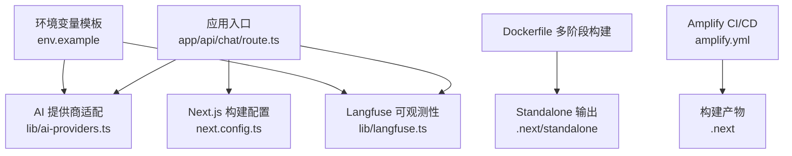
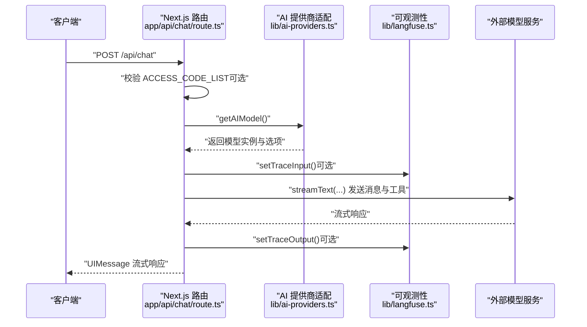
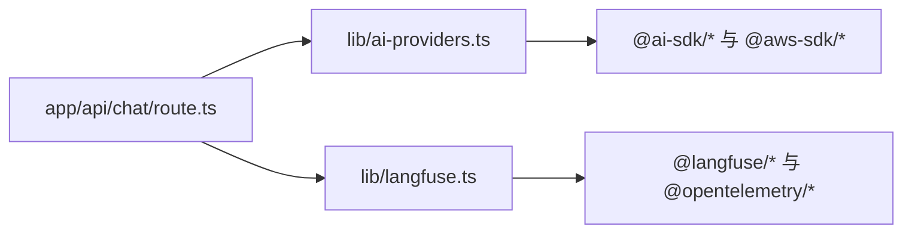

# 设置与部署

<cite>
**本文引用的文件**
- [env.example](file://env.example)
- [next.config.ts](file://next.config.ts)
- [amplify.yml](file://amplify.yml)
- [Dockerfile](file://Dockerfile)
- [package.json](file://package.json)
- [README.md](file://README.md)
- [lib/ai-providers.ts](file://lib/ai-providers.ts)
- [lib/langfuse.ts](file://lib/langfuse.ts)
- [docs/ai-providers.md](file://docs/ai-providers.md)
- [app/api/chat/route.ts](file://app/api/chat/route.ts)
</cite>

## 目录
1. [简介](#简介)
2. [项目结构](#项目结构)
3. [核心组件](#核心组件)
4. [架构总览](#架构总览)
5. [详细组件分析](#详细组件分析)
6. [依赖关系分析](#依赖关系分析)
7. [性能考虑](#性能考虑)
8. [故障排查指南](#故障排查指南)
9. [结论](#结论)
10. [附录](#附录)

## 简介
本文件面向运维与开发人员，提供从环境变量配置到多平台部署的完整指南。内容覆盖：
- 如何基于 env.example 创建本地与生产环境变量文件，并逐项解释关键变量（如 ACCESS_CODE_LIST、LANGFUSE_SECRET_KEY 等）。
- Docker 镜像构建与容器运行的完整流程。
- next.config.ts 的配置要点与对部署的影响。
- amplify.yml 中 CI/CD 流水线的实现细节与注意事项。
- Vercel、AWS Amplify 等平台的部署步骤与环境变量注入方式。
- 开发环境搭建：依赖安装、本地启动与常见问题定位。
- 常见部署问题与解决方案（如环境变量未加载、Docker 构建失败等）。

## 项目结构
该仓库采用 Next.js App Router 结构，核心目录与文件如下：
- app/api/chat/route.ts：聊天接口，负责访问控制、模型选择、流式响应与可观测性埋点。
- lib/ai-providers.ts：多模型提供商适配与环境变量校验。
- lib/langfuse.ts：Langfuse 可观测性集成（可选）。
- env.example：示例环境变量模板。
- next.config.ts：Next.js 构建输出模式为 standalone。
- amplify.yml：AWS Amplify 前端构建脚本。
- Dockerfile：多阶段构建，产物为 standalone 模式。
- package.json：脚本与依赖定义。
- docs/ai-providers.md：各模型提供商的配置说明。

图表来源
- [app/api/chat/route.ts](file://app/api/chat/route.ts#L1-L495)
- [lib/ai-providers.ts](file://lib/ai-providers.ts#L1-L286)
- [lib/langfuse.ts](file://lib/langfuse.ts#L1-L108)
- [next.config.ts](file://next.config.ts#L1-L9)
- [Dockerfile](file://Dockerfile#L1-L56)
- [amplify.yml](file://amplify.yml#L1-L23)
- [env.example](file://env.example#L1-L63)

章节来源
- [README.md](file://README.md#L101-L173)
- [package.json](file://package.json#L1-L84)

## 核心组件
- 环境变量系统
  - 通过 env.example 提供默认键名与注释，实际使用时复制为 .env.local 或在平台注入。
  - 关键变量包括：AI_PROVIDER、AI_MODEL、各提供商 API Key、温度参数、访问控制码列表、Langfuse 公钥/密钥与基础地址等。
- AI 提供商适配
  - 自动检测单一提供商配置；多配置时需显式指定 AI_PROVIDER。
  - 支持 Bedrock、OpenAI、Anthropic、Google、Azure、Ollama、OpenRouter、DeepSeek、SiliconFlow。
- Langfuse 可观测性
  - 当配置了公钥/密钥时启用，自动记录输入、输出与用量指标。
- 构建与运行
  - next.config.ts 使用 standalone 输出，Dockerfile 多阶段构建并以 node server.js 启动。
  - Amplify 通过环境变量写入 .env.production 并执行构建。

章节来源
- [env.example](file://env.example#L1-L63)
- [lib/ai-providers.ts](file://lib/ai-providers.ts#L1-L286)
- [lib/langfuse.ts](file://lib/langfuse.ts#L1-L108)
- [next.config.ts](file://next.config.ts#L1-L9)
- [Dockerfile](file://Dockerfile#L1-L56)
- [amplify.yml](file://amplify.yml#L1-L23)

## 架构总览
下图展示从客户端请求到 AI 模型调用与可观测性记录的整体流程，以及 Docker/AWS Amplify 的部署路径。

图表来源
- [app/api/chat/route.ts](file://app/api/chat/route.ts#L144-L495)
- [lib/ai-providers.ts](file://lib/ai-providers.ts#L112-L286)
- [lib/langfuse.ts](file://lib/langfuse.ts#L1-L108)

## 详细组件分析

### 环境变量与配置详解
- AI_PROVIDER
  - 选择使用的模型提供商（bedrock、openai、anthropic、google、azure、ollama、openrouter、deepseek、siliconflow）。
  - 若仅配置一个提供商的 API Key，系统会自动检测；若配置多个，必须显式设置此变量。
- AI_MODEL
  - 所选提供商的具体模型名称或 ID。
- 各提供商 API Key 与可选自定义端点
  - OpenAI：OPENAI_API_KEY、OPENAI_BASE_URL、OPENAI_ORGANIZATION、OPENAI_PROJECT
  - Anthropic：ANTHROPIC_API_KEY、ANTHROPIC_BASE_URL
  - Google：GOOGLE_GENERATIVE_AI_API_KEY、GOOGLE_BASE_URL
  - Azure：AZURE_RESOURCE_NAME、AZURE_API_KEY、AZURE_BASE_URL
  - Bedrock：AWS_REGION、AWS_ACCESS_KEY_ID、AWS_SECRET_ACCESS_KEY（本地），运行于 AWS 时可使用 IAM 角色自动获取凭据
  - Ollama：OLLAMA_BASE_URL（默认 http://localhost:11434）
  - OpenRouter：OPENROUTER_API_KEY、OPENROUTER_BASE_URL
  - DeepSeek：DEEPSEEK_API_KEY、DEEPSEEK_BASE_URL
  - SiliconFlow：SILICONFLOW_API_KEY、SILICONFLOW_BASE_URL
- Langfuse 可观测性
  - LANGFUSE_PUBLIC_KEY、LANGFUSE_SECRET_KEY、LANGFUSE_BASEURL（默认 https://cloud.langfuse.com）
- 温度参数
  - TEMPERATURE：控制随机性；部分模型不支持该参数，建议按模型能力设置。
- 访问控制
  - ACCESS_CODE_LIST：逗号分隔的访问密码列表；未配置则开放访问，存在安全风险。

章节来源
- [env.example](file://env.example#L1-L63)
- [docs/ai-providers.md](file://docs/ai-providers.md#L1-L169)
- [lib/ai-providers.ts](file://lib/ai-providers.ts#L41-L111)
- [app/api/chat/route.ts](file://app/api/chat/route.ts#L144-L161)
- [lib/langfuse.ts](file://lib/langfuse.ts#L1-L22)

### Docker 部署指南
- 构建镜像
  - 使用多阶段 Dockerfile，第一阶段安装依赖，第二阶段构建，第三阶段运行 standalone 产物。
  - 构建命令示例（请根据实际镜像仓库与标签替换）：
    - docker build -t your-repo/next-ai-draw-io:latest .
- 运行容器
  - 方式一：直接传入环境变量
    - docker run -d -p 3000:3000 -e AI_PROVIDER=... -e AI_MODEL=... -e OPENAI_API_KEY=... your-repo/next-ai-draw-io:latest
  - 方式二：使用 .env 文件
    - cp env.example .env
    - 编辑 .env 后运行
    - docker run -d -p 3000:3000 --env-file .env your-repo/next-ai-draw-io:latest
- 端口与主机
  - 容器内监听 3000 端口，HOSTNAME 默认 0.0.0.0，可通过环境变量覆盖。
- 注意事项
  - 确保 .env 文件包含所有必需的提供商 API Key 与模型信息。
  - 如需本地 Ollama，请确保 Ollama 服务可达或正确设置 OLLAMA_BASE_URL。

章节来源
- [Dockerfile](file://Dockerfile#L1-L56)
- [README.md](file://README.md#L103-L128)

### next.config.ts 配置说明
- output: "standalone"
  - 生成独立可运行的构建产物，便于容器化部署与最小化运行时体积。
- 影响
  - 与 Dockerfile 的多阶段构建配合，最终以 node server.js 启动。

章节来源
- [next.config.ts](file://next.config.ts#L1-L9)
- [Dockerfile](file://Dockerfile#L40-L54)

### AWS Amplify CI/CD 流水线
- 构建阶段
  - 使用 npm ci 安装依赖。
  - 将匹配的环境变量写入 .env.production（用于 Next.js SSR 运行时读取）。
  - 执行 npm run build 生成 .next 目录。
- 缓存策略
  - 缓存 .next/cache 与 .npm，加速后续构建。
- 运行时
  - 通过 Dockerfile 的 standalone 输出与 node server.js 启动。
- 注意事项
  - 确保在 Amplify 控制台中设置所有必要的环境变量（如 AI_PROVIDER、AI_MODEL、各提供商 API Key、ACCESS_CODE_LIST、Langfuse 公钥/密钥等）。

章节来源
- [amplify.yml](file://amplify.yml#L1-L23)
- [Dockerfile](file://Dockerfile#L22-L54)

### Vercel 部署步骤
- 在 Vercel 平台创建新项目，选择本仓库。
- 在项目设置中添加以下环境变量（与本地 .env.local 一致）：
  - AI_PROVIDER、AI_MODEL、各提供商 API Key、ACCESS_CODE_LIST、LANGFUSE_PUBLIC_KEY、LANGFUSE_SECRET_KEY、LANGFUSE_BASEURL（如需）、TEMPERATURE（可选）。
- Vercel 默认使用 npm run build 与 npm start，无需额外配置。
- 建议开启“生产分支”保护与预览部署，确保变更可控。

章节来源
- [README.md](file://README.md#L174-L183)

### 开发环境设置
- 安装依赖
  - npm install
- 启动开发服务器
  - npm run dev（默认端口 6002）
- 配置环境变量
  - cp env.example .env.local
  - 编辑 .env.local，设置 AI_PROVIDER、AI_MODEL 与对应 API Key。
- 访问控制
  - 如需启用访问码，设置 ACCESS_CODE_LIST 并在请求头中携带 x-access-code。
- 常见问题
  - 未设置 ACCESS_CODE_LIST 导致被公开访问，存在令牌消耗风险。
  - 未设置 AI_MODEL 或 API Key 导致初始化失败。

章节来源
- [README.md](file://README.md#L131-L173)
- [app/api/chat/route.ts](file://app/api/chat/route.ts#L144-L161)
- [lib/ai-providers.ts](file://lib/ai-providers.ts#L112-L156)

## 依赖关系分析
- 组件耦合
  - app/api/chat/route.ts 依赖 lib/ai-providers.ts 与 lib/langfuse.ts。
  - lib/ai-providers.ts 依赖各提供商 SDK 与 AWS 凭证链。
  - lib/langfuse.ts 依赖 @langfuse/client 与 OpenTelemetry API。
- 外部依赖
  - Next.js、Vercel AI SDK、各模型提供商 SDK、AWS SDK、Langfuse SDK、OpenTelemetry。
- 潜在循环依赖
  - 无直接循环依赖；模块间通过函数调用解耦。

图表来源
- [app/api/chat/route.ts](file://app/api/chat/route.ts#L1-L40)
- [lib/ai-providers.ts](file://lib/ai-providers.ts#L1-L40)
- [lib/langfuse.ts](file://lib/langfuse.ts#L1-L10)

章节来源
- [package.json](file://package.json#L15-L61)

## 性能考虑
- 构建优化
  - 使用 standalone 输出减少运行时体积。
  - 多阶段构建隔离依赖安装与运行环境。
- 运行时优化
  - 通过缓存与工具修复（如 Bedrock 工具调用输入修复）提升稳定性。
  - Langfuse 记录用量指标，便于成本与性能监控。
- 网络与并发
  - 合理设置模型温度与提示词长度，避免超时与高成本。
  - 对大文件上传进行限制与校验，降低内存压力。

[本节为通用指导，不直接分析具体文件]

## 故障排查指南
- 环境变量未加载
  - 症状：启动时报缺少 API Key 或 AI_MODEL。
  - 排查：
    - 确认 .env.local 或平台环境变量已设置。
    - 在 Amplify 中检查“环境变量”页面是否包含所需键值。
    - 在 Docker 中确认 --env-file 参数指向正确的 .env 文件。
- Docker 构建失败
  - 症状：npm ci 或 next build 报错。
  - 排查：
    - 检查网络与代理设置，确保可访问 npm registry。
    - 确认 Dockerfile 中的 node 版本与 package.json 兼容。
    - 清理缓存后重试（删除 .next 与 .npm 缓存目录）。
- 访问控制失败
  - 症状：401 未授权。
  - 排查：
    - 确认 ACCESS_CODE_LIST 已设置且请求头携带 x-access-code。
    - 确认密码列表去空格后与请求头一致。
- 模型初始化错误
  - 症状：报错提示未配置提供商或缺少 API Key。
  - 排查：
    - 若配置多个提供商，必须显式设置 AI_PROVIDER。
    - 确认所选提供商的 API Key 与 BASE_URL 正确。
- Langfuse 未生效
  - 症状：无追踪数据。
  - 排查：
    - 确认 LANGFUSE_PUBLIC_KEY 与 LANGFUSE_SECRET_KEY 已设置。
    - 确认 LANGFUSE_BASEURL 地址正确（如使用 EU 区域）。

章节来源
- [app/api/chat/route.ts](file://app/api/chat/route.ts#L144-L161)
- [lib/ai-providers.ts](file://lib/ai-providers.ts#L112-L156)
- [lib/langfuse.ts](file://lib/langfuse.ts#L1-L22)
- [amplify.yml](file://amplify.yml#L9-L14)
- [Dockerfile](file://Dockerfile#L22-L26)

## 结论
本项目提供了完善的多提供商 AI 集成、可选的 Langfuse 可观测性与多种部署路径（Docker、Vercel、AWS Amplify）。通过标准化的环境变量与构建配置，可在不同平台上快速完成部署。建议在生产环境中：
- 显式设置 ACCESS_CODE_LIST 以限制访问。
- 为各提供商配置专用 API Key 与 BASE_URL。
- 使用 standalone 构建与容器化部署，确保运行时一致性。
- 在 CI/CD 中统一注入环境变量，避免遗漏。

[本节为总结性内容，不直接分析具体文件]

## 附录

### 环境变量清单与用途
- AI_PROVIDER：选择模型提供商（bedrock、openai、anthropic、google、azure、ollama、openrouter、deepseek、siliconflow）
- AI_MODEL：所选模型名称或 ID
- OPENAI_*：OpenAI 相关（API Key、Base URL、组织/项目）
- ANTHROPIC_*：Anthropic 相关（API Key、Base URL）
- GOOGLE_*：Google Generative AI 相关（API Key、Base URL）
- AZURE_*：Azure OpenAI 相关（资源名/Key、Base URL）
- AWS_*：Bedrock 相关（Region、Access Key、Secret Key）
- OLLAMA_*：Ollama 相关（Base URL）
- OPENROUTER_*：OpenRouter 相关（API Key、Base URL）
- DEEPSEEK_*：DeepSeek 相关（API Key、Base URL）
- SILICONFLOW_*：SiliconFlow 相关（API Key、Base URL）
- LANGFUSE_*：Langfuse 公钥/密钥/基础地址
- TEMPERATURE：模型温度（可选）
- ACCESS_CODE_LIST：访问密码列表（可选）

章节来源
- [env.example](file://env.example#L1-L63)
- [docs/ai-providers.md](file://docs/ai-providers.md#L1-L169)