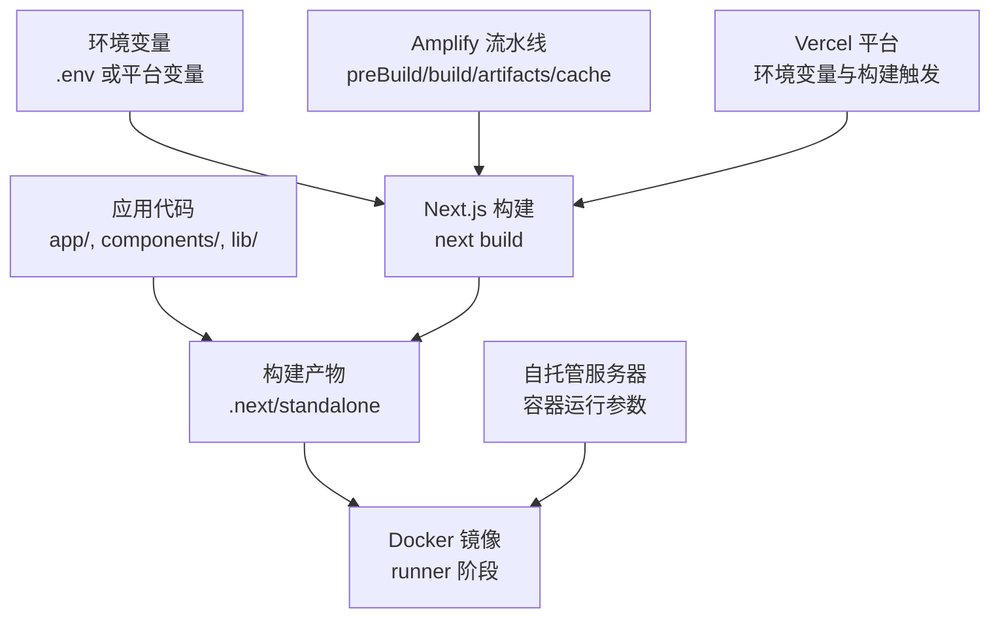
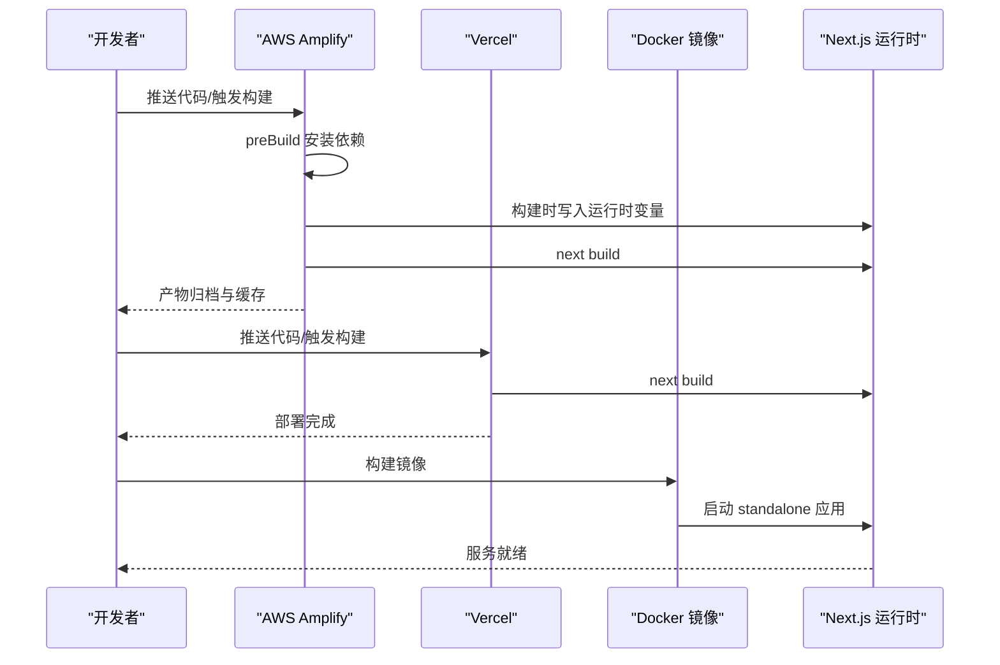
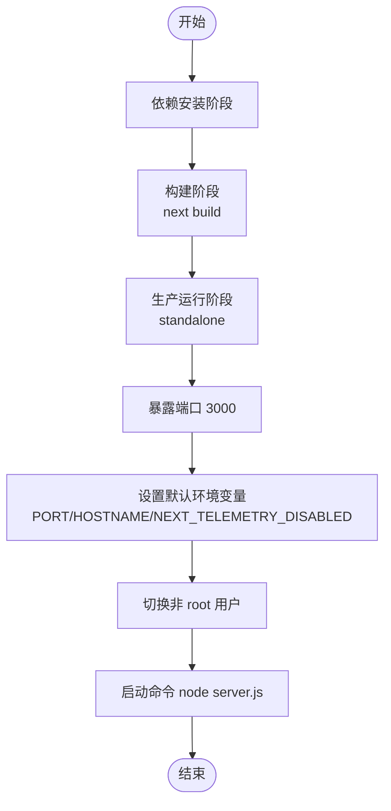
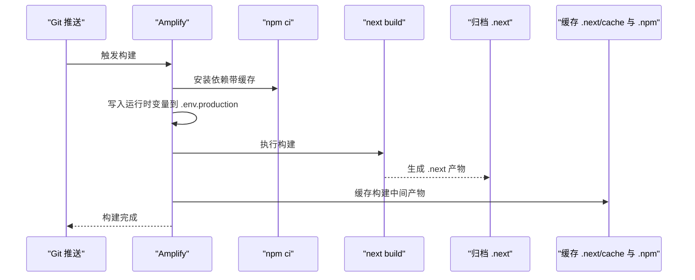
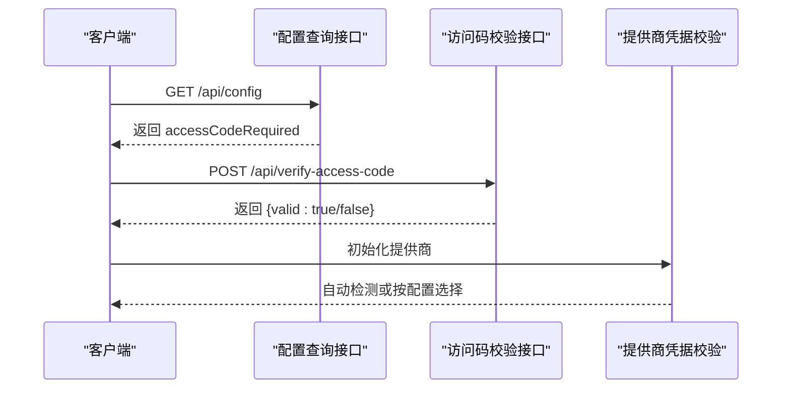
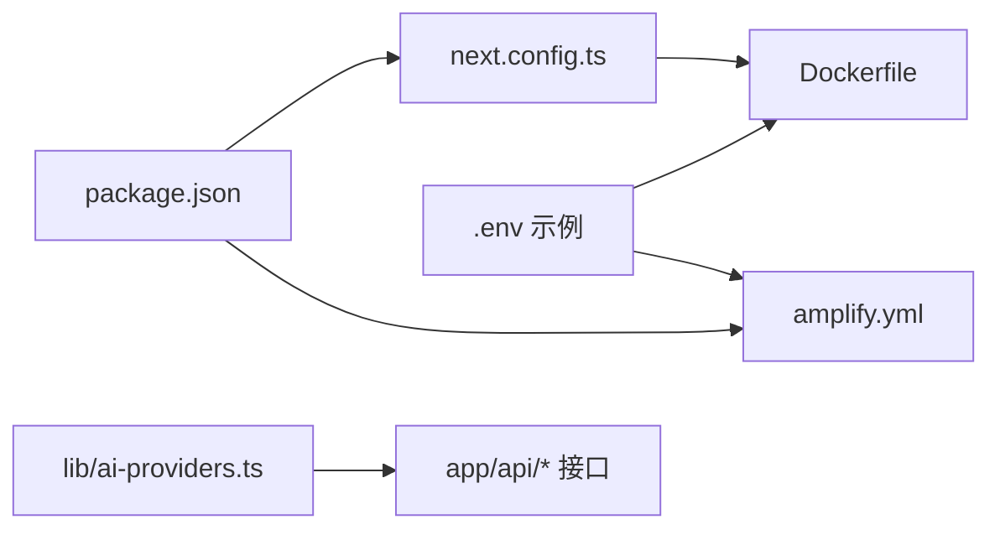

# 部署架构

<cite>
**本文引用的文件**
- [Dockerfile](file://Dockerfile)
- [amplify.yml](file://amplify.yml)
- [next.config.ts](file://next.config.ts)
- [package.json](file://package.json)
- [env.example](file://env.example)
- [README.md](file://README.md)
- [docs/ai-providers.md](file://docs/ai-providers.md)
- [app/api/verify-access-code/route.ts](file://app/api/verify-access-code/route.ts)
- [app/api/config/route.ts](file://app/api/config/route.ts)
- [lib/ai-providers.ts](file://lib/ai-providers.ts)
</cite>

## 目录
1. [简介](#简介)
2. [项目结构](#项目结构)
3. [核心组件](#核心组件)
4. [架构总览](#架构总览)
5. [详细组件分析](#详细组件分析)
6. [依赖关系分析](#依赖关系分析)
7. [性能考虑](#性能考虑)
8. [故障排查指南](#故障排查指南)
9. [结论](#结论)
10. [附录](#附录)

## 简介
本文件面向运维与开发团队，系统化梳理本项目的部署架构与实施方案，覆盖以下主题：
- Docker 多阶段构建与镜像运行参数
- CI/CD 流水线（AWS Amplify）的构建、缓存与触发机制
- 不同平台部署步骤（Vercel、AWS Amplify、自托管服务器）
- 影响部署的关键 Next.js 配置（输出模式、运行时选项）
- 性能优化建议（静态资源、缓存与负载均衡）
- 典型部署问题与排查方法

## 项目结构
本项目采用 Next.js App Router 结构，部署相关的关键文件集中在根目录：
- Dockerfile：定义多阶段构建与生产运行时
- amplify.yml：定义 AWS Amplify 前端构建流水线
- next.config.ts：声明输出模式为 standalone
- package.json：脚本与依赖管理
- env.example：示例环境变量，用于本地与平台配置
- README.md：包含 Docker 运行示例与平台部署指引
- 文档与 API：ai-providers 配置、访问码校验与配置查询接口

图表来源
- [Dockerfile](file://Dockerfile#L1-L56)
- [amplify.yml](file://amplify.yml#L1-L23)
- [next.config.ts](file://next.config.ts#L1-L9)
- [package.json](file://package.json#L1-L84)
- [README.md](file://README.md#L103-L128)

章节来源
- [Dockerfile](file://Dockerfile#L1-L56)
- [amplify.yml](file://amplify.yml#L1-L23)
- [next.config.ts](file://next.config.ts#L1-L9)
- [package.json](file://package.json#L1-L84)
- [README.md](file://README.md#L103-L128)

## 核心组件
- Docker 多阶段构建：分阶段安装依赖、构建应用、生产运行时，最终以 standalone 模式运行
- AWS Amplify 前端流水线：预构建安装依赖、构建时写入运行时环境变量、产物归档与缓存
- Next.js 输出模式：standalone，便于容器化与独立部署
- 环境变量体系：本地 .env、平台注入变量、Next.js 运行时读取
- 访问控制：通过 ACCESS_CODE_LIST 控制访问，API 提供校验与配置查询

章节来源
- [Dockerfile](file://Dockerfile#L1-L56)
- [amplify.yml](file://amplify.yml#L1-L23)
- [next.config.ts](file://next.config.ts#L1-L9)
- [env.example](file://env.example#L1-L63)
- [app/api/verify-access-code/route.ts](file://app/api/verify-access-code/route.ts#L1-L32)
- [app/api/config/route.ts](file://app/api/config/route.ts#L1-L12)

## 架构总览
下图展示从源码到运行时的整体路径，以及各平台的接入点。

图表来源
- [amplify.yml](file://amplify.yml#L1-L23)
- [README.md](file://README.md#L174-L184)
- [Dockerfile](file://Dockerfile#L1-L56)
- [next.config.ts](file://next.config.ts#L1-L9)

## 详细组件分析

### Docker 部署流程
- 多阶段构建策略
  - 依赖安装阶段：仅安装运行所需依赖，减少镜像体积
  - 构建阶段：基于已安装依赖进行构建，禁用遥测
  - 生产运行阶段：复制 public 与 .next/standalone，切换非 root 用户，暴露端口并设置默认环境变量
- 镜像构建命令
  - 使用标准 docker build 命令，结合上下文与 Dockerfile 执行多阶段构建
- 容器运行参数
  - 端口映射：容器内暴露 3000，宿主机映射至可用端口
  - 环境变量注入：通过 -e 或 --env-file 注入 AI 提供商、模型与密钥等变量
  - 健康检查：可结合平台健康检查或自定义探针，确保容器启动后服务可用

图表来源
- [Dockerfile](file://Dockerfile#L1-L56)

章节来源
- [Dockerfile](file://Dockerfile#L1-L56)
- [README.md](file://README.md#L103-L128)

### AWS Amplify CI/CD 流水线
- 构建阶段
  - preBuild：使用 npm ci 并启用缓存与离线优先
  - build：将运行时所需的环境变量写入 .env.production，再执行 next build
- 产物与缓存
  - artifacts：归档 .next 目录及其子文件
  - cache：缓存 .next/cache 与 .npm，加速后续构建
- 触发机制
  - 可通过 Git 推送或平台控制台手动触发；平台会自动识别构建命令与产物

图表来源
- [amplify.yml](file://amplify.yml#L1-L23)

章节来源
- [amplify.yml](file://amplify.yml#L1-L23)

### Vercel 部署步骤
- 在 Vercel 平台创建新项目并关联仓库
- 在平台设置中配置与本地 .env.local 相同的环境变量（如 AI_PROVIDER、AI_MODEL、API 密钥等）
- 平台将自动执行 next build 并部署
- 部署完成后，可在平台仪表板查看日志与域名

章节来源
- [README.md](file://README.md#L174-L184)
- [docs/ai-providers.md](file://docs/ai-providers.md#L1-L169)
- [env.example](file://env.example#L1-L63)

### 自托管服务器部署步骤
- 准备环境变量文件（基于 env.example），包含 AI 提供商、模型与密钥
- 使用 Docker 运行容器，映射端口并注入环境变量
- 如需反向代理或负载均衡，可在容器前层加入 Nginx/HAProxy 等网关

章节来源
- [README.md](file://README.md#L103-L128)
- [env.example](file://env.example#L1-L63)
- [Dockerfile](file://Dockerfile#L1-L56)

### Next.js 配置对部署的影响
- 输出模式：output 设置为 standalone，使构建产物包含可独立运行的服务端，便于容器化与无服务器部署
- 运行时选项：通过环境变量控制端口、主机名与遥测开关
- 依赖与脚本：package.json 中的 build/start 脚本与依赖版本直接影响构建与运行稳定性

章节来源
- [next.config.ts](file://next.config.ts#L1-L9)
- [Dockerfile](file://Dockerfile#L1-L56)
- [package.json](file://package.json#L1-L84)

### 访问控制与安全
- ACCESS_CODE_LIST：当配置了访问码列表时，API 将校验请求头中的访问码；未配置则视为无需访问控制
- 配置查询接口：返回当前是否需要访问码，便于前端提示与逻辑分支
- 提供商凭据验证：在选择单一提供商时自动检测；多提供商时需显式指定 AI_PROVIDER

图表来源
- [app/api/config/route.ts](file://app/api/config/route.ts#L1-L12)
- [app/api/verify-access-code/route.ts](file://app/api/verify-access-code/route.ts#L1-L32)
- [lib/ai-providers.ts](file://lib/ai-providers.ts#L71-L89)

章节来源
- [app/api/config/route.ts](file://app/api/config/route.ts#L1-L12)
- [app/api/verify-access-code/route.ts](file://app/api/verify-access-code/route.ts#L1-L32)
- [lib/ai-providers.ts](file://lib/ai-providers.ts#L71-L89)

## 依赖关系分析
- 组件耦合
  - Dockerfile 依赖 next.config.ts 的输出模式与 package.json 的构建脚本
  - amplify.yml 依赖 package.json 的构建脚本与 .env.production 的注入
  - 访问控制与提供商配置分别由 API 与 lib 层提供
- 外部依赖
  - Next.js 版本与依赖生态影响构建时间与兼容性
  - AI 提供商 SDK 与网络调用影响部署后的运行时稳定性

图表来源
- [package.json](file://package.json#L1-L84)
- [next.config.ts](file://next.config.ts#L1-L9)
- [Dockerfile](file://Dockerfile#L1-L56)
- [amplify.yml](file://amplify.yml#L1-L23)
- [lib/ai-providers.ts](file://lib/ai-providers.ts#L71-L89)

章节来源
- [package.json](file://package.json#L1-L84)
- [next.config.ts](file://next.config.ts#L1-L9)
- [Dockerfile](file://Dockerfile#L1-L56)
- [amplify.yml](file://amplify.yml#L1-L23)
- [lib/ai-providers.ts](file://lib/ai-providers.ts#L71-L89)

## 性能考虑
- 静态资源处理
  - 使用 Next.js 默认静态资源策略，配合 CDN 加速与浏览器缓存
- 缓存策略
  - Amplify 已配置 .next/cache 与 .npm 缓存，建议保持一致以提升构建速度
  - Docker 镜像层缓存：依赖安装与构建阶段利用层缓存，避免重复下载
- 负载均衡
  - 多实例部署时，建议使用反向代理或云负载均衡，开启健康检查与超时重试
- 构建性能
  - 使用 npm ci 与离线优先策略，减少网络波动带来的构建失败
  - 控制依赖版本，避免频繁升级导致的构建不稳定

章节来源
- [amplify.yml](file://amplify.yml#L1-L23)
- [Dockerfile](file://Dockerfile#L1-L56)
- [package.json](file://package.json#L1-L84)

## 故障排查指南
- 构建失败
  - 症状：Amplify 或本地构建报错
  - 排查要点：检查 package.json 的构建脚本、依赖版本与网络连通性；确认 .env.production 是否正确注入
- 依赖安装错误
  - 症状：npm ci 报错或安装缓慢
  - 排查要点：清理缓存、检查 .npm 缓存路径、确认离线优先策略是否生效
- 健康检查超时
  - 症状：容器启动后无法通过健康检查
  - 排查要点：检查端口映射、环境变量（PORT/HOSTNAME）、容器日志与启动命令
- 访问控制问题
  - 症状：访问被拒绝或提示需要访问码
  - 排查要点：确认 ACCESS_CODE_LIST 是否配置、请求头是否携带正确的访问码；检查 /api/config 返回值
- 提供商凭据缺失
  - 症状：初始化提供商时报错缺少必要环境变量
  - 排查要点：根据 ai-providers 的要求设置对应 API Key 与模型；若配置多个提供商，需显式设置 AI_PROVIDER

章节来源
- [amplify.yml](file://amplify.yml#L1-L23)
- [Dockerfile](file://Dockerfile#L1-L56)
- [app/api/verify-access-code/route.ts](file://app/api/verify-access-code/route.ts#L1-L32)
- [lib/ai-providers.ts](file://lib/ai-providers.ts#L71-L89)

## 结论
本项目通过 standalone 输出模式与多阶段 Docker 构建，实现了轻量、可移植且易于扩展的部署方案。配合 AWS Amplify 的流水线与 Vercel 的一键部署，能够快速上线并稳定运行。建议在生产环境中：
- 明确并固化环境变量注入方式
- 利用缓存与层缓存提升构建效率
- 强化访问控制与提供商凭据管理
- 结合负载均衡与健康检查保障高可用

## 附录
- 平台部署入口
  - Vercel：参考 README 中的按钮与部署指引
  - AWS Amplify：参考 amplify.yml 的流水线配置
- 环境变量清单
  - 参考 env.example 与 docs/ai-providers.md 的提供商配置说明

章节来源
- [README.md](file://README.md#L174-L184)
- [docs/ai-providers.md](file://docs/ai-providers.md#L1-L169)
- [env.example](file://env.example#L1-L63)