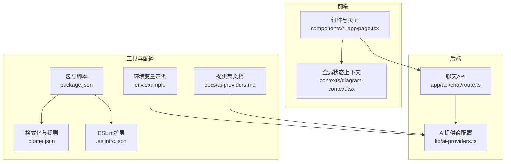
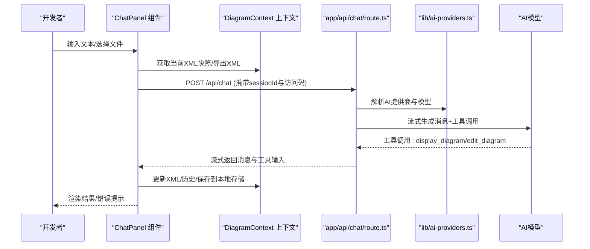
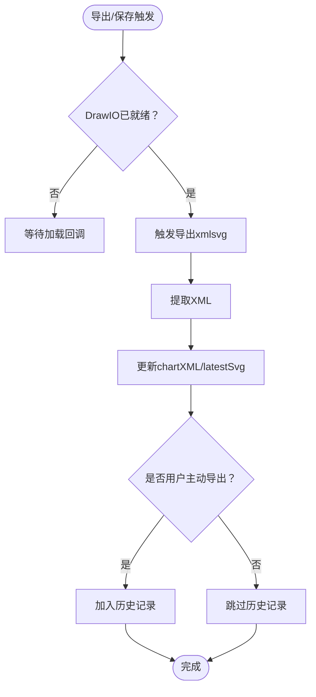
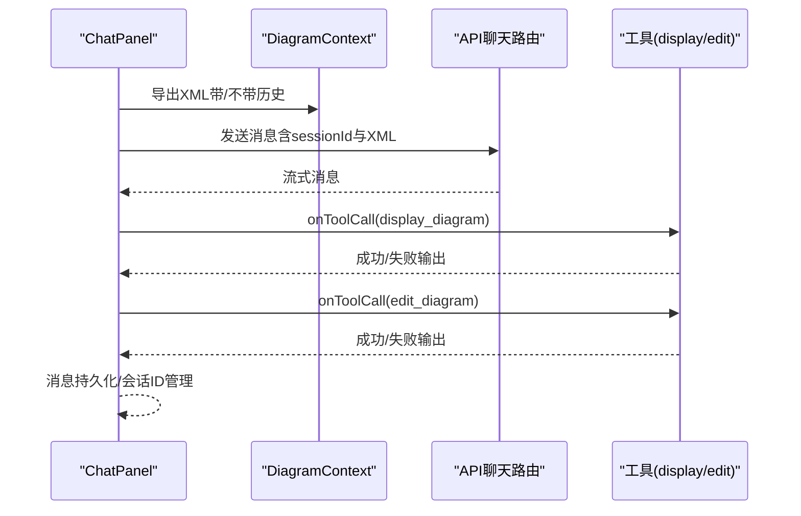
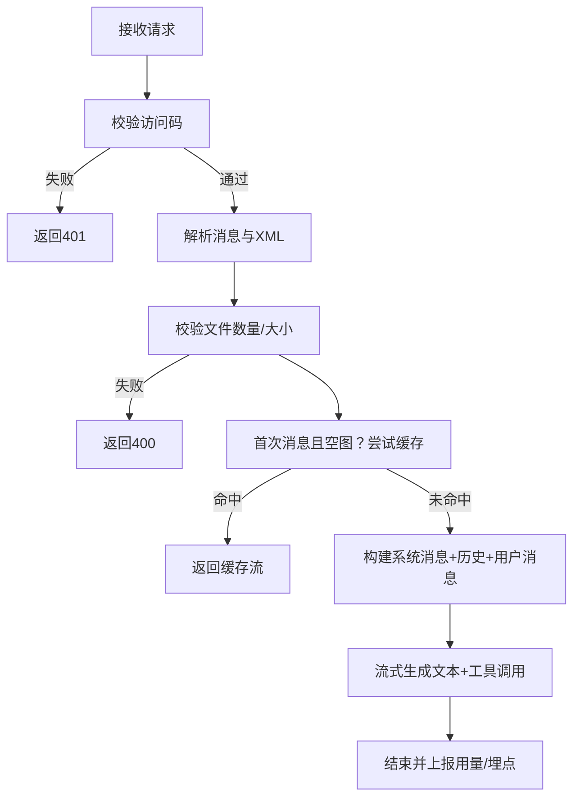

# 贡献指南

<cite>
**本文引用的文件**
- [CONTRIBUTING.md](file://CONTRIBUTING.md)
- [README.md](file://README.md)
- [package.json](file://package.json)
- [biome.json](file://biome.json)
- [.eslintrc.json](file://.eslintrc.json)
- [env.example](file://env.example)
- [docs/ai-providers.md](file://docs/ai-providers.md)
- [lib/ai-providers.ts](file://lib/ai-providers.ts)
- [contexts/diagram-context.tsx](file://contexts/diagram-context.tsx)
- [components/chat-panel.tsx](file://components/chat-panel.tsx)
- [app/api/chat/route.ts](file://app/api/chat/route.ts)
</cite>

## 目录
1. [简介](#简介)
2. [项目结构](#项目结构)
3. [核心组件](#核心组件)
4. [架构总览](#架构总览)
5. [详细组件分析](#详细组件分析)
6. [依赖与开发脚本](#依赖与开发脚本)
7. [本地开发环境设置](#本地开发环境设置)
8. [代码风格与质量要求](#代码风格与质量要求)
9. [提交与拉取请求流程](#提交与拉取请求流程)
10. [测试与质量保障](#测试与质量保障)
11. [文档更新与版本发布](#文档更新与版本发布)
12. [新手入门任务建议](#新手入门任务建议)
13. [故障排查](#故障排查)
14. [结论](#结论)

## 简介
本贡献指南面向希望参与本项目的开发者，覆盖从本地环境搭建、代码风格与质量检查、提交与PR流程，到多提供商AI集成、上下文状态管理、API聊天流处理等关键模块的定位与说明。目标是帮助新贡献者快速上手并高质量地贡献代码。

## 项目结构
项目采用 Next.js App Router 的组织方式，核心目录与职责概览：
- app/api：后端接口（如聊天、配置、日志保存等）
- components：可复用UI与业务组件（如聊天面板、输入框、对话框等）
- contexts：全局状态上下文（如绘图上下文）
- lib：工具函数与AI提供商配置
- docs：文档（如AI提供商配置说明）
- 根目录：构建脚本、格式化与质量规则、环境示例等



图表来源
- [package.json](file://package.json#L1-L84)
- [biome.json](file://biome.json#L1-L84)
- [.eslintrc.json](file://.eslintrc.json#L1-L4)
- [env.example](file://env.example#L1-L63)
- [docs/ai-providers.md](file://docs/ai-providers.md#L1-L169)
- [lib/ai-providers.ts](file://lib/ai-providers.ts#L1-L286)
- [contexts/diagram-context.tsx](file://contexts/diagram-context.tsx#L1-L268)
- [components/chat-panel.tsx](file://components/chat-panel.tsx#L1-L816)
- [app/api/chat/route.ts](file://app/api/chat/route.ts#L1-L495)

章节来源
- [README.md](file://README.md#L180-L204)

## 核心组件
- 绘图上下文（DiagramContext）：负责XML/SVG状态、历史记录、导出与保存、Langfuse埋点等。
- 聊天面板（ChatPanel）：负责消息持久化、会话ID生成、工具调用（显示/编辑绘图）、文件上传等。
- 聊天API（/api/chat）：负责访问控制、缓存命中、系统提示注入、工具修复、流式响应等。
- AI提供商配置（ai-providers.ts）：统一解析环境变量、自动检测提供商、按需注入头部或选项。

章节来源
- [contexts/diagram-context.tsx](file://contexts/diagram-context.tsx#L1-L268)
- [components/chat-panel.tsx](file://components/chat-panel.tsx#L1-L816)
- [app/api/chat/route.ts](file://app/api/chat/route.ts#L1-L495)
- [lib/ai-providers.ts](file://lib/ai-providers.ts#L1-L286)

## 架构总览
下图展示从前端聊天面板到后端API再到AI提供商的整体交互流程。



图表来源
- [components/chat-panel.tsx](file://components/chat-panel.tsx#L1-L816)
- [contexts/diagram-context.tsx](file://contexts/diagram-context.tsx#L1-L268)
- [app/api/chat/route.ts](file://app/api/chat/route.ts#L1-L495)
- [lib/ai-providers.ts](file://lib/ai-providers.ts#L1-L286)

## 详细组件分析

### 绘图上下文（DiagramContext）
- 职责：维护chartXML、latestSvg、diagramHistory；封装导出/保存/清空逻辑；与Langfuse集成。
- 关键点：导出时提取XML并写入history；保存文件时根据格式转换内容；在DrawIO就绪后恢复上次绘图。
- 与聊天面板协作：通过resolverRef传递XML给聊天面板，确保工具调用前后XML一致。



图表来源
- [contexts/diagram-context.tsx](file://contexts/diagram-context.tsx#L1-L268)

章节来源
- [contexts/diagram-context.tsx](file://contexts/diagram-context.tsx#L1-L268)

### 聊天面板（ChatPanel）
- 职责：消息持久化、会话ID管理、工具调用处理（显示/编辑绘图）、文件上传、错误处理与重试。
- 关键点：使用DefaultChatTransport连接/api/chat；对工具调用进行校验与错误回传；支持“重新生成/编辑消息”。
- 与绘图上下文协作：导出XML用于工具调用；恢复本地存储的XML以保证连续性。



图表来源
- [components/chat-panel.tsx](file://components/chat-panel.tsx#L1-L816)
- [contexts/diagram-context.tsx](file://contexts/diagram-context.tsx#L1-L268)
- [app/api/chat/route.ts](file://app/api/chat/route.ts#L1-L495)

章节来源
- [components/chat-panel.tsx](file://components/chat-panel.tsx#L1-L816)

### 聊天API（/api/chat）
- 职责：访问控制（ACCESS_CODE_LIST）、文件大小/数量限制、缓存命中、系统提示注入、工具修复、流式响应。
- 关键点：针对Bedrock工具调用输入做JSON修复；为最后一条助手消息添加缓存断点；Langfuse埋点与用量上报。
- 与AI提供商：通过getAIModel统一获取模型与提供商配置。



图表来源
- [app/api/chat/route.ts](file://app/api/chat/route.ts#L1-L495)
- [lib/ai-providers.ts](file://lib/ai-providers.ts#L1-L286)

章节来源
- [app/api/chat/route.ts](file://app/api/chat/route.ts#L1-L495)

### AI提供商配置（ai-providers.ts）
- 职责：解析AI_PROVIDER与AI_MODEL；自动检测单一提供商；按提供商注入自定义端点、头部或选项。
- 关键点：支持Bedrock/Azure/OpenAI/Anthropic/Google/Ollama/OpenRouter/DeepSeek/SiliconFlow；为Anthropic/Bedrock注入beta特性；缺失凭据时报错。

```mermaid
classDiagram
class AIProviders {
+getAIModel() ModelConfig
-detectProvider() ProviderName?
-validateProviderCredentials(provider)
}
class ProviderName {
<<enum>>
"bedrock","openai","anthropic","google","azure","ollama","openrouter","deepseek","siliconflow"
}
AIProviders --> ProviderName : "选择/验证"
```

图表来源
- [lib/ai-providers.ts](file://lib/ai-providers.ts#L1-L286)

章节来源
- [lib/ai-providers.ts](file://lib/ai-providers.ts#L1-L286)

## 依赖与开发脚本
- 包管理器：使用 npm（仓库中包含 package-lock.json），但脚本与配置基于 Biome 与 Husky。
- 开发脚本（package.json）：
  - dev：启动Next.js开发服务器（启用turbo与指定端口）
  - build/start：构建与运行生产服务
  - lint/format/check：Biome检查、格式化、CI模式
  - prepare：初始化Git钩子（Husky）
- 质量工具：
  - Biome：格式化、LSP、CI检查（.biome配置）
  - ESLint：Next.js核心Web准则与TypeScript扩展（.eslintrc.json）

章节来源
- [package.json](file://package.json#L1-L84)
- [biome.json](file://biome.json#L1-L84)
- [.eslintrc.json](file://.eslintrc.json#L1-L4)

## 本地开发环境设置
- 克隆仓库并安装依赖
- 复制环境示例为本地环境文件
- 配置AI提供商（参考提供商文档与环境变量）
- 启动开发服务器
- 访问本地地址查看应用

章节来源
- [CONTRIBUTING.md](file://CONTRIBUTING.md#L1-L36)
- [README.md](file://README.md#L131-L173)
- [env.example](file://env.example#L1-L63)
- [docs/ai-providers.md](file://docs/ai-providers.md#L1-L169)

## 代码风格与质量要求
- 使用 Biome 进行格式化与静态检查
  - 命令：格式化、检查、CI模式
  - 预提交钩子：通过 Husky 自动运行 Biome
  - VS Code 扩展：推荐安装 Biome 插件以获得实时格式化与保存时修复
- ESLint：基于 Next.js 核心Web准则与TypeScript扩展
- 规则要点（摘自 Biome 配置）：
  - 缩进宽度与样式、引号与分号策略
  - 可选规则关闭（如无障碍、exhaustive deps等），以适配项目现状
  - 对特定目录（如UI组件）可禁用格式化/检查

章节来源
- [CONTRIBUTING.md](file://CONTRIBUTING.md#L13-L31)
- [biome.json](file://biome.json#L1-L84)
- [.eslintrc.json](file://.eslintrc.json#L1-L4)

## 提交与拉取请求流程
- 分支策略：从 main 分支创建功能分支
- 本地检查：确保通过格式化与静态检查
- 提交PR：向 main 分支提交，附清晰描述
- 问题反馈：提供复现步骤、预期/实际行为、使用的AI提供商

章节来源
- [CONTRIBUTING.md](file://CONTRIBUTING.md#L27-L36)

## 测试与质量保障
- 本地质量门禁：Biome格式化与检查、预提交钩子
- 代码审查：遵循PR描述与变更范围
- 错误处理：API层统一捕获异常并返回标准错误信息；聊天面板对访问码错误进行UI引导

章节来源
- [app/api/chat/route.ts](file://app/api/chat/route.ts#L476-L495)
- [components/chat-panel.tsx](file://components/chat-panel.tsx#L258-L287)

## 文档更新与版本发布
- 文档更新：新增或修改功能时同步更新README与相关文档（如提供商配置）
- 版本发布：版本号位于 package.json 中，发布前请更新版本并附变更说明

章节来源
- [package.json](file://package.json#L1-L10)
- [README.md](file://README.md#L1-L20)

## 新手入门任务建议
- 熟悉项目结构与关键入口：阅读 README 与 CONTRIBUTING，定位 app/api、components、contexts、lib 目录
- 环境搭建：复制 env.example 并按提供商文档配置API密钥
- 体验聊天流程：在本地发起一次聊天，观察工具调用（显示/编辑绘图）与导出行为
- 质量改进：基于 Biome 规则修复格式问题，提交PR
- 功能扩展：从 AI 提供商配置入手，增加新的提供商或优化现有配置

章节来源
- [README.md](file://README.md#L180-L204)
- [docs/ai-providers.md](file://docs/ai-providers.md#L1-L169)
- [lib/ai-providers.ts](file://lib/ai-providers.ts#L1-L286)

## 故障排查
- 访问码错误：聊天面板会在错误时提示并打开设置对话框，请在本地存储中设置访问码
- 提供商配置：确认 AI_PROVIDER 与 AI_MODEL 设置正确，必要时显式设置 AI_PROVIDER
- 文件上传：检查文件数量与大小限制，避免超过上限
- 缓存与超时：首次消息且空图时可能命中缓存；工具调用导出存在超时保护

章节来源
- [components/chat-panel.tsx](file://components/chat-panel.tsx#L258-L287)
- [app/api/chat/route.ts](file://app/api/chat/route.ts#L144-L213)

## 结论
本指南提供了从环境搭建、代码风格、提交流程到关键模块定位与排障的完整路径。建议新贡献者先完成本地环境与提供商配置，再围绕聊天与绘图上下文进行功能扩展，始终遵循 Biome 与 ESLint 规范，并通过PR描述清晰说明变更动机与影响。