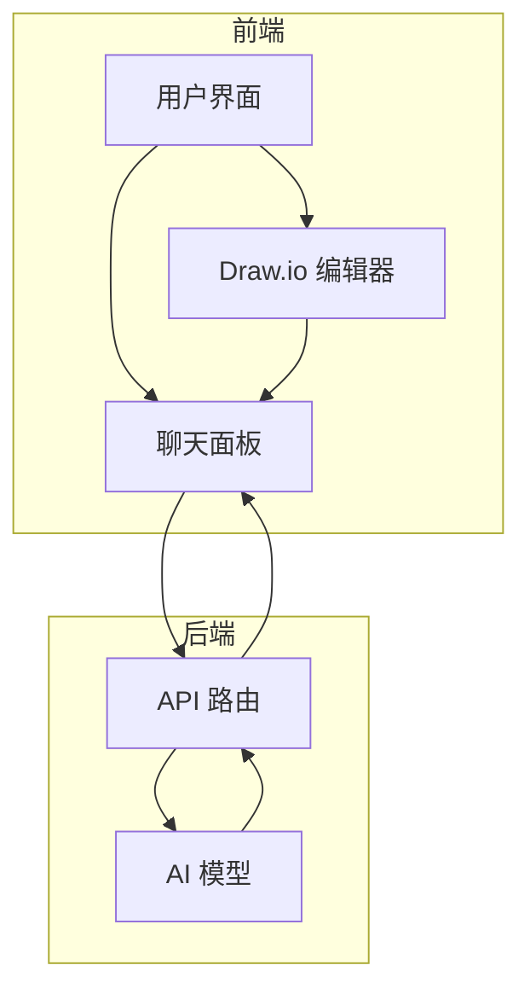
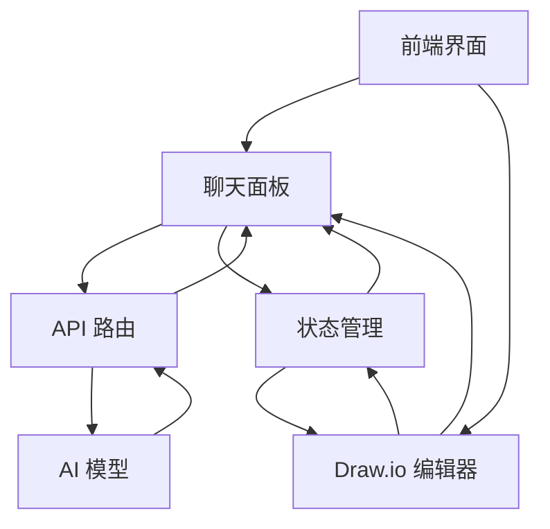

# 项目概述

<cite>
**本文档引用的文件**   
- [page.tsx](file://app/page.tsx)
- [layout.tsx](file://app/layout.tsx)
- [diagram-context.tsx](file://contexts/diagram-context.tsx)
- [chat-panel.tsx](file://components/chat-panel.tsx)
- [chat-input.tsx](file://components/chat-input.tsx)
- [chat-message-display.tsx](file://components/chat-message-display.tsx)
- [route.ts](file://app/api/chat/route.ts)
- [system-prompts.ts](file://lib/system-prompts.ts)
- [ai-providers.ts](file://lib/ai-providers.ts)
- [utils.ts](file://lib/utils.ts)
</cite>

## 目录
1. [简介](#简介)
2. [项目结构](#项目结构)
3. [核心功能](#核心功能)
4. [架构设计](#架构设计)
5. [用户工作流](#用户工作流)
6. [系统上下文图](#系统上下文图)
7. [技术决策](#技术决策)
8. [使用示例](#使用示例)
9. [结论](#结论)

## 简介
next-ai-draw-io 是一个基于 Next.js 的全栈 Web 应用程序，它将 AI 能力与 draw.io 图表工具深度集成。用户可以通过自然语言指令与 AI 交互，创建、修改和增强图表。该项目支持多提供商 AI 模型，包括 AWS Bedrock、OpenAI、Anthropic 等，并具备图表历史记录、交互式聊天界面和 AWS 架构图支持等高级功能。其核心是利用大型语言模型（LLM）生成符合 draw.io 规范的 XML 代码，从而实现自然语言到可视化图表的转换。

## 项目结构
项目采用 Next.js App Router 架构，主要目录包括：
- `app/`: Next.js 应用路由，包含主页面和 API 路由
- `components/`: React 组件，包括聊天面板、输入框、对话框等 UI 组件
- `contexts/`: React 上下文提供者，用于全局状态管理
- `lib/`: 工具函数和辅助库，包括 AI 提供商配置、系统提示和 XML 处理工具
- `public/`: 静态资源，包括示例图片和图标

**Section sources**
- [page.tsx](file://app/page.tsx)
- [layout.tsx](file://app/layout.tsx)

## 核心功能
项目的核心功能包括：
- **LLM 驱动的图表创建**：利用大型语言模型通过自然语言命令创建和操作 draw.io 图表
- **基于图像的图表复制**：上传现有图表或图像，AI 可自动复制并增强
- **图表历史记录**：自动保存每次 AI 编辑前的快照，支持查看和恢复历史版本
- **交互式聊天界面**：通过聊天与 AI 实时沟通，逐步完善图表
- **AWS 架构图支持**：专门支持生成带有 AWS 图标的架构图
- **动画连接线**：创建动态动画连接线以增强可视化效果

**Section sources**
- [README.md](file://README.md)

## 架构设计
项目采用全栈架构，前端使用 Next.js 和 React，后端通过 API 路由与 AI 模型通信。前端通过 `react-drawio` 组件嵌入 draw.io 编辑器，后端使用 Vercel AI SDK 实现 AI 响应流式传输和多提供商支持。状态管理通过 React Context 实现，全局图表状态在 `diagram-context.tsx` 中管理。

**Diagram sources**
- [page.tsx](file://app/page.tsx)
- [chat-panel.tsx](file://components/chat-panel.tsx)
- [route.ts](file://app/api/chat/route.ts)

## 用户工作流
用户工作流从输入自然语言指令开始，经过以下步骤：
1. 用户在聊天输入框中输入指令或上传图像
2. 前端通过 `useChat` Hook 发送请求到 `/api/chat` API 路由
3. API 路由调用配置的 AI 模型，生成或修改图表的 XML 代码
4. AI 模型返回 `display_diagram` 或 `edit_diagram` 工具调用，包含 XML 内容
5. 前端接收工具调用，通过 `loadDiagram` 函数将 XML 加载到 draw.io 编辑器中
6. 图表在 draw.io 编辑器中实时渲染，用户可继续交互

**Section sources**
- [chat-input.tsx](file://components/chat-input.tsx)
- [chat-panel.tsx](file://components/chat-panel.tsx)
- [route.ts](file://app/api/chat/route.ts)
- [diagram-context.tsx](file://contexts/diagram-context.tsx)

## 系统上下文图
系统上下文图展示了前端界面、后端 API、AI 模型和状态管理之间的集成关系。

**Diagram sources**
- [page.tsx](file://app/page.tsx)
- [chat-panel.tsx](file://components/chat-panel.tsx)
- [route.ts](file://app/api/chat/route.ts)
- [diagram-context.tsx](file://contexts/diagram-context.tsx)

## 技术决策
项目的技术决策包括：
- **选择 Next.js App Router**：利用其服务器组件和流式渲染能力，提升性能和用户体验
- **使用 React Context 进行状态管理**：对于全局图表状态，React Context 提供了简单有效的解决方案，避免了复杂的状态管理库
- **Vercel AI SDK**：提供流式 AI 响应和多提供商支持，简化了与不同 AI 模型的集成
- **XML 作为图表表示**：draw.io 图表以 XML 格式表示，便于 AI 模型生成和修改，确保了与 draw.io 编辑器的兼容性

**Section sources**
- [page.tsx](file://app/page.tsx)
- [diagram-context.tsx](file://contexts/diagram-context.tsx)
- [ai-providers.ts](file://lib/ai-providers.ts)
- [system-prompts.ts](file://lib/system-prompts.ts)

## 使用示例
### 创建 AWS 架构图
用户输入：“生成一个带有 AWS 图标的 AWS 架构图。用户连接到托管在实例上的前端。”
AI 模型生成包含 AWS 图标的 XML 代码，图表在 draw.io 编辑器中渲染，显示用户、前端实例和相关连接。

### 通过聊天编辑图表
用户上传一个现有图表图像，AI 分析图像并复制为可编辑的 draw.io 图表。用户随后通过聊天指令“将数据库从 MySQL 改为 PostgreSQL”来编辑图表，AI 使用 `edit_diagram` 工具调用修改相应 XML，图表实时更新。

**Section sources**
- [README.md](file://README.md)
- [system-prompts.ts](file://lib/system-prompts.ts)
- [chat-message-display.tsx](file://components/chat-message-display.tsx)

## 结论
next-ai-draw-io 项目成功地将自然语言处理与图表绘制工具结合，提供了一个强大且直观的图表创建和编辑平台。通过全栈架构和先进的 AI 技术，用户可以轻松创建复杂的图表，如 AWS 架构图，并通过聊天进行实时编辑。项目的模块化设计和清晰的架构使其易于扩展和维护，为开发者提供了一个优秀的参考实现。