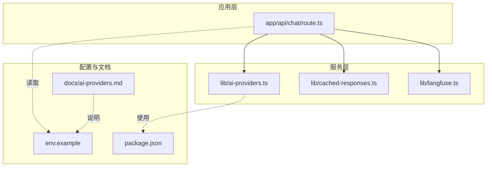
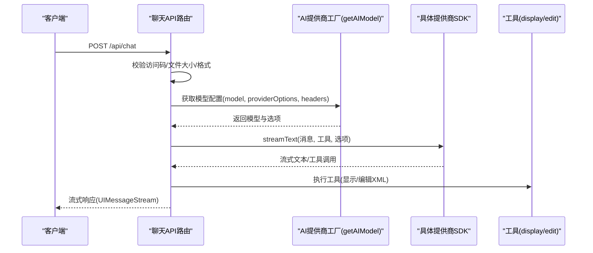
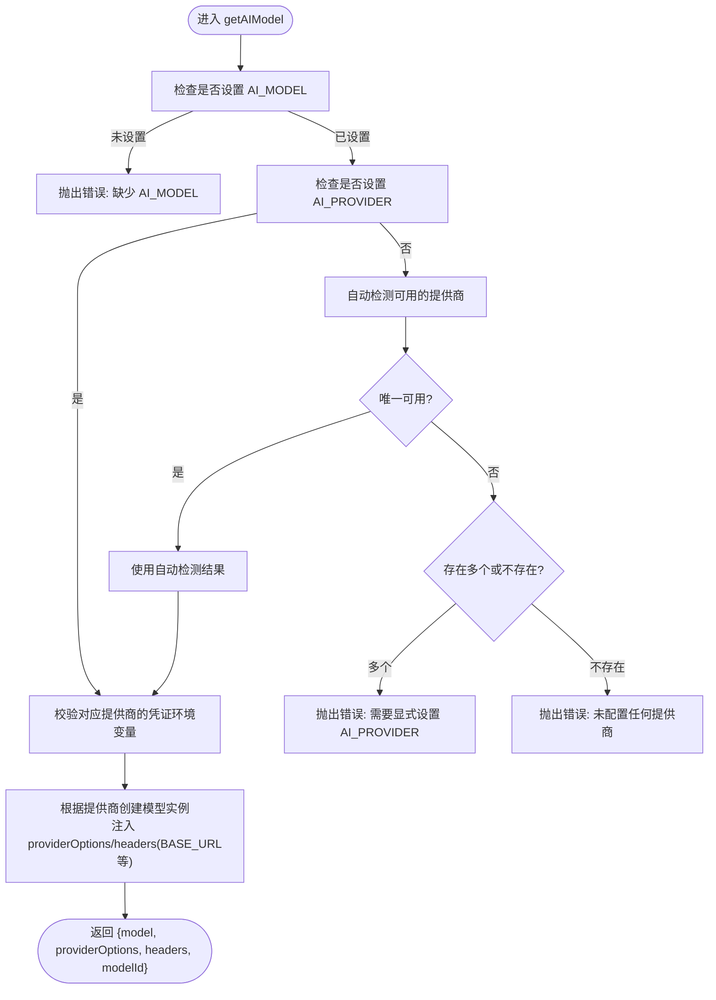
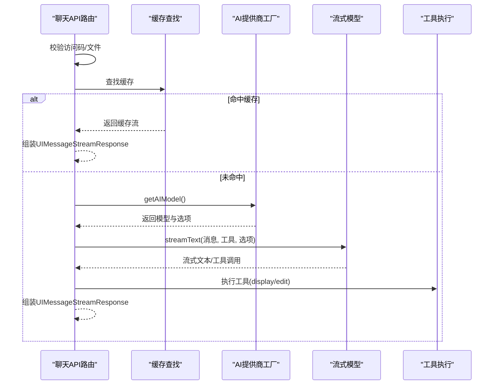
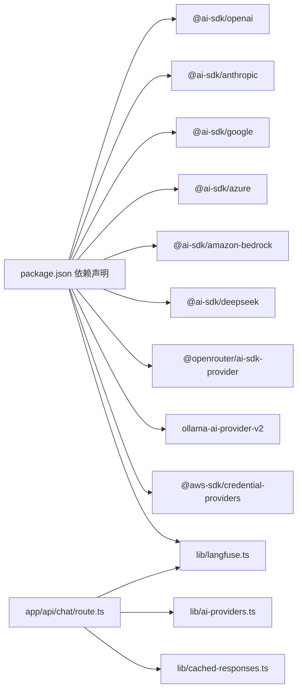

# AI提供商扩展

<cite>
**本文引用的文件**
- [lib/ai-providers.ts](file://lib/ai-providers.ts)
- [app/api/chat/route.ts](file://app/api/chat/route.ts)
- [env.example](file://env.example)
- [docs/ai-providers.md](file://docs/ai-providers.md)
- [lib/cached-responses.ts](file://lib/cached-responses.ts)
- [lib/langfuse.ts](file://lib/langfuse.ts)
- [package.json](file://package.json)
</cite>

## 目录
1. [简介](#简介)
2. [项目结构](#项目结构)
3. [核心组件](#核心组件)
4. [架构总览](#架构总览)
5. [详细组件分析](#详细组件分析)
6. [依赖关系分析](#依赖关系分析)
7. [性能考量](#性能考量)
8. [故障排查指南](#故障排查指南)
9. [结论](#结论)
10. [附录](#附录)

## 简介
本文件面向有经验的开发者，系统性阐述如何在现有工厂模式基础上扩展新的AI模型提供商（如Anthropic、Google AI等），并深入解析getAIModel函数的实现逻辑：包括环境变量检测、凭证验证与多提供商支持；提供扩展新提供商的完整步骤（依赖安装、配置与代码修改）；通过代码路径示例展示如何添加自定义API端点与认证机制；解释自动检测机制在多提供商配置下的行为；最后总结错误处理策略与调试技巧，帮助快速定位并解决集成过程中的连接与认证问题。

## 项目结构
该仓库采用分层组织方式：
- lib：核心业务与工具模块，包含AI提供商工厂、缓存响应、遥测等
- app/api：后端API路由，负责请求接入、消息转换、流式输出与工具调用
- docs：用户与开发者文档
- 根目录：环境变量示例、包管理与构建配置

图表来源
- [app/api/chat/route.ts](file://app/api/chat/route.ts#L1-L60)
- [lib/ai-providers.ts](file://lib/ai-providers.ts#L1-L40)
- [lib/cached-responses.ts](file://lib/cached-responses.ts#L1-L40)
- [lib/langfuse.ts](file://lib/langfuse.ts#L1-L40)
- [env.example](file://env.example#L1-L40)
- [docs/ai-providers.md](file://docs/ai-providers.md#L1-L40)
- [package.json](file://package.json#L1-L40)

章节来源
- [app/api/chat/route.ts](file://app/api/chat/route.ts#L1-L60)
- [lib/ai-providers.ts](file://lib/ai-providers.ts#L1-L40)
- [env.example](file://env.example#L1-L40)
- [docs/ai-providers.md](file://docs/ai-providers.md#L1-L40)
- [package.json](file://package.json#L1-L40)

## 核心组件
- AI提供商工厂（getAIModel）：统一入口，基于环境变量选择具体提供商，创建模型实例，注入providerOptions与headers，支持自定义端点与凭证校验
- 聊天API路由：接收请求、校验访问码、构造系统提示与用户消息、调用AI模型、处理工具调用与缓存命中、封装流式响应
- 缓存响应：预置示例，用于首次无上下文时的快速返回
- 遥测（Langfuse）：可选的链路追踪与用量统计

章节来源
- [lib/ai-providers.ts](file://lib/ai-providers.ts#L111-L285)
- [app/api/chat/route.ts](file://app/api/chat/route.ts#L145-L474)
- [lib/cached-responses.ts](file://lib/cached-responses.ts#L551-L562)
- [lib/langfuse.ts](file://lib/langfuse.ts#L1-L108)

## 架构总览
下图展示了从客户端到AI提供商的调用链路，以及工厂模式如何在运行时决定具体实现。

图表来源
- [app/api/chat/route.ts](file://app/api/chat/route.ts#L145-L474)
- [lib/ai-providers.ts](file://lib/ai-providers.ts#L111-L285)

章节来源
- [app/api/chat/route.ts](file://app/api/chat/route.ts#L145-L474)
- [lib/ai-providers.ts](file://lib/ai-providers.ts#L111-L285)

## 详细组件分析

### getAIModel函数：环境变量检测、凭证验证与多提供商支持
- 环境变量优先级
  - 显式指定：AI_PROVIDER
  - 自动检测：当仅配置一个提供商的API密钥时，自动推断
  - 多配置冲突：若同时配置多个密钥，必须显式设置AI_PROVIDER
- 凭证校验
  - 按提供商映射检查必需环境变量是否存在
  - 对于无需凭证的本地服务（如Ollama），跳过校验
- 模型初始化
  - 基于AI_MODEL选择具体模型ID
  - 支持自定义端点（BASE_URL）与特定提供商的额外选项（如Anthropic Beta头、Bedrock Anthropic Beta）
  - 返回模型对象、providerOptions与headers，供上层调用

图表来源
- [lib/ai-providers.ts](file://lib/ai-providers.ts#L58-L160)
- [lib/ai-providers.ts](file://lib/ai-providers.ts#L161-L285)

章节来源
- [lib/ai-providers.ts](file://lib/ai-providers.ts#L58-L160)
- [lib/ai-providers.ts](file://lib/ai-providers.ts#L161-L285)

### 聊天API路由：消息转换、工具调用与缓存
- 访问控制：可选的访问码列表校验
- 文件校验：限制数量与大小，按data URL解码估算真实大小
- 缓存命中：针对首次且空上下文的场景，命中预置示例
- 消息增强：修复Bedrock工具输入格式、过滤空内容消息、注入系统提示与当前XML上下文
- 流式输出：调用streamText，支持工具调用与用量统计上报

图表来源
- [app/api/chat/route.ts](file://app/api/chat/route.ts#L145-L474)
- [lib/cached-responses.ts](file://lib/cached-responses.ts#L551-L562)
- [lib/ai-providers.ts](file://lib/ai-providers.ts#L111-L285)

章节来源
- [app/api/chat/route.ts](file://app/api/chat/route.ts#L145-L474)
- [lib/cached-responses.ts](file://lib/cached-responses.ts#L551-L562)

### 扩展新提供商：以Anthropic为例
- 安装依赖
  - 在package.json中添加@ai-sdk/anthropic与相关依赖
  - 参考路径：[package.json](file://package.json#L16-L60)
- 配置环境变量
  - 新增ANTHROPIC_API_KEY与可选ANTHROPIC_BASE_URL
  - 参考路径：[env.example](file://env.example#L21-L24)
- 修改AI提供商工厂
  - 在ProviderName联合类型中新增"anthropic"
  - 在PROVIDER_ENV_VARS中为anthropic映射到ANTHROPIC_API_KEY
  - 在switch分支中添加case "anthropic"，使用createAnthropic创建模型实例
  - 如需特殊头部（如Anthropic Beta），在headers中注入
  - 参考路径：[lib/ai-providers.ts](file://lib/ai-providers.ts#L11-L21)，[lib/ai-providers.ts](file://lib/ai-providers.ts#L41-L52)，[lib/ai-providers.ts](file://lib/ai-providers.ts#L195-L206)
- 文档更新
  - 在docs/ai-providers.md中补充该提供商的配置示例与注意事项
  - 参考路径：[docs/ai-providers.md](file://docs/ai-providers.md#L40-L52)

章节来源
- [package.json](file://package.json#L16-L60)
- [env.example](file://env.example#L21-L24)
- [lib/ai-providers.ts](file://lib/ai-providers.ts#L11-L21)
- [lib/ai-providers.ts](file://lib/ai-providers.ts#L41-L52)
- [lib/ai-providers.ts](file://lib/ai-providers.ts#L195-L206)
- [docs/ai-providers.md](file://docs/ai-providers.md#L40-L52)

### 扩展新提供商：以Google AI为例
- 安装依赖
  - 在package.json中添加@ai-sdk/google与相关依赖
  - 参考路径：[package.json](file://package.json#L16-L60)
- 配置环境变量
  - 新增GOOGLE_GENERATIVE_AI_API_KEY与可选GOOGLE_BASE_URL
  - 参考路径：[env.example](file://env.example#L25-L28)
- 修改AI提供商工厂
  - 在ProviderName联合类型中新增"google"
  - 在PROVIDER_ENV_VARS中为google映射到GOOGLE_GENERATIVE_AI_API_KEY
  - 在switch分支中添加case "google"，使用createGoogleGenerativeAI或google创建模型实例
  - 参考路径：[lib/ai-providers.ts](file://lib/ai-providers.ts#L11-L21)，[lib/ai-providers.ts](file://lib/ai-providers.ts#L41-L52)，[lib/ai-providers.ts](file://lib/ai-providers.ts#L209-L219)
- 文档更新
  - 在docs/ai-providers.md中补充该提供商的配置示例与注意事项
  - 参考路径：[docs/ai-providers.md](file://docs/ai-providers.md#L14-L26)

章节来源
- [package.json](file://package.json#L16-L60)
- [env.example](file://env.example#L25-L28)
- [lib/ai-providers.ts](file://lib/ai-providers.ts#L11-L21)
- [lib/ai-providers.ts](file://lib/ai-providers.ts#L41-L52)
- [lib/ai-providers.ts](file://lib/ai-providers.ts#L209-L219)
- [docs/ai-providers.md](file://docs/ai-providers.md#L14-L26)

### 自定义API端点与认证机制
- 自定义端点
  - OpenAI兼容：OPENAI_BASE_URL
  - Anthropic：ANTHROPIC_BASE_URL
  - Google：GOOGLE_BASE_URL
  - Azure：AZURE_BASE_URL
  - OpenRouter：OPENROUTER_BASE_URL
  - DeepSeek：DEEPSEEK_BASE_URL
  - SiliconFlow：SILICONFLOW_BASE_URL
  - Ollama：OLLAMA_BASE_URL
  - 参考路径：[lib/ai-providers.ts](file://lib/ai-providers.ts#L184-L206)，[lib/ai-providers.ts](file://lib/ai-providers.ts#L210-L219)，[lib/ai-providers.ts](file://lib/ai-providers.ts#L222-L231)，[lib/ai-providers.ts](file://lib/ai-providers.ts#L234-L242)，[lib/ai-providers.ts](file://lib/ai-providers.ts#L244-L253)，[lib/ai-providers.ts](file://lib/ai-providers.ts#L256-L265)，[lib/ai-providers.ts](file://lib/ai-providers.ts#L267-L276)
- 认证机制
  - 各提供商通过各自的apiKey参数注入
  - AWS Bedrock使用fromNodeProviderChain自动解析IAM角色或环境变量
  - 参考路径：[lib/ai-providers.ts](file://lib/ai-providers.ts#L170-L174)，[lib/ai-providers.ts](file://lib/ai-providers.ts#L195-L206)

章节来源
- [lib/ai-providers.ts](file://lib/ai-providers.ts#L170-L174)
- [lib/ai-providers.ts](file://lib/ai-providers.ts#L184-L206)
- [lib/ai-providers.ts](file://lib/ai-providers.ts#L210-L219)
- [lib/ai-providers.ts](file://lib/ai-providers.ts#L222-L231)
- [lib/ai-providers.ts](file://lib/ai-providers.ts#L234-L242)
- [lib/ai-providers.ts](file://lib/ai-providers.ts#L244-L253)
- [lib/ai-providers.ts](file://lib/ai-providers.ts#L256-L265)
- [lib/ai-providers.ts](file://lib/ai-providers.ts#L267-L276)

### 自动检测机制的行为
- 当仅配置一个提供商的API密钥时，自动检测会返回该提供商，无需设置AI_PROVIDER
- 当配置了多个提供商的API密钥时，必须显式设置AI_PROVIDER，否则抛出错误
- 未配置任何提供商时，同样抛出错误并提示配置项
- 参考路径：[lib/ai-providers.ts](file://lib/ai-providers.ts#L58-L76)，[lib/ai-providers.ts](file://lib/ai-providers.ts#L121-L156)

章节来源
- [lib/ai-providers.ts](file://lib/ai-providers.ts#L58-L76)
- [lib/ai-providers.ts](file://lib/ai-providers.ts#L121-L156)

## 依赖关系分析
- 包依赖
  - @ai-sdk/*系列：各提供商SDK（openai、anthropic、google、azure、amazon-bedrock、deepseek、openrouter）
  - ollama-ai-provider-v2：本地Ollama支持
  - @aws-sdk/credential-providers：Bedrock凭证链
  - @langfuse/*：可观测性与链路追踪
  - 参考路径：[package.json](file://package.json#L16-L60)
- 运行时导入关系
  - 路由依赖AI提供商工厂与缓存、遥测模块
  - 工厂依赖各提供商SDK与AWS凭证链
  - 参考路径：[app/api/chat/route.ts](file://app/api/chat/route.ts#L1-L12)，[lib/ai-providers.ts](file://lib/ai-providers.ts#L1-L10)

图表来源
- [package.json](file://package.json#L16-L60)
- [app/api/chat/route.ts](file://app/api/chat/route.ts#L1-L12)
- [lib/ai-providers.ts](file://lib/ai-providers.ts#L1-L10)

章节来源
- [package.json](file://package.json#L16-L60)
- [app/api/chat/route.ts](file://app/api/chat/route.ts#L1-L12)
- [lib/ai-providers.ts](file://lib/ai-providers.ts#L1-L10)

## 性能考量
- 流式输出：使用streamText进行增量响应，降低首字延迟
- 缓存策略：对首次且空上下文的请求命中预置示例，减少重复计算
- 用量统计：Bedrock流式不自动上报token，通过setTraceOutput手动写入，便于成本控制
- 系统提示与上下文：拆分为多个cache breakpoint，最大化复用静态指令与当前XML上下文

章节来源
- [app/api/chat/route.ts](file://app/api/chat/route.ts#L194-L213)
- [app/api/chat/route.ts](file://app/api/chat/route.ts#L315-L338)
- [lib/langfuse.ts](file://lib/langfuse.ts#L30-L76)

## 故障排查指南
- 常见错误与定位
  - 缺少AI_MODEL：抛出错误提示需要设置AI_MODEL
    - 参考路径：[lib/ai-providers.ts](file://lib/ai-providers.ts#L115-L119)
  - 未配置任何提供商或配置多个但未设置AI_PROVIDER：抛出明确提示，建议设置AI_PROVIDER
    - 参考路径：[lib/ai-providers.ts](file://lib/ai-providers.ts#L137-L155)
  - 凭证缺失：按提供商映射检查对应环境变量
    - 参考路径：[lib/ai-providers.ts](file://lib/ai-providers.ts#L81-L89)，[lib/ai-providers.ts](file://lib/ai-providers.ts#L41-L52)
- 调试技巧
  - 启用日志：查看getAIModel初始化日志与聊天路由中的DEBUG信息
    - 参考路径：[lib/ai-providers.ts](file://lib/ai-providers.ts#L161-L162)，[app/api/chat/route.ts](file://app/api/chat/route.ts#L240-L261)
  - 访问码校验失败：确认ACCESS_CODE_LIST与请求头x-access-code
    - 参考路径：[app/api/chat/route.ts](file://app/api/chat/route.ts#L147-L161)
  - Bedrock工具输入格式：确保工具调用输入为JSON对象而非字符串
    - 参考路径：[app/api/chat/route.ts](file://app/api/chat/route.ts#L67-L112)
  - Langfuse配置：确认公钥/私钥/基础地址，避免上传大图片媒体
    - 参考路径：[lib/langfuse.ts](file://lib/langfuse.ts#L1-L22)，[lib/langfuse.ts](file://lib/langfuse.ts#L78-L96)

章节来源
- [lib/ai-providers.ts](file://lib/ai-providers.ts#L81-L89)
- [lib/ai-providers.ts](file://lib/ai-providers.ts#L115-L155)
- [lib/ai-providers.ts](file://lib/ai-providers.ts#L161-L162)
- [app/api/chat/route.ts](file://app/api/chat/route.ts#L147-L161)
- [app/api/chat/route.ts](file://app/api/chat/route.ts#L67-L112)
- [app/api/chat/route.ts](file://app/api/chat/route.ts#L240-L261)
- [lib/langfuse.ts](file://lib/langfuse.ts#L1-L22)
- [lib/langfuse.ts](file://lib/langfuse.ts#L78-L96)

## 结论
通过工厂模式与环境变量驱动，系统实现了对多家AI提供商的统一接入与灵活切换。getAIModel承担了“配置解析—凭证校验—模型实例化—选项注入”的核心职责；聊天API路由则在此基础上完成消息增强、工具调用与流式输出。扩展新提供商的关键在于：正确安装依赖、完善环境变量、在工厂中注册并实现对应的初始化分支，并在文档中同步说明配置要点。配合自动检测与详尽的错误提示，开发者可以高效地在多提供商环境中进行集成与排错。

## 附录
- 快速开始参考
  - 复制.env.example为.env.local，设置所需提供商API密钥与AI_MODEL，运行开发服务器
  - 参考路径：[docs/ai-providers.md](file://docs/ai-providers.md#L6-L11)，[env.example](file://env.example#L1-L10)
- 推荐模型与温度设置
  - 参考路径：[docs/ai-providers.md](file://docs/ai-providers.md#L139-L169)

章节来源
- [docs/ai-providers.md](file://docs/ai-providers.md#L6-L11)
- [docs/ai-providers.md](file://docs/ai-providers.md#L139-L169)
- [env.example](file://env.example#L1-L10)