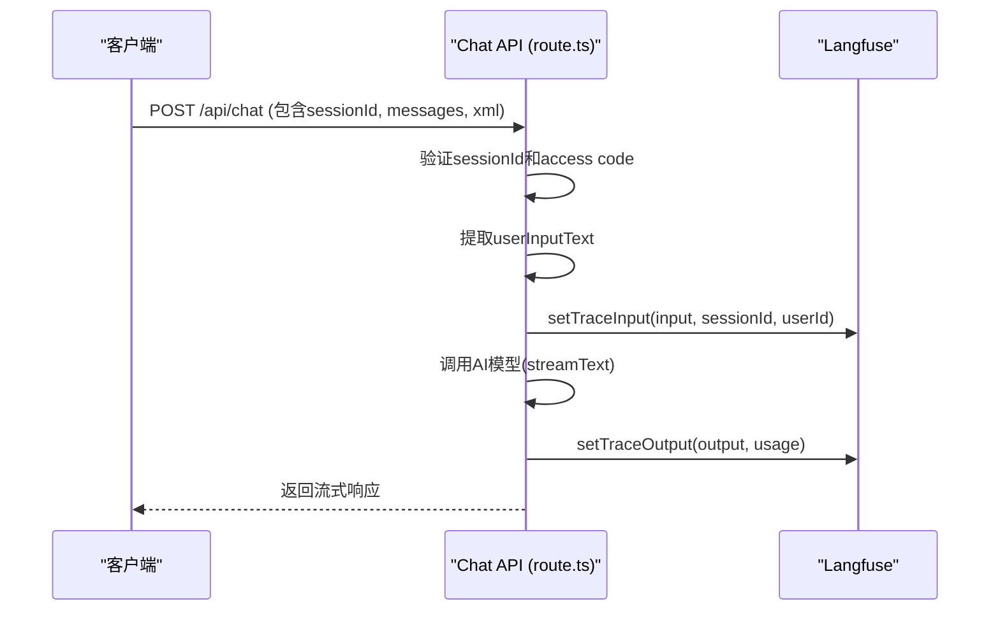
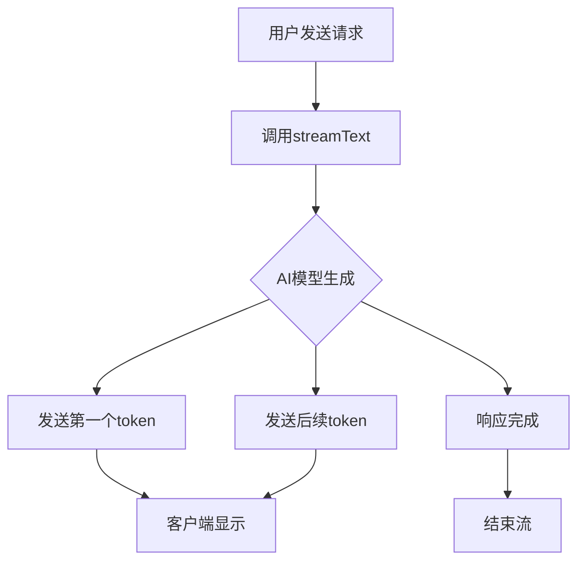

# 性能调优

<cite>
**本文档引用的文件**   
- [diagram-context.tsx](file://contexts/diagram-context.tsx)
- [langfuse.ts](file://lib/langfuse.ts)
- [cached-responses.ts](file://lib/cached-responses.ts)
- [route.ts](file://app/api/chat/route.ts)
- [ai-providers.ts](file://lib/ai-providers.ts)
- [utils.ts](file://lib/utils.ts)
- [route.ts](file://app/api/log-save/route.ts)
- [route.ts](file://app/api/verify-access-code/route.ts)
- [instrumentation.ts](file://instrumentation.ts)
- [chat-panel.tsx](file://components/chat-panel.tsx)
- [chat-input.tsx](file://components/chat-input.tsx)
- [chat-message-display.tsx](file://components/chat-message-display.tsx)
</cite>

## 目录
1. [引言](#引言)
2. [Langfuse追踪系统集成](#langfuse追踪系统集成)
3. [DiagramContext引用管理与状态优化](#diagramcontext引用管理与状态优化)
4. [AI调用性能优化](#ai调用性能优化)
5. [前端性能优化](#前端性能优化)
6. [故障排除指南](#故障排除指南)
7. [可扩展的监控与调试接口](#可扩展的监控与调试接口)
8. [结论](#结论)

## 引言
本文档旨在为有经验的开发者提供关于`next-ai-draw-io`项目的深度性能调优指南。文档将深入探讨Langfuse追踪系统的集成细节，分析DiagramContext中的引用管理（如ref的使用）和状态更新优化策略，提供优化AI调用性能的建议，并讨论如何提升前端响应速度。同时，文档将包含解决常见问题的故障排除指南，并记录可扩展的监控和调试接口。

## Langfuse追踪系统集成

本项目通过`lib/langfuse.ts`文件实现了对Langfuse追踪系统的深度集成，用于监控和分析AI调用的性能。该集成不仅记录了会话ID，还实现了用户反馈日志记录和详细的性能监控指标收集。

### 会话ID与用户ID管理
系统通过`handleChatRequest`函数在每次聊天请求中生成并验证会话ID（`sessionId`）。会话ID从客户端传递，并在服务器端进行长度和类型验证，确保其符合Langfuse的要求（字符串，最大200个字符）。如果未提供或无效，则使用`undefined`。同时，系统从`x-forwarded-for`请求头中提取用户IP地址作为`userId`，用于区分不同用户，即使他们未登录。



**Diagram sources**
- [route.ts](file://app/api/chat/route.ts#L163-L185)
- [langfuse.ts](file://lib/langfuse.ts#L30-L43)

### 用户反馈日志记录
系统通过`/api/log-feedback`端点记录用户对AI响应的反馈。当用户在聊天界面点击“赞”或“踩”按钮时，会触发`submitFeedback`函数，该函数向此端点发送POST请求，包含`messageId`、`feedback`（"good"或"bad"）和`sessionId`。这为模型的持续改进提供了宝贵的数据。

### 性能监控指标收集
性能监控是通过`@langfuse/tracing`库实现的。关键指标包括：
- **输入/输出记录**：通过`setTraceInput`和`setTraceOutput`函数手动记录用户输入和AI输出，避免了自动记录可能带来的大体积数据（如base64图片）上传问题。
- **Token用量**：由于AI SDK的流式传输不自动报告token用量，系统在`onFinish`回调中手动调用`setTraceOutput`，并传入`promptTokens`和`completionTokens`，确保这些关键性能指标被准确记录。
- **自定义元数据**：在`getTelemetryConfig`中，通过`metadata`字段将`sessionId`和`userId`附加到追踪中，便于后续分析。

**Section sources**
- [langfuse.ts](file://lib/langfuse.ts#L46-L76)
- [route.ts](file://app/api/chat/route.ts#L380-L392)

## DiagramContext引用管理与状态优化

`contexts/diagram-context.tsx`文件是前端状态管理的核心，它利用React的`useRef`和`useState`钩子来高效管理Draw.io图表的状态和引用，从而减少不必要的重新渲染。

### 引用管理（ref的使用）
`DiagramContext`使用了多个`useRef`实例来存储可变的值，这些值的改变不会触发组件重新渲染，这对于性能至关重要。
- `drawioRef`: 用于存储对Draw.io嵌入组件的引用，允许在不重新渲染整个组件的情况下直接调用其方法（如`load`和`exportDiagram`）。
- `resolverRef`和`saveResolverRef`: 用于存储回调函数（resolver），这些函数在异步操作（如导出图表）完成后被调用。通过`useRef`存储它们，避免了在每次渲染时创建新的函数引用，防止了不必要的依赖变化。
- `hasCalledOnLoadRef`和`expectHistoryExportRef`: 用于存储布尔标志，确保某些操作（如设置`isDrawioReady`）只执行一次，防止了无限循环。

```mermaid
classDiagram
class DiagramContext {
+chartXML : string
+latestSvg : string
+diagramHistory : {svg : string, xml : string}[]
+isDrawioReady : boolean
+drawioRef : React.Ref<DrawIoEmbedRef>
+resolverRef : React.Ref<(value : string) => void>
+saveResolverRef : React.Ref<{resolver : (data : string) => void, format : ExportFormat}>
+hasCalledOnLoadRef : React.Ref<boolean>
+expectHistoryExportRef : React.Ref<boolean>
+loadDiagram(chart : string) : string | null
+handleExport() : void
+handleDiagramExport(data : any) : void
+clearDiagram() : void
+saveDiagramToFile(filename : string, format : ExportFormat) : void
+onDrawioLoad() : void
}
DiagramContext --> "1" DrawIoEmbedRef : "uses"
DiagramContext --> "1" DiagramProvider : "provides"
DiagramProvider --> "n" useDiagram : "consumes"
```

**Diagram sources**
- [diagram-context.tsx](file://contexts/diagram-context.tsx#L39-L55)

### 状态更新优化策略
上下文通过精心设计的状态更新逻辑来最小化重新渲染。
- **批量更新**：`handleDiagramExport`函数在处理导出数据时，会一次性更新`chartXML`、`latestSvg`和`diagramHistory`等多个状态，而不是分多次更新，这减少了渲染次数。
- **条件更新**：`handleExport`和`handleExportWithoutHistory`函数通过`expectHistoryExportRef`这个ref来决定是否将导出的图表添加到历史记录中，避免了无谓的`setDiagramHistory`调用。
- **避免无效状态**：`onDrawioLoad`函数使用`hasCalledOnLoadRef`来确保`setIsDrawioReady(true)`只被调用一次，防止了因重复调用导致的潜在问题。

**Section sources**
- [diagram-context.tsx](file://contexts/diagram-context.tsx#L44-L50)
- [diagram-context.tsx](file://contexts/diagram-context.tsx#L114-L127)

## AI调用性能优化

项目通过多种策略优化了与AI模型的交互性能，包括缓存机制和流式响应处理。

### 流式响应处理
系统使用`ai`库的`streamText`函数来处理AI响应。这允许AI模型在生成内容的同时，将结果以流的形式逐步发送给客户端，极大地提升了用户体验，用户无需等待整个响应生成完毕即可看到部分内容。



### 缓存机制
项目实现了两级缓存策略，显著减少了对AI模型的调用次数。
1.  **示例响应缓存**：`lib/cached-responses.ts`文件定义了一个`CACHED_EXAMPLE_RESPONSES`数组，其中包含了预定义的提示词和对应的XML图表。当用户发送的是一条首次消息且图表为空时，系统会检查该数组，如果找到匹配项，则直接返回一个预构建的流式响应，完全绕过AI模型调用。
2.  **AI模型缓存**：在`app/api/chat/route.ts`中，通过向`streamText`的`messages`数组中添加带有`providerOptions.bedrock.cachePoint`的系统消息，实现了对AI模型内部缓存的利用。这包括两个缓存点：一个用于静态指令，另一个用于当前的图表XML。这使得在用户消息变化时，可以重用大部分已缓存的上下文，从而加快响应速度。

**Section sources**
- [cached-responses.ts](file://lib/cached-responses.ts#L7-L549)
- [route.ts](file://app/api/chat/route.ts#L194-L212)
- [route.ts](file://app/api/chat/route.ts#L315-L337)

## 前端性能优化

前端通过减少DOM操作和优化事件处理来提升响应速度。

### 减少DOM操作
- **虚拟滚动**：`components/chat-message-display.tsx`组件使用了`<ScrollArea>`（基于`@radix-ui/react-scroll-area`），它实现了虚拟滚动，只渲染视口内的聊天消息，对于长对话历史，这能显著减少DOM节点数量。
- **避免不必要的渲染**：`ChatMessageDisplay`组件通过`useCallback`和`useMemo`（隐含在`React.memo`等优化中）来记忆化函数和值，确保只有当相关数据真正改变时，子组件才会重新渲染。

### 优化事件处理
- **防抖与节流**：虽然代码中未显式使用，但`handleKeyDown`和`handlePaste`等事件处理器的设计避免了在短时间内触发大量昂贵的操作。
- **高效的文件处理**：`components/chat-input.tsx`中的`handleFileChange`和`handlePaste`函数在处理文件上传时，会先进行验证（大小、数量），并使用`FileReader`异步读取文件内容，避免了阻塞主线程。

**Section sources**
- [chat-message-display.tsx](file://components/chat-message-display.tsx#L346-L347)
- [chat-input.tsx](file://components/chat-input.tsx#L185-L216)

## 故障排除指南

本指南帮助开发者诊断和解决项目中常见的问题。

### 访问码验证失败
**问题**：用户收到“Invalid or missing access code”的错误。
**原因**：环境变量`ACCESS_CODE_LIST`未设置，或用户提供的访问码不在列表中。
**解决方案**：
1.  检查`.env.local`文件，确保`ACCESS_CODE_LIST`已正确配置。
2.  在`app/api/verify-access-code/route.ts`中，`POST`请求会验证访问码。如果`ACCESS_CODE_LIST`为空，则验证通过。
3.  确保客户端在请求头中正确设置了`x-access-code`。

**Section sources**
- [route.ts](file://app/api/verify-access-code/route.ts#L1-L32)
- [chat-panel.tsx](file://components/chat-panel.tsx#L494-L497)

### 图表渲染延迟
**问题**：图表加载或更新时出现延迟。
**原因**：Draw.io编辑器的加载是异步的，`isDrawioReady`状态可能未及时更新。
**解决方案**：
1.  确保在调用`loadDiagram`等方法前，`isDrawioReady`为`true`。
2.  `DiagramContext`中的`onDrawioLoad`函数通过`hasCalledOnLoadRef`确保只设置一次`isDrawioReady`，避免了竞争条件。

**Section sources**
- [diagram-context.tsx](file://contexts/diagram-context.tsx#L44-L50)
- [chat-panel.tsx](file://components/chat-panel.tsx#L328-L367)

### 内存泄漏
**问题**：长时间使用后，应用内存占用持续增长。
**原因**：未正确清理事件监听器或定时器。
**解决方案**：
1.  检查`useEffect`钩子，确保返回了清理函数。例如，在`chat-panel.tsx`中，`handleBeforeUnload`事件监听器在组件卸载时被正确移除。
2.  避免在`useRef`中存储大型对象或DOM节点，除非必要。

**Section sources**
- [chat-panel.tsx](file://components/chat-panel.tsx#L444-L447)

## 可扩展的监控与调试接口

项目提供了可扩展的监控和调试接口，便于二次开发。

### Langfuse集成
`lib/langfuse.ts`提供了一套清晰的API（`getLangfuseClient`, `setTraceInput`, `setTraceOutput`, `getTelemetryConfig`），开发者可以轻松地在其他API路由中集成Langfuse，只需导入并调用这些函数即可。

### 自定义API端点
项目结构清晰地分离了API逻辑。开发者可以轻松地在`app/api/`目录下创建新的路由文件（如`/api/custom-monitoring/route.ts`），并复用现有的工具（如`zod`验证、`getLangfuseClient`）来构建自定义的监控或调试接口。

**Section sources**
- [langfuse.ts](file://lib/langfuse.ts#L8-L108)
- [route.ts](file://app/api/chat/route.ts)

## 结论
通过对`next-ai-draw-io`项目的深入分析，本文档详细阐述了其在性能调优方面的各项实践。从利用Langfuse进行精细化的追踪和监控，到通过`useRef`和状态管理优化前端性能，再到实施高效的AI调用缓存策略，该项目为开发者提供了一个高性能、可维护且易于扩展的架构范例。遵循本文档中的指南，开发者可以有效地进行二次开发，解决常见问题，并进一步提升应用的性能和用户体验。