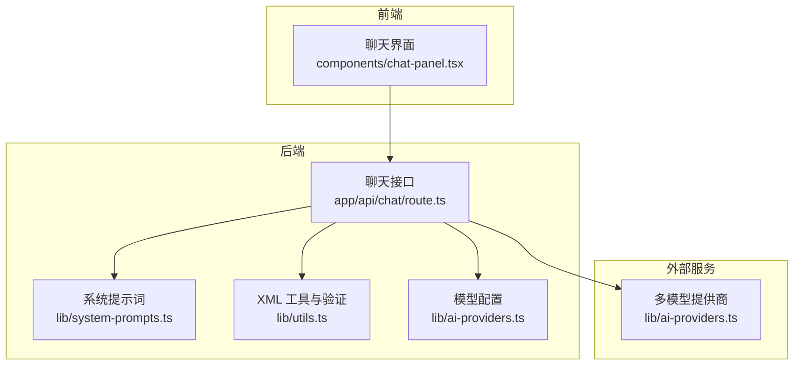
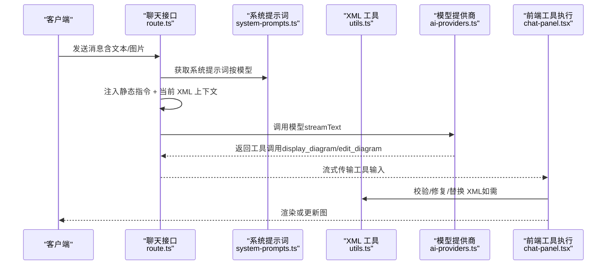
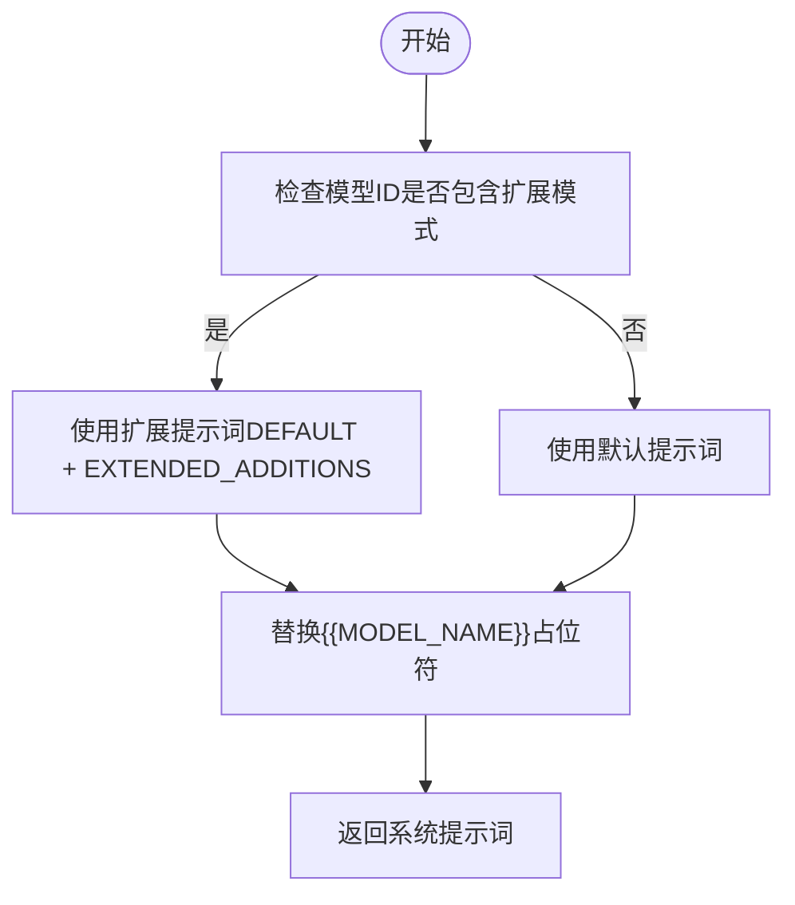
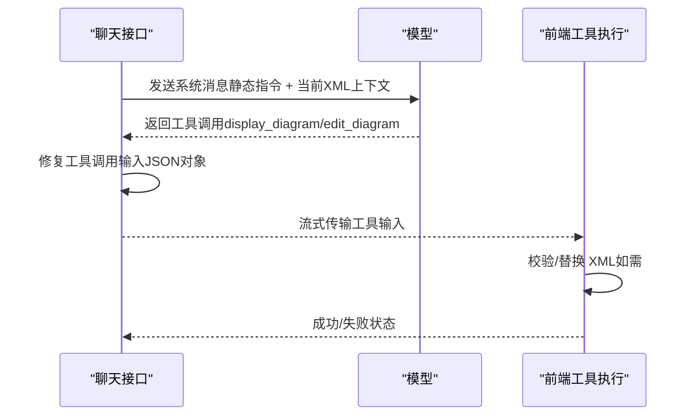
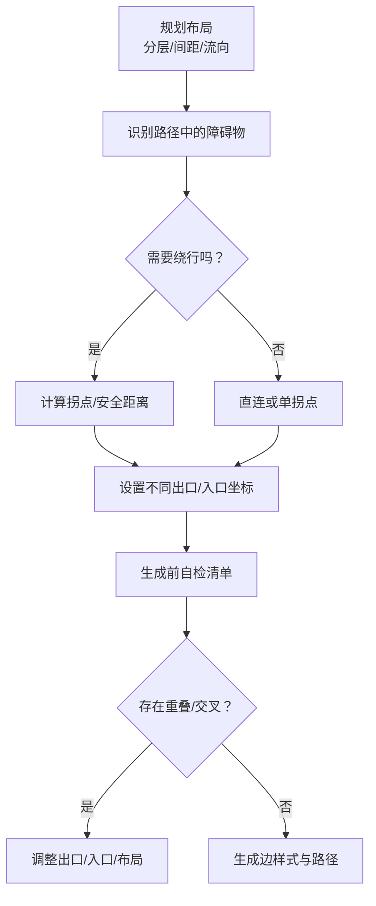
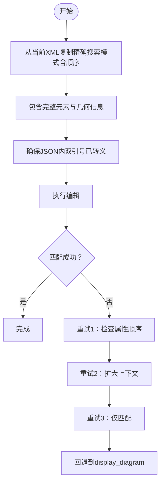
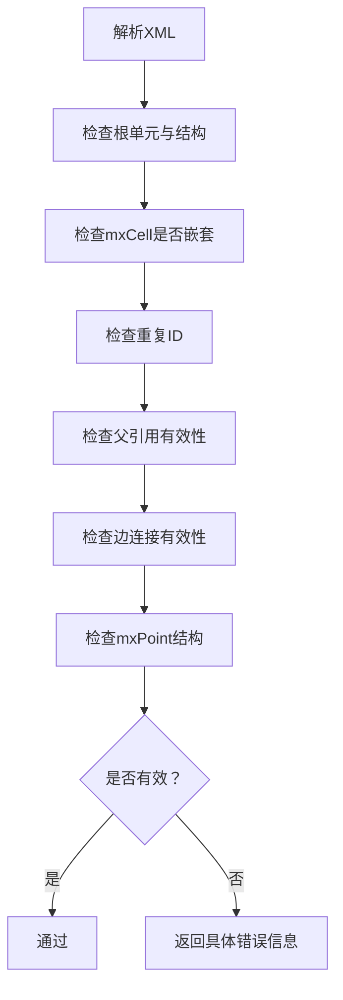
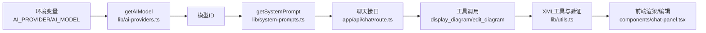

# 系统提示词优化

<cite>
**本文引用的文件**
- [lib/system-prompts.ts](file://lib/system-prompts.ts)
- [app/api/chat/route.ts](file://app/api/chat/route.ts)
- [lib/ai-providers.ts](file://lib/ai-providers.ts)
- [lib/utils.ts](file://lib/utils.ts)
- [components/chat-panel.tsx](file://components/chat-panel.tsx)
- [app/api/chat/xml_guide.md](file://app/api/chat/xml_guide.md)
- [README.md](file://README.md)
</cite>

## 目录
1. [简介](#简介)
2. [项目结构](#项目结构)
3. [核心组件](#核心组件)
4. [架构总览](#架构总览)
5. [详细组件分析](#详细组件分析)
6. [依赖关系分析](#依赖关系分析)
7. [性能考量](#性能考量)
8. [故障排查指南](#故障排查指南)
9. [结论](#结论)
10. [附录](#附录)

## 简介
本文件聚焦于系统提示词优化，面向有经验的开发者，深入解析 DEFAULT_SYSTEM_PROMPT 与 EXTENDED_SYSTEM_PROMPT 的设计原则与差异，解释为何针对特定模型（如 Opus 4.5、Haiku 4.5）采用扩展提示词，以及如何在 draw.io XML 生成、工具调用、布局约束与边路由规则上达成最佳实践。同时提供性能优化技巧、JSON 转义与属性顺序匹配的关键细节，并给出常见错误的解决方案与实际案例。

## 项目结构
该系统围绕“聊天接口 + 多模型提供商 + 提示词选择 + 工具调用 + XML 验证”构建，关键路径如下：
- 提示词管理：lib/system-prompts.ts
- 聊天 API：app/api/chat/route.ts
- 模型配置：lib/ai-providers.ts
- XML 工具与验证：lib/utils.ts
- 前端工具调用执行：components/chat-panel.tsx
- XML 结构参考：app/api/chat/xml_guide.md
- 项目说明与推荐模型：README.md

**图示来源**
- [app/api/chat/route.ts](file://app/api/chat/route.ts#L1-L120)
- [lib/system-prompts.ts](file://lib/system-prompts.ts#L1-L120)
- [lib/utils.ts](file://lib/utils.ts#L1-L120)
- [lib/ai-providers.ts](file://lib/ai-providers.ts#L112-L180)

**章节来源**
- [README.md](file://README.md#L80-L120)
- [lib/system-prompts.ts](file://lib/system-prompts.ts#L1-L120)
- [app/api/chat/route.ts](file://app/api/chat/route.ts#L1-L120)

## 核心组件
- 系统提示词模块：负责默认与扩展提示词的定义、拼接与按模型选择返回。
- 聊天 API：负责消息格式化、系统消息注入、工具调用修复、缓存断点设置与流式输出。
- 模型配置：负责根据环境变量自动检测或显式指定提供商与模型 ID。
- XML 工具与验证：负责 XML 合法性校验、节点替换、格式化与错误定位。
- 前端工具调用执行：负责接收工具调用并在画布上渲染或应用编辑。

**章节来源**
- [lib/system-prompts.ts](file://lib/system-prompts.ts#L1-L120)
- [app/api/chat/route.ts](file://app/api/chat/route.ts#L200-L380)
- [lib/ai-providers.ts](file://lib/ai-providers.ts#L112-L180)
- [lib/utils.ts](file://lib/utils.ts#L508-L711)
- [components/chat-panel.tsx](file://components/chat-panel.tsx#L140-L240)

## 架构总览
系统提示词在聊天请求中被注入为两段系统消息，分别用于：
- 静态指令（极少变化）
- 当前图 XML 上下文（每轮对话变化）

随后，模型基于这些系统消息与历史消息进行推理，生成工具调用（display_diagram 或 edit_diagram），前端据此渲染或局部修改。

**图示来源**
- [app/api/chat/route.ts](file://app/api/chat/route.ts#L315-L380)
- [lib/system-prompts.ts](file://lib/system-prompts.ts#L332-L371)
- [lib/utils.ts](file://lib/utils.ts#L240-L506)
- [lib/ai-providers.ts](file://lib/ai-providers.ts#L112-L180)
- [components/chat-panel.tsx](file://components/chat-panel.tsx#L140-L240)

## 详细组件分析

### 系统提示词设计与模型适配
- 默认提示词（约 2700 token）：覆盖基础能力、工具使用、布局约束、XML 规则与注意事项。
- 扩展提示词（约 1800 token）：补充工具细节、编辑最佳实践、边路由规则、JSON 转义与错误恢复策略。
- 提示词拼接：EXTENDED_SYSTEM_PROMPT = DEFAULT + EXTENDED_ADDITIONS。
- 模型适配：当模型 ID 包含特定模式（如 claude-opus-4-5、claude-haiku-4-5）时，使用扩展提示词；否则使用默认提示词。
- 模型名占位符：在最终提示词中替换 {{MODEL_NAME}}。

**图示来源**
- [lib/system-prompts.ts](file://lib/system-prompts.ts#L332-L371)

**章节来源**
- [lib/system-prompts.ts](file://lib/system-prompts.ts#L1-L120)
- [lib/system-prompts.ts](file://lib/system-prompts.ts#L135-L331)
- [lib/system-prompts.ts](file://lib/system-prompts.ts#L332-L371)

### 工具调用与 XML 生成/编辑
- 工具定义：
  - display_diagram：生成全新图或重大结构调整时使用。
  - edit_diagram：对现有图进行小范围精准修改。
- 工具调用修复：针对某些提供商（如 Bedrock）要求工具调用参数为 JSON 对象而非字符串的问题，进行修复。
- 缓存断点：将系统消息拆分为静态指令与当前 XML 上下文两段，分别设置缓存断点，提升后续请求复用率。
- 错误修复：对模型生成的 JSON 中未转义双引号进行自动修复，避免解析失败。

**图示来源**
- [app/api/chat/route.ts](file://app/api/chat/route.ts#L262-L380)
- [components/chat-panel.tsx](file://components/chat-panel.tsx#L140-L240)

**章节来源**
- [app/api/chat/route.ts](file://app/api/chat/route.ts#L262-L380)
- [components/chat-panel.tsx](file://components/chat-panel.tsx#L140-L240)

### 边路由与布局约束最佳实践
- 路由规则要点：
  - 不同连接共享同一路径会导致重叠，必须使用不同出口/入口坐标。
  - 双向连接应使用相反侧（例如 A→B 使用右侧出口、B→A 使用左侧入口）。
  - 每条边必须显式设置 exitX、exitY、entryX、entryY。
  - 路径中存在中间形状时，必须绕行（沿外围走），并留出 20-30px 安全距离。
  - 先规划布局再生成 XML，按流向分层排列，保持清晰的通道。
  - 复杂路径使用 2-3 个拐点形成 L/U 形路径，确保水平/垂直段。
  - 自然连接点优先使用中心位置，避免角落连接。
- 验证清单（生成前自检）：
  - 是否有边跨越了非源/目标形状？
  - 是否有两条边走同一路径？
  - 是否使用了角落连接点？
  - 是否可通过重新排列形状减少交叉？

**图示来源**
- [lib/system-prompts.ts](file://lib/system-prompts.ts#L243-L331)

**章节来源**
- [lib/system-prompts.ts](file://lib/system-prompts.ts#L243-L331)

### JSON 转义与属性顺序匹配
- JSON 转义：
  - 在 edit_diagram 的工具调用中，所有字符串值内的双引号必须转义为 \"，否则导致 JSON 解析错误。
- 属性顺序匹配：
  - 搜索模式必须与当前 XML 中的完全一致（包括空格、换行与属性顺序），否则无法匹配。
  - 建议包含完整元素（mxCell + mxGeometry）以便唯一定位。
  - 若首次匹配失败，可逐步增加上下文或尝试仅匹配 <mxCell id="X"> 前缀，最多重试三次，之后回退到 display_diagram。

**图示来源**
- [lib/system-prompts.ts](file://lib/system-prompts.ts#L174-L239)
- [lib/system-prompts.ts](file://lib/system-prompts.ts#L80-L94)

**章节来源**
- [lib/system-prompts.ts](file://lib/system-prompts.ts#L80-L94)
- [lib/system-prompts.ts](file://lib/system-prompts.ts#L174-L239)

### XML 结构与验证
- 基本结构与根元素：
  - 必须包含两个特殊根单元：id="0" 与 id="1"（parent="0"）。
  - 所有 mxCell 必须直接作为 <root> 的子元素，不得嵌套。
  - 边的 source/target 必须引用存在的 cell ID。
  - 特殊字符需转义：使用 &lt;、&gt;、&amp;、&quot;。
- 常见问题与修复：
  - 嵌套 mxCell：必须改为兄弟节点。
  - 重复 ID：确保每个 mxCell 唯一。
  - 缺失父引用：除 id="0" 外，其他元素必须有 parent。
  - 无效边连接：source/target 必须存在。
  - 孤立 mxPoint：必须位于 <Array as="points"> 内或具有 as 属性。
- 工具函数：
  - validateMxCellStructure：一次性收集并报告上述问题。
  - replaceXMLParts：支持多种匹配策略（精确、去空白、属性顺序无关、按 id/value 定位等）。

**图示来源**
- [lib/utils.ts](file://lib/utils.ts#L508-L711)
- [app/api/chat/xml_guide.md](file://app/api/chat/xml_guide.md#L1-L120)

**章节来源**
- [lib/utils.ts](file://lib/utils.ts#L508-L711)
- [app/api/chat/xml_guide.md](file://app/api/chat/xml_guide.md#L1-L120)

### 实战案例：优化提示词以改善图表生成效果
- 案例1：AWS 架构图
  - 使用扩展提示词（包含 AWS 2025 图标提示）与工具调用，确保边样式与图标规范。
  - 通过布局规划与边路由规则，避免跨容器连线遮挡。
- 案例2：泳道流程图
  - 明确 swimlane 与步骤的父子关系，保证所有 mxCell 为 <root> 的直接子节点。
  - 使用 orthogonalEdgeStyle 并设置 exit/entry 坐标，避免重叠。
- 案例3：复杂拓扑网络
  - 先分层布局，再添加中间形状绕行路径，必要时使用多个拐点。
  - 严格遵守属性顺序与 JSON 转义，确保 edit_diagram 精准命中。

**章节来源**
- [lib/system-prompts.ts](file://lib/system-prompts.ts#L1-L120)
- [lib/system-prompts.ts](file://lib/system-prompts.ts#L243-L331)
- [app/api/chat/xml_guide.md](file://app/api/chat/xml_guide.md#L236-L266)

## 依赖关系分析
- 模型选择依赖：
  - getAIModel 从环境变量读取 AI_PROVIDER 与 AI_MODEL，决定使用的提供商与模型 ID。
  - getSystemPrompt 基于模型 ID 判断是否使用扩展提示词。
- 工具调用依赖：
  - 聊天接口将系统提示词与历史消息合并，注入工具定义与修复逻辑。
  - 前端在收到工具调用后，调用 lib/utils 的验证与替换函数，确保 XML 合法。

**图示来源**
- [lib/ai-providers.ts](file://lib/ai-providers.ts#L112-L180)
- [lib/system-prompts.ts](file://lib/system-prompts.ts#L332-L371)
- [app/api/chat/route.ts](file://app/api/chat/route.ts#L215-L230)
- [lib/utils.ts](file://lib/utils.ts#L240-L506)
- [components/chat-panel.tsx](file://components/chat-panel.tsx#L140-L240)

**章节来源**
- [lib/ai-providers.ts](file://lib/ai-providers.ts#L112-L180)
- [lib/system-prompts.ts](file://lib/system-prompts.ts#L332-L371)
- [app/api/chat/route.ts](file://app/api/chat/route.ts#L215-L230)

## 性能考量
- 提示词长度与模型响应质量的平衡：
  - 扩展提示词（约 4500 token）适用于 Opus 4.5、Haiku 4.5 等具备较高缓存最小值的模型，能显著提升编辑精度与边路由稳定性。
  - 对于较小缓存的模型，优先使用默认提示词，避免超出上下文限制导致截断或性能下降。
- 缓存断点策略：
  - 将系统消息拆分为静态指令与当前 XML 上下文两段，分别设置缓存断点，使后续请求能复用静态指令，降低 token 消耗。
- 工具调用修复与 JSON 修复：
  - 针对提供商差异进行工具调用输入修复，减少重试与失败成本。
  - 对未转义的 JSON 进行自动修复，提高成功率与稳定性。
- 前端渲染与编辑：
  - 使用 replaceXMLParts 的多策略匹配，减少因属性顺序或空白差异导致的失败。
  - 在 edit_diagram 失败时快速回退到 display_diagram，避免长时间卡顿。

**章节来源**
- [lib/system-prompts.ts](file://lib/system-prompts.ts#L332-L371)
- [app/api/chat/route.ts](file://app/api/chat/route.ts#L315-L380)
- [lib/utils.ts](file://lib/utils.ts#L240-L506)

## 故障排查指南
- 常见错误与解决：
  - XML 结构错误：嵌套 mxCell、重复 ID、缺失父引用、无效边连接、孤立 mxPoint。
    - 解决：使用 validateMxCellStructure 定位问题，按规则修正。
  - JSON 解析失败：字符串内未转义双引号。
    - 解决：遵循提示词中的 JSON 转义规则，确保所有 " 转义为 \"。
  - edit_diagram 匹配失败：属性顺序不一致、上下文不足、仅匹配 id/value 导致歧义。
    - 解决：从当前 XML 精确复制搜索模式，包含完整元素与几何信息；必要时扩大上下文或仅匹配 <mxCell id="X"> 前缀；最多重试三次后回退。
  - 边重叠/交叉：出口/入口坐标相同、使用角落连接、未绕行障碍物。
    - 解决：按边路由规则设置不同坐标、避免角落连接、计算安全距离并使用拐点。
- 建议的调试流程：
  - 生成失败时，先查看 validateMxCellStructure 的错误信息，逐项修正。
  - 对 edit_diagram，打印当前 XML 与搜索模式，确认属性顺序与上下文。
  - 如仍失败，缩小搜索范围或仅匹配 id，再逐步扩大，最后回退到 display_diagram。

**章节来源**
- [lib/utils.ts](file://lib/utils.ts#L508-L711)
- [lib/system-prompts.ts](file://lib/system-prompts.ts#L80-L94)
- [lib/system-prompts.ts](file://lib/system-prompts.ts#L174-L239)
- [lib/system-prompts.ts](file://lib/system-prompts.ts#L243-L331)

## 结论
通过将系统提示词按模型差异化配置、明确工具调用与 XML 结构约束、强化边路由规则与 JSON 转义，本系统在 draw.io XML 生成与编辑方面实现了高一致性与高稳定性。结合缓存断点与工具调用修复策略，可在保证质量的同时提升性能与用户体验。建议在复杂场景中优先采用扩展提示词，并严格遵循属性顺序与转义规则，以获得最佳效果。

## 附录
- 推荐模型与能力：
  - README 指出 claude-sonnet-4-5 训练包含 AWS 图标，适合生成 AWS 架构图。
- XML 结构参考：
  - xml_guide.md 提供了完整的 draw.io XML 结构、样式与常见模式，便于对照实现。

**章节来源**
- [README.md](file://README.md#L95-L101)
- [app/api/chat/xml_guide.md](file://app/api/chat/xml_guide.md#L1-L120)