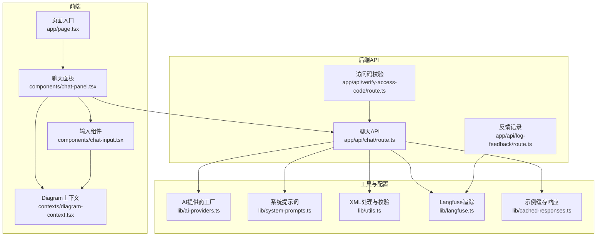
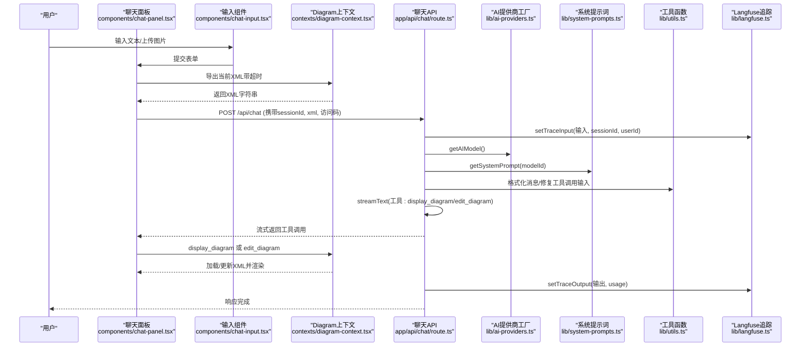
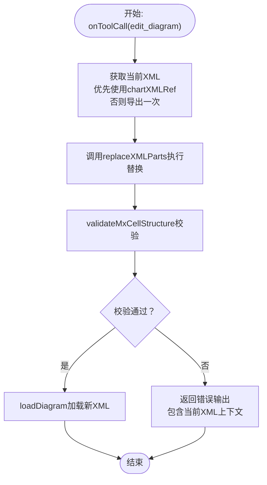
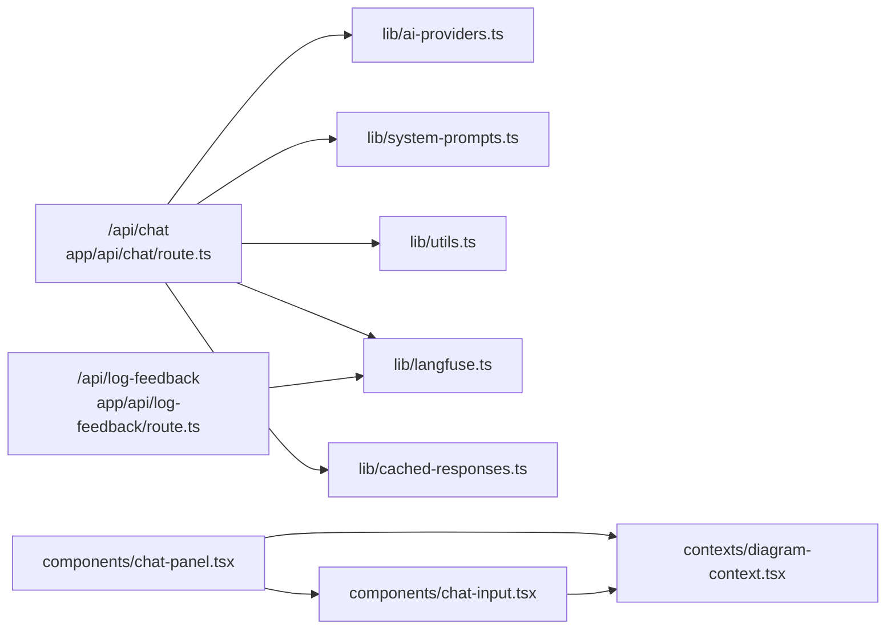

# 高级主题

<cite>
**本文引用的文件列表**
- [README.md](file://README.md)
- [docs/ai-providers.md](file://docs/ai-providers.md)
- [lib/ai-providers.ts](file://lib/ai-providers.ts)
- [lib/system-prompts.ts](file://lib/system-prompts.ts)
- [lib/langfuse.ts](file://lib/langfuse.ts)
- [lib/utils.ts](file://lib/utils.ts)
- [lib/cached-responses.ts](file://lib/cached-responses.ts)
- [app/api/chat/route.ts](file://app/api/chat/route.ts)
- [app/api/verify-access-code/route.ts](file://app/api/verify-access-code/route.ts)
- [app/api/log-feedback/route.ts](file://app/api/log-feedback/route.ts)
- [contexts/diagram-context.tsx](file://contexts/diagram-context.tsx)
- [components/chat-panel.tsx](file://components/chat-panel.tsx)
- [components/chat-input.tsx](file://components/chat-input.tsx)
- [app/page.tsx](file://app/page.tsx)
- [package.json](file://package.json)
</cite>

## 目录
1. [简介](#简介)
2. [项目结构](#项目结构)
3. [核心组件](#核心组件)
4. [架构总览](#架构总览)
5. [详细组件分析](#详细组件分析)
6. [依赖关系分析](#依赖关系分析)
7. [性能考量](#性能考量)
8. [故障排除指南](#故障排除指南)
9. [结论](#结论)
10. [附录](#附录)

## 简介
本“高级主题”文档面向有经验的开发者，聚焦于以下能力与扩展点：
- 多AI提供商支持的扩展机制：如何接入新模型（如Anthropic、Google AI），以及在现有框架下新增提供商的步骤与注意事项。
- 系统提示词设计原则与优化技巧：如何通过系统提示词约束输出格式、工具调用与布局规则，提升生成质量与稳定性。
- Langfuse追踪系统的集成细节：会话ID管理、输入/输出记录、评分反馈与埋点配置。
- 状态管理高级模式：DiagramContext中的引用管理（ref）与性能优化策略。
- 性能优化建议：减少不必要重渲染、优化AI调用与缓存策略。
- 故障排除指南：访问码验证失败、图表渲染错误等常见问题定位与修复。
- 扩展点与自定义选项：为二次开发提供可插拔的接口与最佳实践。

## 项目结构
该应用采用Next.js App Router组织前端页面与API路由，核心逻辑集中在lib工具模块、上下文与聊天组件中。整体结构如下图所示：

图表来源
- [app/page.tsx](file://app/page.tsx#L1-L162)
- [components/chat-panel.tsx](file://components/chat-panel.tsx#L1-L816)
- [components/chat-input.tsx](file://components/chat-input.tsx#L1-L481)
- [contexts/diagram-context.tsx](file://contexts/diagram-context.tsx#L1-L268)
- [app/api/chat/route.ts](file://app/api/chat/route.ts#L1-L495)
- [app/api/verify-access-code/route.ts](file://app/api/verify-access-code/route.ts#L1-L33)
- [app/api/log-feedback/route.ts](file://app/api/log-feedback/route.ts#L1-L113)
- [lib/ai-providers.ts](file://lib/ai-providers.ts#L1-L286)
- [lib/system-prompts.ts](file://lib/system-prompts.ts#L1-L371)
- [lib/utils.ts](file://lib/utils.ts#L1-L711)
- [lib/langfuse.ts](file://lib/langfuse.ts#L1-L108)
- [lib/cached-responses.ts](file://lib/cached-responses.ts#L1-L562)

章节来源
- [README.md](file://README.md#L1-L225)
- [package.json](file://package.json#L1-L84)

## 核心组件
- AI提供商工厂：统一创建不同提供商的模型实例，支持自动检测与环境变量配置，覆盖Bedrock、OpenAI、Anthropic、Google、Azure、Ollama、OpenRouter、DeepSeek、SiliconFlow等。
- 系统提示词：提供默认与扩展版提示词，针对高缓存令牌模型（如Claude Opus/Haiku 4.5）自动切换扩展提示词，严格约束draw.io XML生成规则与工具调用格式。
- Langfuse追踪：封装客户端初始化、会话ID注入、输入输出记录、使用量属性设置与观察器包装，支持禁用自动输入记录以避免上传大图片媒体。
- Diagram上下文：集中管理图表XML、历史快照、导出回调、保存到文件、清理与就绪状态；通过ref管理DrawIO引用与解析器，避免闭包陷阱与重复渲染。
- 聊天面板与输入：基于@ai-sdk/react的useChat驱动流式对话，支持工具调用（display_diagram/edit_diagram）、消息持久化、会话ID生成与本地存储恢复。
- 工具函数：XML格式化、合法性校验、节点替换、压缩解压与提取、缓存示例响应等。

章节来源
- [lib/ai-providers.ts](file://lib/ai-providers.ts#L1-L286)
- [lib/system-prompts.ts](file://lib/system-prompts.ts#L1-L371)
- [lib/langfuse.ts](file://lib/langfuse.ts#L1-L108)
- [contexts/diagram-context.tsx](file://contexts/diagram-context.tsx#L1-L268)
- [components/chat-panel.tsx](file://components/chat-panel.tsx#L1-L816)
- [components/chat-input.tsx](file://components/chat-input.tsx#L1-L481)
- [lib/utils.ts](file://lib/utils.ts#L1-L711)
- [lib/cached-responses.ts](file://lib/cached-responses.ts#L1-L562)

## 架构总览
下图展示了从用户交互到AI生成再到图表渲染与追踪的整体流程：

图表来源
- [components/chat-panel.tsx](file://components/chat-panel.tsx#L1-L816)
- [components/chat-input.tsx](file://components/chat-input.tsx#L1-L481)
- [contexts/diagram-context.tsx](file://contexts/diagram-context.tsx#L1-L268)
- [app/api/chat/route.ts](file://app/api/chat/route.ts#L1-L495)
- [lib/ai-providers.ts](file://lib/ai-providers.ts#L1-L286)
- [lib/system-prompts.ts](file://lib/system-prompts.ts#L1-L371)
- [lib/utils.ts](file://lib/utils.ts#L1-L711)
- [lib/langfuse.ts](file://lib/langfuse.ts#L1-L108)

## 详细组件分析

### 多AI提供商支持与扩展机制
- 支持的提供商与特性
  - Bedrock/AWS：支持Anthropic模型并通过beta头启用细粒度工具流；支持IAM角色与环境变量凭证链。
  - OpenAI/Azure OpenAI/OpenRouter：支持自定义base_url；Azure支持资源名与密钥。
  - Anthropic：支持自定义base_url与细粒度工具流beta头。
  - Google AI：支持自定义base_url。
  - Ollama：支持自定义base_url；无需API密钥。
  - DeepSeek/SiliconFlow：OpenAI兼容，支持自定义base_url。
- 自动检测与配置
  - 若仅配置一个提供商API密钥，系统自动选择；若配置多个，必须显式设置AI_PROVIDER。
  - 缺少AI_MODEL或未配置任何提供商时抛出明确错误。
- 新增提供商的步骤（以Google为例）
  1) 在提供商映射中添加新条目，并在PROVIDER_ENV_VARS中注册所需环境变量。
  2) 在getAIModel的switch分支中添加新case，按需设置baseURL与headers。
  3) 在README与docs/ai-providers.md中补充配置说明与示例。
  4) 如需自定义endpoint，确保支持baseURL参数。
- 注意事项
  - 某些提供商对工具调用输入格式有严格要求（如Bedrock需要JSON对象而非字符串），已在API层进行修复。
  - 对于需要特殊头部的提供商（如Anthropic beta），需在headers中注入。

章节来源
- [lib/ai-providers.ts](file://lib/ai-providers.ts#L1-L286)
- [docs/ai-providers.md](file://docs/ai-providers.md#L1-L169)
- [README.md](file://README.md#L81-L100)

### 系统提示词设计原则与优化技巧
- 设计原则
  - 明确工具边界：display_diagram用于全新生成，edit_diagram用于局部修改，避免重复生成。
  - 严格的XML结构约束：根元素、唯一ID、父子关系、边连接有效性、mxPoint规范等。
  - 边路由规则：避免路径重叠、自然连接点、绕过障碍物、分段路径等。
  - JSON转义与模式匹配：对引号转义、属性顺序、标签展开等进行容错与修复。
- 优化技巧
  - 针对高缓存令牌模型（如Claude Opus/Haiku 4.5）自动切换扩展提示词，提升复杂任务表现。
  - 将当前XML上下文作为系统消息的一部分，结合Bedrock缓存断点，复用指令与上下文，降低token消耗。
  - 使用工具调用的“修复”机制，对模型生成的无效JSON进行回退修复，提高鲁棒性。
- 实践要点
  - 在edit_diagram中，优先使用精确搜索模式（包含完整mxCell与上下文），并保留原始属性顺序。
  - 对于大图布局，先规划再生成，减少边交叉与重排成本。

章节来源
- [lib/system-prompts.ts](file://lib/system-prompts.ts#L1-L371)
- [app/api/chat/route.ts](file://app/api/chat/route.ts#L1-L495)

### Langfuse追踪集成细节
- 会话ID管理
  - 客户端：聊天面板生成唯一sessionId并持久化到localStorage；每次清空会话时重置。
  - 服务端：从请求头读取sessionId并限制长度；同时从x-forwarded-for提取userId。
- 输入/输出记录
  - setTraceInput：手动记录用户输入、sessionId与userId。
  - setTraceOutput：记录最终输出，并在Bedrock流式场景下手动写入promptTokens/completionTokens。
  - getTelemetryConfig：返回实验性遥测配置，禁用自动输入记录以避免上传大图片媒体。
- 观察器包装
  - wrapWithObserve：将API处理器包裹为Langfuse观察器，支持trace生命周期控制。
- 反馈日志
  - /api/log-feedback：接收用户反馈（good/bad），尝试附加到最近的聊天trace，否则创建独立trace并打分。
- 最佳实践
  - 仅记录必要的文本输入，避免上传大体积媒体；使用Langfuse的recordInputs=false。
  - 在Bedrock等流式场景下，显式传入usage统计，保证指标准确。

章节来源
- [lib/langfuse.ts](file://lib/langfuse.ts#L1-L108)
- [components/chat-panel.tsx](file://components/chat-panel.tsx#L1-L816)
- [app/api/chat/route.ts](file://app/api/chat/route.ts#L1-L495)
- [app/api/log-feedback/route.ts](file://app/api/log-feedback/route.ts#L1-L113)

### 状态管理高级模式：DiagramContext中的引用管理与性能优化
- 引用管理（ref）
  - drawioRef：指向DrawIO嵌入组件的引用，用于导出与加载。
  - resolverRef：工具调用回调解析器，避免闭包捕获旧状态导致的竞态。
  - saveResolverRef：保存文件时的回调解析器，确保下载前的数据准备。
  - chartXMLRef：在工具回调中直接读取最新XML，避免useChat回调中的闭包陷阱。
- 性能优化
  - 避免不必要的重渲染：通过useRef持有可变状态，仅在必要时触发setter。
  - 导出超时保护：Promise.race设置10秒超时，防止阻塞UI。
  - 本地持久化：消息、XML快照、sessionId、Diagram XML均持久化到localStorage，恢复时跳过验证以加速。
  - 清理与就绪：仅在DrawIO首次加载完成后恢复Diagram，避免重复渲染。
- 错误处理
  - loadDiagram对XML进行结构校验，返回错误信息供模型重试。
  - edit_diagram在失败时提供上下文XML，便于定位问题。

章节来源
- [contexts/diagram-context.tsx](file://contexts/diagram-context.tsx#L1-L268)
- [components/chat-panel.tsx](file://components/chat-panel.tsx#L1-L816)
- [lib/utils.ts](file://lib/utils.ts#L1-L711)

### 复杂逻辑流程图：edit_diagram工具调用

图表来源
- [components/chat-panel.tsx](file://components/chat-panel.tsx#L1-L816)
- [lib/utils.ts](file://lib/utils.ts#L1-L711)
- [contexts/diagram-context.tsx](file://contexts/diagram-context.tsx#L1-L268)

## 依赖关系分析
- 外部依赖概览
  - AI SDK：@ai-sdk/*系列（OpenAI、Anthropic、Google、Azure、Bedrock、DeepSeek、OpenRouter、Ollama）。
  - 前端：@ai-sdk/react、react-drawio、react-resizable-panels、lucide-react、sonner等。
  - 追踪：@langfuse/client、@langfuse/tracing、@langfuse/otel、@opentelemetry/*。
  - 工具：pako（zlib解压）、@xmldom/xmldom（DOM解析）、zod（输入校验）。
- 内部模块耦合
  - app/api/chat/route.ts 依赖 lib/ai-providers.ts、lib/system-prompts.ts、lib/utils.ts、lib/langfuse.ts、lib/cached-responses.ts。
  - components/chat-panel.tsx 依赖 contexts/diagram-context.tsx、lib/utils.ts、components/chat-input.tsx。
  - components/chat-input.tsx 依赖 contexts/diagram-context.tsx、components/save-dialog等。
  - lib/langfuse.ts 与 app/api/log-feedback/route.ts 共享Langfuse客户端与追踪逻辑。

图表来源
- [app/api/chat/route.ts](file://app/api/chat/route.ts#L1-L495)
- [lib/ai-providers.ts](file://lib/ai-providers.ts#L1-L286)
- [lib/system-prompts.ts](file://lib/system-prompts.ts#L1-L371)
- [lib/utils.ts](file://lib/utils.ts#L1-L711)
- [lib/langfuse.ts](file://lib/langfuse.ts#L1-L108)
- [lib/cached-responses.ts](file://lib/cached-responses.ts#L1-L562)
- [components/chat-panel.tsx](file://components/chat-panel.tsx#L1-L816)
- [components/chat-input.tsx](file://components/chat-input.tsx#L1-L481)
- [contexts/diagram-context.tsx](file://contexts/diagram-context.tsx#L1-L268)
- [app/api/log-feedback/route.ts](file://app/api/log-feedback/route.ts#L1-L113)

章节来源
- [package.json](file://package.json#L1-L84)

## 性能考量
- 减少不必要重渲染
  - 使用useRef持有可变状态（如chartXMLRef、resolverRef、stopRef），避免在回调中依赖过时闭包。
  - 仅在必要时更新useState，例如导出成功后再更新历史与最新SVG。
- 优化AI调用
  - 使用Bedrock缓存断点，将系统指令与当前XML上下文拆分为可复用片段，降低token消耗。
  - 启用工具调用修复机制，减少因JSON格式错误导致的重试次数。
  - 控制温度与提示词长度，结合示例缓存（首次消息且为空图时命中）提升首屏响应速度。
- 图表渲染
  - 在工具回调中优先使用chartXMLRef，避免频繁导出；仅在无缓存时才触发导出。
  - 本地持久化消息与XML快照，恢复时跳过验证，缩短启动时间。
- 文件导出
  - 保存到文件时延迟URL回收，确保下载完成；对非xmlsvg格式跳过XML提取，避免解析失败。

章节来源
- [components/chat-panel.tsx](file://components/chat-panel.tsx#L1-L816)
- [contexts/diagram-context.tsx](file://contexts/diagram-context.tsx#L1-L268)
- [app/api/chat/route.ts](file://app/api/chat/route.ts#L1-L495)
- [lib/cached-responses.ts](file://lib/cached-responses.ts#L1-L562)

## 故障排除指南
- 访问码验证失败
  - 现象：401错误，提示“无效或缺少访问码”。
  - 排查：确认已设置ACCESS_CODE_LIST；检查前端是否正确携带x-access-code请求头；后端校验逻辑会拒绝缺失或不在白名单中的访问码。
  - 解决：在设置对话框中配置访问码，或在部署时设置环境变量。
- 图表渲染错误
  - 现象：XML结构错误（重复ID、嵌套mxCell、无效父引用、边连接无效、孤立mxPoint等）。
  - 排查：validateMxCellStructure会返回具体错误；edit_diagram失败时返回当前XML上下文以便定位。
  - 解决：遵循系统提示词中的结构约束；使用edit_diagram时保持属性顺序与上下文完整性；必要时改用display_diagram全量生成。
- AI调用异常
  - 现象：Bedrock工具调用输入为字符串而非JSON对象；流式输出token统计缺失。
  - 排查：API层已对工具调用输入进行修复；Bedrock流式场景需手动传入usage。
  - 解决：确保提供正确的providerOptions与headers；在onFinish中传递usage。
- 导出/保存失败
  - 现象：导出超时或保存文件为空。
  - 排查：导出Promise.race设置了10秒超时；保存时根据格式选择数据源（xmlsvg/数据URL）。
  - 解决：检查DrawIO就绪状态；确保sessionId有效；确认浏览器允许下载。

章节来源
- [app/api/verify-access-code/route.ts](file://app/api/verify-access-code/route.ts#L1-L33)
- [components/chat-panel.tsx](file://components/chat-panel.tsx#L1-L816)
- [lib/utils.ts](file://lib/utils.ts#L1-L711)
- [app/api/chat/route.ts](file://app/api/chat/route.ts#L1-L495)
- [contexts/diagram-context.tsx](file://contexts/diagram-context.tsx#L1-L268)

## 结论
本项目通过统一的AI提供商工厂、严谨的系统提示词与工具调用约束、完善的Langfuse追踪与状态管理，构建了可扩展、可观测且高性能的AI绘图平台。对于高级开发者，可在现有框架上快速接入新提供商、优化提示词策略、完善追踪与缓存机制，并通过ref与持久化策略进一步提升用户体验与稳定性。

## 附录
- 扩展点与自定义选项
  - 新增提供商：在lib/ai-providers.ts中添加映射与环境变量，switch分支中创建模型实例，必要时设置headers/baseURL。
  - 自定义提示词：在lib/system-prompts.ts中扩展提示词模板与匹配规则，针对特定模型调整策略。
  - 追踪增强：在lib/langfuse.ts中扩展metadata字段与usage统计维度，或在app/api/chat/route.ts中增加额外埋点。
  - 工具调用修复：在app/api/chat/route.ts中完善experimental_repairToolCall策略，覆盖更多非法JSON模式。
  - 缓存策略：在lib/cached-responses.ts中新增示例缓存项，或在app/api/chat/route.ts中扩展缓存键组合。

章节来源
- [lib/ai-providers.ts](file://lib/ai-providers.ts#L1-L286)
- [lib/system-prompts.ts](file://lib/system-prompts.ts#L1-L371)
- [lib/langfuse.ts](file://lib/langfuse.ts#L1-L108)
- [app/api/chat/route.ts](file://app/api/chat/route.ts#L1-L495)
- [lib/cached-responses.ts](file://lib/cached-responses.ts#L1-L562)